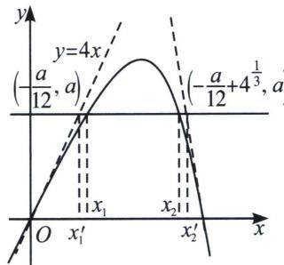

<!-- question-source:start -->
例1 (2015·天津)已知函数 $f(x)=4x-x^{4}$ ， $x\in R$ .

(1)求 $f(x)$ 的单调区间；

(2)设曲线 $y=f(x)$ 与 x 轴正半轴的交点为 P，曲线在点 P 处的切线方程为 $y=g(x)$ ，求证：对于任意的实数 x，都有 $f(x)\leqslant g(x)$ ;

(3)若方程 $f(x)=a$ (a为实数)有两个实数根 $x_{1}$ ， $x_{2}$ ，且 $x_{1}<x_{2}$ ，求证： $x_{2}-x_{1}\leqslant-\frac{a}{3}+4^{\frac{1}{3}}$ .

(1)由 $f(x)=4x-x^{4}$ ，可得 $f'(x)=4-4x^{3}$ 。当 $f'(x)>0$ ，即x<1时，函数 $f(x)$ 单调递增；当 $f'(x)<0$ ，即x>1时，函数 $f(x)$ 单调递减。所以 $f(x)$ 的单调递增区间为 $(-∞,1)$ ，单调递减区间为 $(1,+∞)$ 。

(2)证明：设点 P 的坐标为 $(x_{0}, 0)$ ，则 $x_{0}=4^{\frac{1}{3}}$ ， $f'(x_{0})=-12$ ，

曲线 $y=f(x)$ 在点 P 处的切线方程为 $y=f'(x_{0})(x-x_{0})$ ，即 $g(x)=f'(x_{0})(x-x_{0})$ ，令函数 $F(x)=f(x)-g(x)$ ，即 $F(x)=f(x)-f'(x_{0})(x-x_{0})$ ，则 $F'(x)=f'(x)-f'(x_{0})$ 。

因为 $F'(x_{0})=0$ ，所以当 $x\in(-\infty,x_{0})$ 时， $F'(x)>0$ ；当 $x\in(x_{0},+\infty)$ 时， $F'(x)<0$ ，所以 $F(x)$ 在 $(-∞,x_{0})$ 上单调递增，在 $(x_{0},+\infty)$ 上单调递减，则对于任意实数 x， $F(x)\leqslant F(x_{0})=0$ ，即对任意实数 x，都有 $f(x)\leqslant g(x)$ ；

(3)证明：由
(2)知， $g(x)=-12(x-4^{\frac{1}{3}})$ ，设方程 $g(x)=a$ 的根为 $x_{2}'$ ，可得 $x_{2}'=-\frac{a}{12}+4^{\frac{1}{3}}$ 。因为 $g(x)$ 在 $(-∞,+∞)$ 上单调递减，又由 (2)知 $g(x_{2})≥f(x_{2})=a=g(x_{2}')$ ，因此 $x_{2}≤x_{2}'$ 。类似地，设曲线 $y=f(x)$ 在原点处的切线方程为 $y=h(x)$ ，可得 $h(x)=4x$ ，

对于任意的 $x \in (-\infty, +\infty)$ ，有 $f(x) - h(x) = -x^{4} \leqslant 0$ ，即 $f(x) \leqslant h(x)$ .

设方程 $h(x)=a$ 的根为 $x_{1}^{\prime}$ ，可得 $x_{1}^{\prime}=\frac{a}{4}$ ，因为 $h(x)=4x$ 在 $(-∞,+∞)$ 上单调递增，且 $h(x_{1}^{\prime})=a=f(x_{1})\leqslant h(x_{1})$ ，因此 $x_{1}^{\prime}\leqslant x_{1}$ ，如图所示，由此可得 $x_{2}-x_{1}\leqslant x_{2}^{\prime}-x_{1}^{\prime}=-\frac{a}{3}+4^{\frac{1}{3}}$ .
<!-- question-source:end -->

![[高中/总复习/专题/2026版高中《mst老唐说题》导数专题（数学）/下册/第09章_导数与双变量/第三节_零点差直线拟合问题/一_双零点处切线夹_x__2__x__1_x__4__x__3__构造/例题/answers/Q00047456A1.md]]
