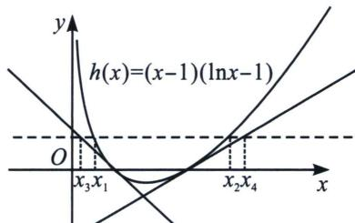

> [!faq]- 《导数专题(下册)》例题解析
>
> > [!success]- **【答案】** 详见解析
>
> > [!note]- **【解析】**
> > 解析 (1) $F(x)=f(x)-g(x)=ax-1-(\ln x-1)=ax-\ln x\geqslant0$ 恒成立，因为定义域为 $(0,+\infty)$ ，所以 $a\geqslant\frac{\ln x}{x}$ 恒成立，令 $t(x)=\frac{\ln x}{x}$ ，原问题转化为求函数 $t(x)$ 在 $(0,+\infty)$ 的最大值，则 $t'(x)=\frac{1-\ln x}{x^2}$ ，令 $t'(x)>0$ ，则0<x<e，所以函数 $t(x)$ 在 $(0,e)$ 上单调递增；令 $t'(x)<0$ ，则x>e，所以函数 $t(x)$ 在 $(e,+\infty)$ 上单调递减，所以 $t(x)_{\max}=t(e)=\frac{1}{e}$ ，所以 $a\geqslant\frac{1}{e}$ ，故a的取值范围为 $\left[\frac{1}{e},+\infty\right)$ .
> >
> > 
> >
> > (2)当 $a = 1$ 时，令 $h(x) = f(x) \cdot g(x) = (x - 1)(\ln x - 1)$ ，则 $h'(x) = \ln x - \frac{1}{x}$ ，显然该函数在定义域内单调递增，而 $h'(1) = -1 < 0$ ， $h'(e) = 1 - \frac{1}{e} > 0$ ，所以存在 $x_0 \in (1, e)$ ，使 $h'(x_0) = 0$ ，因此当 $x \in (0, x_0)$ 时， $h'(x) < 0$ ， $h(x)$ 单调递减；当 $x \in (x_0, +\infty)$ 时， $h'(x) > 0$ ， $h(x)$ 单调递增。令 $h(x) = 0$ ，解得 $x = 1$ 或 $e$ 。设函数 $h(x)$ 在两个零点处的切线方程与直线 $y = m$ 的交点的横坐标分别为 $x_3$ 和 $x_4$ ，则 $x_1 \geqslant x_3$ ， $x_2 \leqslant x_4$ ，易计算函数 $h(x)$ 在 $(1, 0)$ 处的切线方程为 $y_1 = -x + 1$ ；在 $(e, 0)$ 处的切线方程为 $y_2 = \left(1 - \frac{1}{e}\right)(x - e)$ ，令 $y_1 = m$ ，得 $x_3 = 1 - m$ ；令 $y_2 = m$ 得 $x_4 = \frac{em}{e-1} + e = e\left(\frac{m}{e-1} + 1\right)$ ，因为 $x_1 \geqslant x_3$ ， $x_2 \leqslant x_4$ ，所以 $\frac{x_2}{x_1} \leqslant \frac{x_4}{x_3} = \frac{e\left(\frac{m}{e-1} + 1\right)}{1 - m} = \frac{e}{1 - m}\left(\frac{m}{e-1} + 1\right)$ ，故命题得证。
