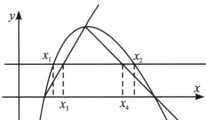

## 三、双零点割线夹 $x_{2} - x_{1} > x_{4} - x_{3}$ 构造

若 $f(x)=m$ 有两根，满足 $x_{2}-x_{1}>g(m)=x_{4}-x_{3}$ ，通常在双零点和极值点连线进行割线夹构造，如图，分别找出两个零点处切线与y=m的交点， $(x_{3},m)$ 和 $(x_{4},m)$ ，即可证明.

![[高中/总复习/专题/2026版高中《mst老唐说题》导数专题（数学）/下册/第09章_导数与双变量/第三节_零点差直线拟合问题/三_双零点割线夹_x__2____x__1__x__4____x__3__构造/例题/Q00047462.md]]
