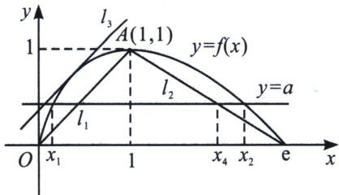

> [!faq]- 《导数专题(下册)》例题解析
>
> > [!success]- **【答案】** 详见解析
>
> > [!note]- **【解析】**
> > 解析 (1) 因为 $f(x) = x(t - \ln x)$ ，所以 $f'(x) = t - \ln x + x\left(-\frac{1}{x}\right) = t - 1 - \ln x$ ，令 $f'(x) > 0 \Leftrightarrow 0 < x < e^{t-1}$ ，令 $f'(x) < 0 \Leftrightarrow x > e^{t-1}$ ，所以 $f(x)$ 在 $(0, e^{t-1})$ 上单调递增，在 $(e^{t-1}, +\infty)$ 上单调递减；(2) 证明： $f(x) = x(1 - \ln x)$ ， $f'(x) = -\ln x$ ， $f(x) = x(1 - \ln x)$ 在 $(0, 1)$ 上单调递增， $(1, +\infty)$ 上单调递减， $f(1) = f(e) = 0$ ，函数 $f(x)$ 在区间 $(0, e]$ 的图象如图所示。不妨设 $x_1 < x_2$ ，则 $0 < x_1 < 1 < x_2 < e$ 。
> >
> > 
> >
> > 连接 $A(1, 1)$ 和点 $(e, 0)$ 的直线 $l_{2}$ 的方程为: $y = \frac{1}{1 - e} (x - e)$ , 当 $y = a$ 时, $x_{4} = (1 - e)a + e$ , 由图可知 $x_{2} > x_{4}$ , 所以要证明 $x_{1} + x_{2} > a(2 - e) + e - \frac{1}{e}$ , 只需证明 $x_{1} + x_{4} > a(2 - e) + e - \frac{1}{e}$ , 即只需证明 $x_{1} > a(2 - e) + e - \frac{1}{e} - x_{4} = a - \frac{1}{e}$ , 连接 $OA$ 的直线 $l_{1}$ 的方程为 $y = x$ , 设函数 $f(x)$ 的图象的与 $OA$ 平行的切线是直线 $l_{3}$ , 令 $f'(x) = -\ln x = 1$ , 可得 $x = \frac{1}{e}$ , 又 $f\left(\frac{1}{e}\right) = \frac{1}{e}\left(1 - \ln \frac{1}{e}\right) = \frac{2}{e}$ , 所以切线 $l_{3}$ 的方程为 $y - \frac{2}{e} = x - \frac{1}{e}$ , 即 $y = x + \frac{1}{e}$ , 令 $y = a$ , 得直线 $y = a$ 与直线 $l_{3}$ 的交点横坐标为 $a - \frac{1}{e}$ , 由图可知 $x_{1} > a - \frac{1}{e}$ , 故得证!
