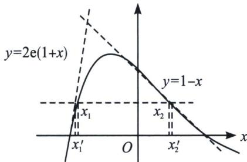

<!-- question-source:start -->
例4 (2023·安徽模拟)已知函数 $f(x)=\frac{1-x^{2}}{\mathrm{e}^{x}}$ (e为自然对数的底数).

(1)求函数 $f(x)$ 的零点 $x_{0}$ ，以及曲线 $y=f(x)$ 在 $x=x_{0}$ 处的切线方程；

(2)设方程 $f(x)=m(m>0)$ 有两个实数根 $x_{1}$ ， $x_{2}$ ，求证： $\left|x_{1}-x_{2}\right|<2-m\left(1+\frac{1}{2e}\right)$ .

(1) 由 $f(x) = \frac{1 - x^2}{\mathrm{e}^x} = 0$ ，得 $x = \pm 1$ ，所以函数的零点 $x_0 = \pm 1$ ， $f'(x) = \frac{x^2 - 2x - 1}{\mathrm{e}^x}$ ， $f'(-1) = 2\mathrm{e}$ ， $f(-1) = 0$ 。曲线 $y = f(x)$ 在 $x = -1$ 处的切线方程为 $y = 2\mathrm{e}(x + 1)$ ， $f' (1) = -\frac{2}{\mathrm{e}}$ ， $f (1) = 0$ ，所以曲线 $y = f(x)$ 在 $x = 1$ 处的切线方程为 $y = -\frac{2}{\mathrm{e}}(x - 1)$ ；

(2)由 $f'(x)=\frac{x^{2}-2x-1}{e^{x}}$ ，当 $x\in(-\infty,1-\sqrt{2})\cup(1+\sqrt{2},+\infty)$ 时， $f'(x)>0$ ；当 $x\in(1-\sqrt{2},1+\sqrt{2})$ 时， $f'(x)<0$ 。所以 $f(x)$ 的单调递增区间为 $(-∞,1-\sqrt{2}),(1+\sqrt{2},+\infty)$ ，单调递减区间为 $(1-\sqrt{2},1+\sqrt{2})$ 。由
(1)知，当x<-1或x>1时， $f(x)<0$ ；当-1<x<1时， $f(x)>0$ 。

下面证明：当 $x \in (-1, 1)$ 时， $2\mathrm{e}(x+1) > f(x)$ .

当 $x \in (-1, 1)$ 时， $2\mathrm{e}(x + 1) > f(x) \Leftrightarrow 2\mathrm{e}(x + 1) + \frac{x^2 - 1}{\mathrm{e}^x} > 0 \Leftrightarrow \mathrm{e}^{x + 1} + \frac{x - 1}{2} > 0$ 。易知， $g(x) = \mathrm{e}^{x + 1} + \frac{x - 1}{2}$ 在 $x \in [-1, 1]$ 上单调递增，而 $g(-1) = 0$ ，即 $g(x) > g(-1) = 0$ 对 $\forall x \in (-1, 1)$ 恒成立，所以当 $x \in (-1, 1)$ 时， $2\mathrm{e}(x + 1) > f(x)$ . 由 $\left\{ \begin{array}{l} y = 2\mathrm{e}(x + 1) \\ y = m \end{array} \right.$ 得 $x = \frac{m}{2\mathrm{e}} - 1$ . 记 $x_1' = \frac{m}{2\mathrm{e}} - 1$ . 不妨设 $x_1 < x_2$ ，则 $-1 < x_1 < 1 - \sqrt{2} < x_2 < 1$ ，即 $|x_1 - x_2| < |x_1' - x_2| = x_2 - x_1' = x_2 - \left(\frac{m}{2\mathrm{e}} - 1\right)$ . 要证 $|x_1 - x_2| < 2 - m\left(1 + \frac{1}{2\mathrm{e}}\right)$ ，只要证 $x_2 - \left(\frac{m}{2\mathrm{e}} - 1\right) \leqslant 2 - m\left(1 + \frac{1}{2\mathrm{e}}\right)$ ，即证 $x_2 \leqslant 1 - m$ . 又因为 $m = \frac{1 - x_2^2}{\mathrm{e}^{x_2}}$ ，所以只要证 $x_2 \leqslant 1 - \frac{1 - x_2^2}{\mathrm{e}^{x_2}}$ ，即 $(x_2 - 1) \cdot (\mathrm{e}^{x_2} - (x_2 + 1)) \leqslant 0$ .

因为 $x_{2}\in(1-\sqrt{2},1)$ ，即证 $\mathrm{e}^{x_{2}}-(x_{2}+1)\geqslant0$ 。令 $\varphi(x)=\mathrm{e}^{x}-(x+1)$ ， $\varphi'(x)=\mathrm{e}^{x}-1$ 。当 $x\in(1-\sqrt{2},0)$ 时， $\varphi'(x)<0$ ， $\varphi(x)$ 为单调递减函数；当 $x\in(0,1)$ 时， $\varphi'(x)>0$ ， $\varphi(x)$ 为单调递增函数。所以 $\varphi(x)\geqslant\varphi(0)=0$ ，则 $\mathrm{e}^{x_{2}}-(x_{2}+1)\geqslant0$ ，故 $|x_{1}-x_{2}|<2-m\left(1+\frac{1}{2\mathrm{e}}\right)$ 。

## 注意：切线夹放缩，拐点是关键
<!-- question-source:end -->

![[高中/总复习/专题/2026版高中《mst老唐说题》导数专题（数学）/下册/第09章_导数与双变量/第三节_零点差直线拟合问题/例题/answers/Q00046791A1.md]]
