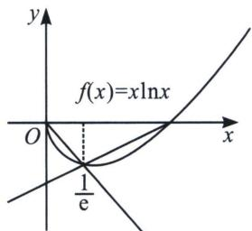
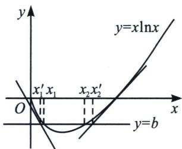
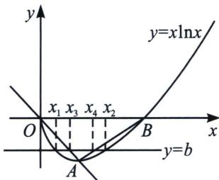

<!-- question-source:start -->
例6 (2024·汉中一模)已知函数 $f(x)=x\ln x$ ， $g(x)=\frac{2f(x)}{x}-x+\frac{1}{x}$ .

(1)求函数 $g(x)$ 的单调区间；

(2)若方程 $f(x)=m$ 的根为 $x_{1}$ 、 $x_{2}$ ，且 $x_{2}>x_{1}$ ，求证： $x_{2}-x_{1}>1+em$ .

(1) 因为 $f(x) = x \ln x$ ， $g(x) = \frac{2f(x)}{x} - x + \frac{1}{x}$ ，所以 $g(x) = 2 \ln x - x + \frac{1}{x}$ 定义域为 $(0, +\infty)$ ， $g'(x) = \frac{2}{x} - 1 - \frac{1}{x^2} = \frac{-x^2 + 2x - 1}{x^2} = -\frac{-(x - 1)^2}{x^2} \leqslant 0$ ，所以 $g(x)$ 在 $(0, +\infty)$ 上单调递减，即 $g(x)$ 的单调递减区间为 $(0, +\infty)$ ，无单调递增区间；

(2)证明： $f(x)=x\ln x,\quad f'(x)=1+\ln x$ ，当 $0<x<\frac{1}{e}$ 时， $f'(x)<0$ ，当 $x>\frac{1}{e}$ 时， $f'(x)>0$ ，所以 $f(x)$ 在 $\left(0,\frac{1}{e}\right)$ 上是单调递减，在 $\left(\frac{1}{e},+\infty\right)$ 上单调递增，则 $f(x)_{\min}=f\left(\frac{1}{e}\right)=-\frac{1}{e}$ 当 0 < x < 1 时， $f(x)=x\ln x<0$ ，所以 $0<x_{1}<\frac{1}{e}<x_{2}<1$ ，且 $-\frac{1}{e}<m<0$ ，当 $x\in\left(0,\frac{1}{e}\right)$ 时， $\ln x<-1$ ，所以 $x\ln x<-x$ ，即 $f(x)<-x$ ，设直线 y=-x 与 y=m 的交点的横坐标为 $x_{3}$ ，则 $x_{1}<x_{3}$ $=-m=-x_{1}\ln x_{1}$ ，下面证明当 $x\in\left(\frac{1}{e},1\right)$ 时， $f(x)<\frac{1}{e-1}(x-1)$ ，设 $h(x)=x\ln x-\frac{1}{e-1}(x-1)=x\left(\ln x-\frac{1}{e-1}+\frac{1}{(e-1)x}\right)$ ，令 $m(x)=\ln x-\frac{1}{e-1}+\frac{1}{(e-1)x}$ ，则 $m^{\prime}(x)=\frac{1}{x}-\frac{1}{(e-1)x^{2}}=\frac{(e-1)x-1}{(e-1)x^{2}}$ ，当 $\frac{1}{e}<x<\frac{1}{e-1}$ 时， $m^{\prime}(x)<0$ ，当 $\frac{1}{e-1}<x<1$ 时， $m^{\prime}(x)>0$ ，所以 $m(x)$ 在 $\left(\frac{1}{e},\frac{1}{e-1}\right)$ 上是减函数，在 $\left(\frac{1}{e-1},1\right)$ 上增函数，又因为 $m\left(\frac{1}{e}\right)=0,\quad m
(1)=0$ ，所以当 $\frac{1}{e}<x<1$ 时， $m(x)<0,\quad h(x)<0$ ，故当 $x\in\left(\frac{1}{e},1\right)$ 时， $f(x)<\frac{1}{e-1}(x-1)$ ，设直线 $y=\frac{1}{e-1}(x-1)$ 与y=m的交点的横坐标为 $x_{4}$ ，则 $x_{2}>x_{4}=1+(e-1)m$ ，所以 $x_{2}-x_{1}>x_{4}-x_{3}=1+em$ ，得证.

## 例7 (2023·龙凤区期中)已知函数 $f(x)=x\ln x$ .

(1) 若 $a \leqslant -2$ ，证明： $f(x) \geqslant ax - e^{-3}$ 在 $(0, +\infty)$ 上恒成立；

(2)若方程. $f(x) = b$ 有两个实数根 $x_{1}, x_{2}$ , 且 $x_{1} < x_{2}$ , 求证: $b \mathrm{e} + 1 < x_{2} - x_{1} < \frac{\mathrm{e}^{-3} + 2 + 3b}{2}$ . 解析 证明:
(1)由 $f'(x) = \ln x + 1$ , 则 $x \in \left(0, \frac{1}{\mathrm{e}}\right)$ 时, $f'(x) < 0$ , $f(x)$ 单调递减, $x \in \left(\frac{1}{\mathrm{e}}, +\infty\right)$ 时, $f'(x) > 0$ , $f(x)$ 单调递增, 所以 $f(x)$ 的递减区间为 $\left(0, \frac{1}{\mathrm{e}}\right)$ , 递增区间为 $\left(\frac{1}{\mathrm{e}}, +\infty\right)$ ;

因为 $a \leqslant -2, x \in (0, +\infty)$ ，令 $g(a) = ax - e^{-3}$ ，所以 $g(a) = ax - e^{-3} \leqslant g(-2) = -2x - e^{-3}$ ，下证 $-2x - e^{-3} \leqslant x \ln x$ ，令 $h(x) = x \ln x + 2x + e^{-3}$ ，则 $h'(x) = \ln x + 3$ ，当 $0 < x < e^{-3}$ 时， $h'(x) < 0$ ，当 $x > e^{-3}$ ， $H'(x) > 0$ ，所以 $h(x)$ 在 $(0, e^{-3})$ 上单调递减，在 $(e^{-3}, +\infty)$ 上单调递增，所以 $h(x) = x \ln x + 2x + e^{-3} \geqslant h(e^{-3}) = 0$ ，所以 $f(x) \geqslant ax - e^{-3}$ 在 $(0, +\infty)$ 上恒成立；

(2)先证右半部分不等式: $x_{2} - x_{1} < \frac{\mathrm{e}^{-3} + 2 + 3b}{2}$ , 因为 $f(x) = x\ln x$ , $f'(x) = \ln x + 1$ , 所以 $f
(1) = 0$ , $f(\mathrm{e}^{-3}) = -3\mathrm{e}^{-3}$ , $f' (1) = 1$ , $f'(\mathrm{e}^{-3}) = -2$ , 可求曲线 $y = f(x)$ 在 $x = \mathrm{e}^{-3}$ 和 $x = 1$ 处的切线分别为 $l_{1}: y = -2x - \mathrm{e}^{-3}$ 和 $l_{2}: y = x - 1$ ; 设直线 $y = b$ 与直线 $l_{1}$ , 函数 $f(x)$ 的图象和直线 $l_{2}$ 交点的横坐标分别为 $x_{1}'$ , $x_{1}$ , $x_{2}$ , $x_{2}'$ , 则 $x_{1}' = -\frac{\mathrm{e}^{-3} + b}{2}$ , $x_{2}' = b + 1$ , 则 $x_{2} - x_{1} = x_{2}' - x_{1}' = (b + 1) - (-\frac{\mathrm{e}^{-3} + b}{2}) = \frac{\mathrm{e}^{-3} + 2 + 3b}{2}$ , 因此 $x_{2} - x_{1} < \frac{\mathrm{e}^{-3} + 2 + 3b}{2}$ ,

再证左半部分不等式： $x_{2}-x_{1}>be+1$ ，设取曲线上两点 $A\left(\frac{1}{e},-\frac{1}{e}\right)$ ， $B(1,0)$ ，用割线OA：y=-x, AB: $y=\frac{1}{e-1}(x-1)$ 来限制 $x_{2}-x_{1}$ ，设直线 y=b 与直线 y=-x， $y-\frac{1}{e-1}(x-1)$ 的交点的横坐标分别为 $x_{3}$ ， $x_{4}$ ，则 $x_{1}<x_{3}<x_{4}<x_{2}$ ，且 $x_{3}=-b$ ， $x_{4}=(e-1)b+1$ ，所以 $x_{2}-x_{1}>x_{4}-x_{3}=(e-1)b+1-(-b)=be+1$ ，综上可得 $be+1<x_{2}-x_{1}<\frac{e^{-3}+2+3b}{2}$ 成立.

## 例 8 (24-25 高二下·山东·期中)已知函数 $f(x) = x - \ln x + a$ 有两个不同零点 $x_{1}, x_{2} (x_{1} < x_{2})$ .

(1) 求 a 的取值范围；

(2)证明： $x_{1}+x_{2}>2;$

(3)证明： $2+\frac{2ae}{e-1}<x_{2}-x_{1}<\frac{-ae-a-2}{e-1}.$

(1)由题意可知: $f(x)$ 的定义域为 $(0, +\infty)$ , 且 $f'(x)=1-\frac{1}{x}=\frac{x-1}{x}$ , 令 $f'(x)>0$ , 解得 $x>1$ ; 令 $f'(x)<0$ , 解得 $0<x<1$ ; 可知 $f(x)$ 在 $(0, 1)$ 内单调递减, 在 $(1, +\infty)$ 内单调递增, 可知 $f(x)_{\min}=f (1)$ , 且当趋近于 0 或 $+\infty$ 时, $f(x)$ 趋近于 $+\infty$ , 若函数 $f(x)$ 有两个不同零点, 则 $f (1)=1+a<0$ , 即 $a<-1$ , 所以 $a$ 的取值范围为 $(- \infty, -1)$ .

$$
g (x) = f (1 - x) - f (1 + x) = \ln (1 + x) - \ln (1 - x) - 2 x, 0 <   x <   1
$$

则 $g^{\prime}(x) = \frac{1}{1 + x} +\frac{1}{1 - x} -2 = \frac{2x^{2}}{1 - x^{2}} >0$ ，可知 $g(x)$ 在(0，1)内单调递增，

可得 $g(x) > g(0) = 0$ ，即 $f(1 - x) > f(1 + x)$ ，0 < x < 1，可得 $f(x) > f(2 - x)$ ，0 < x < 1，
由题意可知： $0<x_{1}<1<x_{2}$ ，则 $f(x_{2})=f(x_{1})>f(2-x_{1})$

$$
2 - x _ {1} > 1, x _ {2} > 1
$$

$$
(1, + \infty)
$$

$$
x _ {2} > 2 - x _ {1}
$$

$$
x _ {1} + x _ {2} > 2
$$

$$
x _ {1} + x _ {2} > 2
$$

$$
x _ {2} > 2 - x _ {1}
$$

$$
x _ {2} - x _ {1} > 2 - 2 x _ {1}
$$

若证 $x_{2} - x_{1} > 2 + \frac{2ae}{e - 1}$ ，等价于 $2 - 2x_{1} > 2 + \frac{2ae}{e - 1}$ ，即 $x_{1} <   \frac{-ae}{e - 1},$

因为 $x_{1} - \ln x_{1} + a = 0$ ，即 $x_{1} - \ln x_{1} = -a$ ，可得 $x_{1} <   \frac{(x_{1} - \ln x_{1})\mathrm{e}}{\mathrm{e} - 1}$ ，整理可得 $x_{1} - \mathrm{e}\ln x_{1}\geqslant 0$

令 $F(x)=x-\mathrm{e}\ln x,\quad x\in(0,1)$ ，则 $F'(x)=1-\frac{\mathrm{e}}{x}=\frac{x-\mathrm{e}}{x}>0$ ，令 $F'(x)>0$ ，解得 x>e；
令 $F'(x) < 0$ ，解得 0 < x < e；

可知 $F(x)$ 在 $(0, e)$ 内单调递减，在 $(e, +\infty)$ 内单调递增，则 $F(x) \geqslant F(e) = 0$ ，注意到 $x_{1} \in (0, 1)$ ，则 $F(x_{1}) = x_{1} - \mathrm{e}\ln x_{1} > 0$ ，即 $x_{2} - x_{1} > 2 + \frac{2ae}{e-1}$ ;

因为 $f\left(\frac{1}{\mathrm{e}}\right) = \frac{1}{\mathrm{e}} + 1 + a, f'\left(\frac{1}{\mathrm{e}}\right) = 1 - \mathrm{e}$ ，即切点坐标为 $\left(\frac{1}{\mathrm{e}}, \frac{1}{\mathrm{e}} + 1 + a\right)$ ，切线斜率 $k = 1 - \mathrm{e}$ ，则 $f(x)$ 在 $x = \frac{1}{\mathrm{e}}$ 处切线方程为 $y - \left(\frac{1}{\mathrm{e}} + 1 + a\right) = (1 - \mathrm{e})\left(x - \frac{1}{\mathrm{e}}\right)$ ，即 $y = (1 - \mathrm{e})x + 2 + a$ ，令 $y = 0$ ，可得 $x_3 = \frac{2 + a}{\mathrm{e} - 1}$ ，构建 $m(x) = (1 - \mathrm{e})x + 2 + a, G(x) = f(x) - m(x) = \mathrm{e}x - \ln x - 2$ ，则 $G'(x) = \mathrm{e} - \frac{1}{x} = \frac{\mathrm{e}x - 1}{x}$ ，令 $G'(x) > 0$ ，可得 $x > \frac{1}{\mathrm{e}}$ ；令 $G'(x) < 0$ ，可得 $0 < x < \frac{1}{\mathrm{e}}$ ；

可知 $G(x)$ 在 $\left(\frac{1}{\mathrm{e}}, +\infty\right)$ 内单调递增，在 $\left(0, \frac{1}{\mathrm{e}}\right)$ 内单调递减，则 $G(x) \geqslant G\left(\frac{1}{\mathrm{e}}\right) = 0$ ，即 $f(x) \geqslant m(x)$ ，则 $m(x_{1}) \leqslant f(x_{1}) = 0 = m(x_{3})$ ，且 $m(x)$ 在定义域 R 内单调递减，所以 $x_{1} \geqslant x_{3}$ ;

因为 $f(e)=e-1+a$ ， $f'(e)=1-\frac{1}{e}$ ，即切点坐标为 $(e, e-1+a)$ ，切线斜率 $k=1-\frac{1}{e}$ ，则 $f(x)$ 在 x=e 处切线方程为 $y-(e-1+a)=(1-\frac{1}{e})(x-e)$ ，即 $y=\left(1-\frac{1}{e}\right)x+a$ ，令 y=0，可得 $x_{4}=-\frac{ae}{e-1}$ ，构建 $n(x)=\left(1-\frac{1}{e}\right)x+a$ ， $H(x)=f(x)-n(x)=\frac{1}{e}(x-\mathrm{e}\ln x)\geqslant0$ ，即 $f(x)\geqslant n(x)$ ，则 $n(x_{2})\leqslant f(x_{2})=0=n(x_{4})$ ，且 $n(x)$ 在定义域 R 内单调递增，所以 $x_{2}\leqslant x_{4}$ ;

注意到等号不能同时成立，所以 $x_{2}-x_{1}<x_{4}-x_{3}=\frac{-ae-a-2}{e-1}$ ;

综上所述： $2+\frac{2ae}{e-1}<x_{2}-x_{1}<\frac{-ae-a-2}{e-1}$

## 四、单零点和极值点形成曲线夹 $x_{2}-x_{1}>x_{4}-x_{3}$ 构造

如果 $f(x)$ 只有一个零点，另一边有渐近线，则我们可以构造零点和极值点形成的二次拟合函数，形成内部封闭构造出 $x_{2}-x_{1}>x_{4}-x_{3}$ .
<!-- question-source:end -->

![[高中/总复习/专题/2026版高中《mst老唐说题》导数专题（数学）/下册/第09章_导数与双变量/第三节_零点差直线拟合问题/例题/answers/Q00046794A1.md]]
