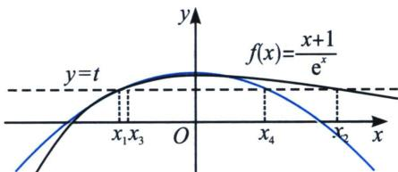
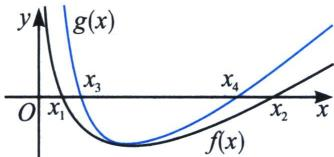
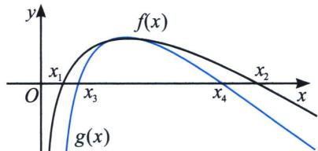

<!-- question-source:start -->
例 9 (2022 · 盐城期末) 已知函数 $f(x)=\frac{x+1}{e^{x}}$ .

(1) 当 x > -1 时，求函数 $g(x) = f(x) + x^{2} - 1$ 的最小值；

(2)已知 $x_{1} \neq x_{2}$ , $f(x_{1}) = f(x_{2}) = t$ , 求证: $|x_{1} - x_{2}| > 2\sqrt{1 - t}$ .

(1)由题意可得 $g^{\prime}(x) = \frac{-x}{\mathrm{e}^{x}} + 2x = \frac{x(2\mathrm{e}^{x} - 1)}{\mathrm{e}^{x}}$ ，令 $f^{\prime}(x) = 0$ ，则 $x = 0$ 或 $x = -\ln 2$ ，列表如下：

<table><tr><td>x</td><td>(-1,-ln2)</td><td>-ln2</td><td>(-ln2,0)</td><td>0</td><td>(0,+∞)</td></tr><tr><td>g&#x27;(x)</td><td>+</td><td>0</td><td>-</td><td>0</td><td>+</td></tr><tr><td>g(x)</td><td>单调递增</td><td>极大值</td><td>单调递减</td><td>极小值</td><td>单调递增</td></tr></table>

当 x 趋近于 -1 时， $g(x)$ 趋近于 $g(-1)=0$ ， $g(0)=0$ ，所以 $g(x)_{\min}=g(0)=0$ .

(2)证明：由题意可得 $f'(x)=\frac{-x}{\mathrm{e}^{x}}$ ，所以当 x<0 时， $f'(x)>0$ ，即 $f(x)$ 在 $(-∞,0)$ 上单调递增，当 x>0 时， $f'(x)<0$ ，即 $f(x)$ 在 $(0,+\infty)$ 上单调递减，所以 $f(x)_{\max}=f(0)=1$ ，因为 $f(x_{1})=f(x_{2})$ ，不妨设 $x_{1}<0<x_{2}$ ，因为 $x_{2}>0$ 时， $f(x_{2})>0$ ， $t=f(x_{2})\in(0,1)$ ，所以 $f(x_{1})=f(x_{2})>0$ ，所以 $x_{1}>-1$ ，由
(1)知 x>-1，且 $x\neq0$ 时， $g(x)=f(x)+x^{2}-1>0$ ，所以 $f(x)>1-x^{2}$ ，则 $t=f(x_{1})>1-x_{1}^{2}$ ，解得 $x_{1}<x_{3}=-\sqrt{1-t}$ ， $t=f(x_{2})>1-x_{2}^{2}$ ，解得 $x_{2}>x_{4}=\sqrt{1-t}$ ，所以 $|x_{1}-x_{2}|=$

$$
x _ {2} - x _ {1} > x _ {4} - x _ {3} = 2 \sqrt {1 - t}.
$$

很多问题到了这里，通过前面的例题发现，关于 $x_{2} - x_{1} > x_{4} - x_{3}$ 的逻辑就很清晰了，如果讲参数引入函数，形成参变混合的 $f(x)$ 与 $g(x)$ ，我们进行以下分析：

考点1： $f(x)$ 极小值模型

如果我们需要构造 $x_{2}-x_{1}>x_{4}-x_{3}$ ，我们需要找到 $f(x)$ 的恒大的极值点处拟合函数 $g(x)$ ，如图；

考点 2: $f(x)$ 极大值模型

如果我们需要构造 $x_{2} - x_{1} > x_{4} - x_{3}$ ，我们需要找到 $f(x)$ 的恒小的极值点处拟合函数 $g(x)$ 如图；
<!-- question-source:end -->

![[高中/总复习/专题/2026版高中《mst老唐说题》导数专题（数学）/下册/第09章_导数与双变量/第三节_零点差直线拟合问题/例题/answers/Q00046795A1.md]]
