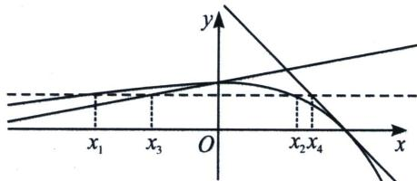

<!-- question-source:start -->
例12 (2023·盐城期中)已知 $f(x)=\mathrm{e}^{x}(1-x)$ .

(1) 求函数 $g(x)=f(x)+\mathrm{e}x-\mathrm{e}$ 的最大值；

(2) 设 $f(x_{1}) = f(x_{2}) = t$ , $x_{1} \neq x_{2}$ ，求证： $x_{1} + x_{2} < 2t - \frac{t}{e} - 1$ .

(1) 易知 $g(x) = f(x) + \mathrm{e}x - \mathrm{e} = (1 - x)\mathrm{e}^x +\mathrm{e}x - \mathrm{e}$ ，函数定义域为R，可得 $g^{\prime}(x) = \mathrm{e} - x\mathrm{e}^{x}$ 不妨设 $h(x) = \mathrm{e} - x\mathrm{e}^{x}$ ，函数定义域为R，可得 $h^{\prime}(x) = -\mathrm{e}^{x}(x + 1)$ ，当 $x <   - 1$ 时， $h^{\prime}(x) > 0$ ， $h(x)$ 单调递增；

当 x > -1 时， $h'(x) < 0$ ， $h(x)$ 单调递减，因为 x < 0 时， $h(x) > 0$ ，且 $h
(1) = 0$ ，所以当 x < 1 时， $g'(x) > 0$ ， $g(x)$ 单调递增；当 x > 1 时， $g'(x) < 0$ ， $g(x)$ 单调递减，所以当 x = 1 时，函数 $g(x)$ 取得极大值也是最大值，最大值 $g (1) = 0$ ；

(2)证明：易知 $f'(x)=\mathrm{e}^{x}(1-x)-\mathrm{e}^{x}=-x\mathrm{e}^{x}$ ，当 x<0 时， $f'(x)>0$ ， $f(x)$ 单调递增；
当 x>0 时， $f'(x)<0$ ， $f(x)$ 单调递减，所以当 x=0 时，函数 $f(x)$ 取得极大值也是最大值，最大值 $f(0)=1$ ，当 $x\to-\infty$ 时， $f(x)\to0$ ；当 $x\to+\infty$ 时， $f(x)\to-\infty$ ，因为 $f(x_{1})=f(x_{2})=t$ ，所以 $x_{1}$ ， $x_{2}$ 异号，不妨设 $x_{1}<0<x_{2}$ 且 $t\in(0,1)$ ，由
(1)知 $f(x)+\mathrm{e}x-\mathrm{e}\leqslant0$ 恒成立，所以 $f(x_{2})+\mathrm{e}x_{2}-\mathrm{e}\leqslant0$ ，即 $t+\mathrm{e}x_{2}-\mathrm{e}\leqslant0$ ，所以 $x_{2}\leqslant1-\frac{t}{e}$ ，要证 $x_{1}+x_{2}<2t-\frac{t}{e}-1$ ，即证 $x_{1}<2t-2$ ，因为 $x_{1}\in(-\infty,0)$ ，所以 $2t-2\in(-\infty,0)$ ，又函数 $f(x)$ 在 $(-\infty,0)$ 上单调递增，此时需证 $f(x_{1})<f(2t-2)$ ，要证 $t<\mathrm{e}^{2t-2}(3-2t)$ ，即证 $\frac{\mathrm{e}^{2t-2}(3-2t)}{t}>1$ ，不妨设 $k(t)=\frac{\mathrm{e}^{2t-2}(3-2t)}{t}$ ，函数定义域为 $(0,1)$ ，可得 $k'(t)=\frac{\mathrm{e}^{2t-2}(-4t^{2}+6t-3)}{t^{2}}<0$ ，所以函数 $k(t)$ 在 $(0,1)$ 上单调递减，则 $k(t)>k (1)=1$ ，故 $x_{1}+x_{2}<2t-\frac{t}{e}-1$ 。

<!-- question-source:end -->

![[高中/总复习/专题/2026版高中《mst老唐说题》导数专题（数学）/下册/第09章_导数与双变量/第三节_零点差直线拟合问题/例题/answers/Q00046798A1.md]]
