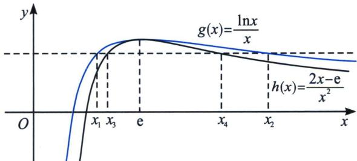
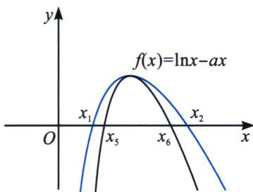

<!-- question-source:start -->
例10 (2021·湖北十一校联考)已知函数 $f(x)=\ln x-ax$ .

(1) 讨论 $f(x)$ 的单调性；

(2) 若 $x_{1}, x_{2}, (x_{1} < x_{2})$ 是 $f(x)$ 的两个零点；证明：① $x_{1} + x_{2} > \frac{2}{a}$ ；② $x_{2} - x_{1} > \frac{2\sqrt{1 - e a}}{a}$ .

(1)由 $f'(x) = \frac{1}{x} - a = \frac{1 - ax}{x}$ ，当 $a \leqslant 0$ 时， $f'(x) > 0$ 恒成立，故 $f(x)$ 在 $(0, +\infty)$ 单调递增；当 $a > 0$ 时， $f'(x) = 0$ 时， $x = \frac{1}{a}$ ，故 $x \in \left(0, \frac{1}{a}\right)$ 时， $f'(x) > 0$ ， $f(x)$ 单调递增， $x \in \left(\frac{1}{e}, +\infty\right)$ 时， $f'(x) < 0$ ， $f(x)$ 单调递减；

(2)①根据题意可知 $\left\{ \begin{array}{l} \ln x_{1} = ax_{1} \\ \ln x_{2} = ax_{2} \end{array} \right. \Rightarrow \frac{x_{2} - x_{1}}{\ln x_{2} - \ln x_{1}} = \frac{1}{a}$ ，易求得 $0 < a < \frac{1}{e}$ （省略了过程，读者可以自证）构造函数 $g(x) = \ln x - \frac{2(x - 1)}{x + 1}$ ， $(x > 1)$ ，则 $g'(x) = \frac{1}{x} - \frac{4}{(x + 1)^2} = \frac{(x - 1)^2}{x(x + 1)^2}$ ，

$$
x > 1
$$

$$
g ^ {\prime} (x) > 0
$$

$$
g (x)
$$

$$
g (x) > g
(1) = 0
$$

$$
x _ {2} > x _ {1}
$$

时， $\ln \frac{x_2}{x_1} >\frac{2\left(\frac{x_2}{x_1} - 1\right)}{\frac{x_2}{x_1} + 1}$ ，即 $\ln x_{2} - \ln x_{1} > \frac{2(x_{2} - x_{1})}{x_{2} + x_{1}}$ ，即 $\frac{x_2 + x_1}{2} >\frac{x_2 - x_1}{\ln x_2 - \ln x_1} = \frac{1}{a}$ ，故 $x_{1} + x_{2} > \frac{2}{a}$

②法一(参变分离极值点放缩): 先根据条件探路, 由 $x_{1} + x_{2} > \frac{2}{a}$ 得, $x_{2} > \frac{2}{a} - x_{1}$ 要证 $x_{2} - x_{1} > \frac{2\sqrt{1 - e a}}{a}$ , 只需 $x_{2} > \frac{2}{a} - x_{1} > \frac{2\sqrt{1 - e a}}{a} + x_{1}$ , 故只需 $x_{1} < \frac{1}{a} - \frac{\sqrt{1 - e a}}{a}$ , 由于 $\frac{1}{e} > a > 0$ , 故只需$ax_{1}<1-\sqrt{1-ea}$ ，只需 $a^{2}x_{1}^{2}-2ax_{1}+1>1-ea$ ，只需 $ax_{1}^{2}-2x_{1}+e>0$ ，此时由于 $\ln x_{1}=ax_{1}$ ，故只需证 $x_{1}\ln x_{1}>2x_{1}-e$ ，显然求导即可证明，或者根据不等式 $x\ln x\geqslant x-1$ ，得： $\frac{x}{e}\ln\frac{x}{e}\geqslant\frac{x}{e}-1\Leftrightarrow x\ln x-x\geqslant x-e\Leftrightarrow x\ln x\geqslant2x-e$ （当且仅当x=e时等号成立，）由于 $0<x_{1}<e<x_{2}$ ，故命题得证。此方案虽然得到探路的不等式，但是总感觉不是那么通透，为什么会构造出 $ax_{1}^{2}-2x_{1}+e>0$ ？命题逻辑是什么？能有什么样得几何背景？

由题意 $x_{2} - x_{1} > x_{4} - x_{3} = \frac{2\sqrt{1 - \mathrm{e}a}}{a}$ ，参变分离后 $g(x) = \frac{\ln x}{x}$ 需要构造极值点 $x = \mathrm{e}$ 处的先小后小的放缩函数，即 $a = \frac{\ln x}{x} = g(x)$ ，由于 $\ln x\geqslant 1 - \frac{1}{x}$ ，所以 $\ln \frac{x}{\mathrm{e}}\geqslant 1 - \frac{\mathrm{e}}{x}\Rightarrow \ln x\geqslant 2 - \frac{\mathrm{e}}{x}$ 故 $g(x) = \frac{\ln x}{x}\geqslant$ $\frac{2x - \mathrm{e}}{x^2}$ ，如图，

书写过程：令 $ax^{2}-2x+e=0$ 两根为 $x_{3}$ ， $x_{4}\left(x_{3}<x_{4},0<a<\frac{1}{e}\right)$ ，则 $x_{4}-x_{3}=\frac{2\sqrt{1-ea}}{a}$ ；由于 $\ln x \leqslant x-1$ （请自证），故 $\ln\frac{1}{x} \leqslant \frac{1}{x}-1 \Rightarrow \ln x \geqslant 1-\frac{1}{x}$ ，当且仅当 x=1 时等号成立，则 $\ln\frac{x}{e} \geqslant 1-\frac{e}{x} \Rightarrow \ln x \geqslant 2-\frac{e}{x}$ ，当且仅当 x=e 时等号成立，构造 $g(x)=\frac{\ln x}{x}=a$ ，则 $g(x) \geqslant \frac{2-\frac{e}{x}}{x}=\frac{2x-e}{x^{2}}$ ，当且仅当 x=e 时等号成立，故当 1<x<e 时， $a=\frac{\ln x_{1}}{x_{1}}=\frac{2x_{3}-e}{x_{3}^{2}}<\frac{\ln x_{3}}{x_{3}}$ ，由于在此区间单调递增，故一定有 $x_{1}<x_{3}$ ，同理，当 x>e 时， $a=\frac{\ln x_{2}}{x_{2}}=\frac{2x_{4}-e}{x_{4}^{2}}<\frac{\ln x_{4}}{x_{4}}$ ，此区间单调递减，故一定有 $x_{2}>x_{4}$ ，所以 $x_{2}-x_{1}>x_{4}-x_{3}=\frac{2\sqrt{1-ea}}{a}$ .

法三(参变不分离极值点放缩): 构造差型需要 $x_{2} - x_{1} > x_{6} - x_{5} \geqslant \frac{2\sqrt{1 - \mathrm{e}a}}{a}$ , 根据 $f(x)$ 先增后减的性质, 需要找恒小于 $f(x)$ 函数, 根据 $\ln x \geqslant 1 - \frac{1}{x}$ 来构造, 由于极值点是 $\frac{1}{a}$ , $\ln ax \geqslant 1 - \frac{1}{ax} \Rightarrow \ln x \geqslant 1 - \frac{1}{ax} - \ln a$ ,

$f(x)>1-\frac{1}{ax}-\ln a-ax=0$ ，取 $\left\{\begin{aligned}x_{5}&=\frac{1-\ln a-\sqrt{\ln^{2}a-2\ln a-3}}{2a}\\ x_{6}&=\frac{1-\ln a+\sqrt{\ln^{2}a-2\ln a-3}}{2a}\end{aligned}\right.$ ，所以存在 $x_{1}\in(x_{3},x_{5})$ ，存在 $x_{2}\in(x_{6},+\infty)$ ，使 $f(x_{1})=f(x_{2})=0$ ，只需证 $x_{6}-x_{5}=\frac{\sqrt{\ln^{2}a-2\ln a-3}}{a}>\frac{2\sqrt{1-ea}}{a}$ ，即证 $g(a)=\ln^{2}a-2\ln a-7+4ea>0$ ，由于 $g'(a)=\frac{2\ln a}{a}-\frac{2}{a}+4e=\frac{2}{e}\frac{\ln\frac{a}{e}}{\frac{a}{e}}+4e<0$ 对 $0<a<\frac{1}{e}$ 恒成立，所以 $g(a)_{\min}=g\left(\frac{1}{e}\right)=0$ 成立，综上， $x_{2}-x_{1}>x_{6}-x_{5}=\frac{\sqrt{\ln^{2}a-2\ln a-3}}{a}>\frac{2\sqrt{1-ea}}{a}.$
<!-- question-source:end -->

![[高中/总复习/专题/2026版高中《mst老唐说题》导数专题（数学）/下册/第09章_导数与双变量/第三节_零点差直线拟合问题/考点_2_f_x__极大值模型/例题/answers/Q00047464A1.md]]
