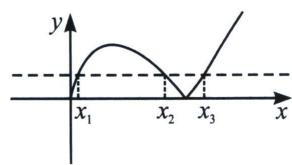
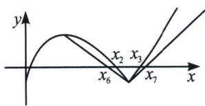

> [!faq]- 《导数专题(下册)》例题解析
>
> > [!success]- **【答案】** 详见解析
>
> > [!note]- **【解析】**
> > 解析（i）易得 $h(x) = \begin{cases} -x\ln x - b(\text{当 } 0 < x \leqslant 1) \\ x\ln x - b(\text{当 } x > 1) \end{cases}$ ，我们需要构造 $-x\ln x - b$ 先大后小的拟合函数，即构造 $\ln x$ 的先小后大的拟合函数，只有飘带函数 $\left\{ \begin{array}{l} \ln x > \frac{1}{2}\left(x - \frac{1}{x}\right) (\text{当 } 0 < x < 1) \\ \ln x < \frac{1}{2}\left(x - \frac{1}{x}\right) (\text{当 } x > 1) \end{array} \right.$ ，由于极值点在 $x = \frac{1}{e}$ 处，故我们按照 $\left\{ \begin{array}{l} \ln e x > \frac{1}{2}\left(e x - \frac{1}{e x}\right)\left(\text{当 } 0 < x < \frac{1}{e}\right) \\ \ln e x < \frac{1}{2}\left(e x - \frac{1}{e x}\right)\left(\text{当 } x > \frac{1}{e}\right) \end{array} \right.$ ，即 $\left\{ \begin{array}{l} -x\ln x - b < -\frac{e}{2}x^2 + x + \frac{1}{2e} - b \\ -x\ln x - b > -\frac{e}{2}x^2 + x + \frac{1}{2e} - b \end{array} \right.$ ，故取 $\left\{ \begin{array}{l} x_4 = \frac{1 - \sqrt{2 - 2eb}}{e} \\ x_5 = \frac{1 + \sqrt{2 - 2eb}}{e} \end{array} \right.$ ，所以存在 $x_1 \in (x_4, \frac{1}{e})$ 使 $h(x_1) = 0$ ，存在 $x_2 \in (x_5, +\infty)$ 使 $h(x_2) = 0$ ，故 $x_1 + x_2 > x_4 + x_5 = \frac{2}{e}$ ，所以 $x_1^2 + x_2^2 > \frac{(x_1 + x_2)^2}{2} > \frac{2}{e^2}$ 成立.
> >
> > 
> >
> > 
> >
> > (ii) 令 $\sqrt{1 - 2b} = x_4$ ，易证 $h(\sqrt{1 - 2b}) = -(\sqrt{1 - 2b})\ln (\sqrt{1 - 2b}) - b = -x_4\ln x_4 - \frac{1 - x_4^2}{2} < 0 (x_4 < 1)$ ，令 $\sqrt{1 + 2b} = x_5$ ，易证 $h(\sqrt{1 + 2b}) = (\sqrt{1 + 2b})\ln (\sqrt{1 + 2b}) - b = x_5\ln x_5 - \frac{x_5^2 - 1}{2} < 0 (x_5 > 1)$ ，
> >
> > 如图，连接 $h(x)$ 顶点 $\left(\frac{1}{\mathrm{e}}, \frac{1}{\mathrm{e}} - b\right)$ 和分段点 $(1, -b)$ ，易证 $h(x) = -x\ln x - b > \frac{1}{1 - \mathrm{e}} (x - 1) - b$ ，当 $\frac{1}{\mathrm{e}} < x < 1$ 成立，再构造 $h(x)$ 在 $x = 1$ 处的切线，即 $y = x - 1 - b$ ，当 $y = 0$ 时，分别取 $x_6 = 1 + b - \mathrm{eb}$ ， $x_7 = 1 + b$ ， $h(x_6) > 0$ ， $h(x_7) > 0$ ，故存在 $x_2 \in (x_6, x_4)$ ，使 $h(x_2) = 0$ ， $x_3 \in (x_7, x_5)$ ，使 $h(x_3) = 0$ ，所以 $x_7 - x_6 = be > x_3 - x_2 > x_5 - x_4 = \sqrt{1 + 2b} - \sqrt{1 - 2b}$ .
