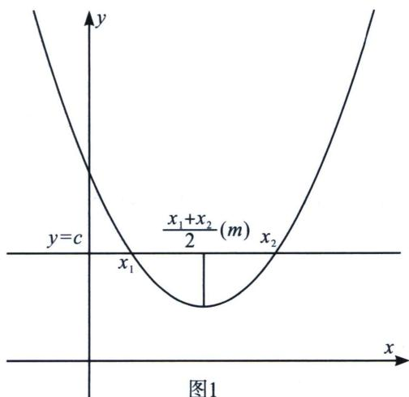
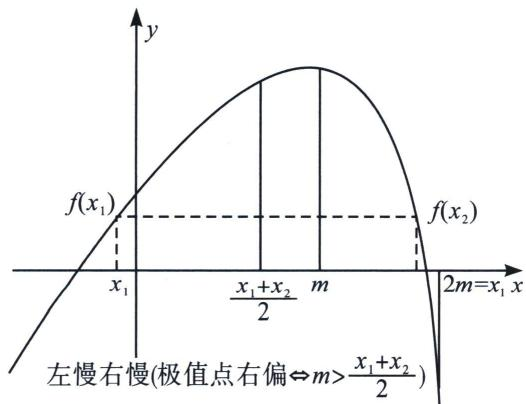
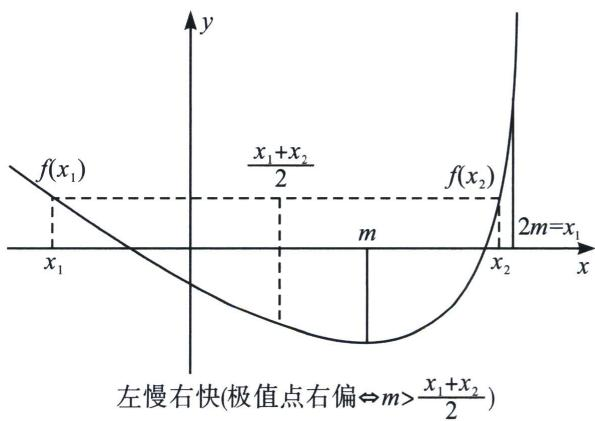
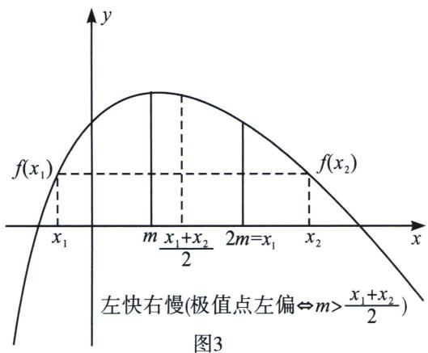
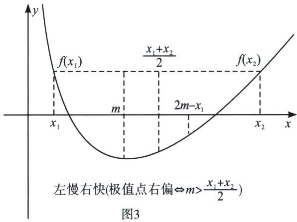

## 一、对称化构造

极值点偏移概念函数 $f(x)$ 满足定义域内任意自变量 x 都有 $f(x)=f(2m-x)$ ，则函数 $f(x)$ 关于直线 $x=x_{0}$ 对称；可以理解为函数 $f(x)$ 的对称轴两侧，函数值变化快慢相同，且若 $f(x)$ 为单峰函数，则 $x=x_{0}$ 必为 $f(x)$ 的极值点，如二次函数 $f(x)$ 的对称轴就是极值点 $x_{0}$ ，若 $f(x)=c$ 的两根的中点为 $\frac{x_{1}+x_{2}}{2}=x_{0}$ ，即极值点在两根的正中间，也就是极值点没有偏移.

当相等变为不等，则极值点偏移：若单峰函数 $y = f(x)$ 的极值点为 $x_0$ ， $x_1 < x_0 < x_2$ ，且 $f(x_1) = f(x_2)$ ，对任意 $x_1$ 都有 $f(x_1) > f(2x_0 - x_1)$ （见图 2-1）或 $f(x_1) < f(2x_0 - x_1)$ （见图 3-1），由于 $2x_0 - x_1 > x_0$ ， $f(x)$ 在 $(x_0, +\infty)$ 上单调，则 $2x_0 - x_1 > x_2$ 或 $2x_0 - x_1 < x_2$ ，即 $\frac{x_1 + x_2}{2} < x_0$ （极值点右偏）或 $\frac{x_1 + x_2}{2} > x_0$ （极值点左偏）。

  
图2

图1  

1)极值点偏移问题的一般题设形式(和型)

和型：
(1)若函数 $f(x)$ 存在两个零点 $x_{1}$ ， $x_{2}$ 且 $x_{1} \neq x_{2}$ ，求证： $x_{1} + x_{2} > 2x_{0} (x_{0}$ 为函数 $f(x)$ 的极值点）；

(2)若函数 $f(x)$ 存在 $x_{1}$ ， $x_{2}$ 且 $x_{1} \neq x_{2}$ 满足 $f(x_{1}) = f(x_{2})$ ，求证： $x_{1} + x_{2} > 2x_{0} (x_{0}$ 为函数 $f(x)$ 的极值点）；

(3)若函数 $f(x)$ 存在两个零点 $x_{1}$ ， $x_{2}$ 且 $x_{1} \neq x_{2}$ ，令 $x_{0} = \frac{x_{1} + x_{2}}{2}$ ，求证： $f'(x_{0}) > 0$ ;

(4)若函数 $f(x)$ 存在 $x_{1}$ ， $x_{2}$ 且 $x_{1} \neq x_{2}$ 满足 $f(x_{1}) = f(x_{2})$ ，令 $x_{0} = \frac{x_{1} + x_{2}}{2}$ ，求证： $f'(x_{0}) > 0$ .

(5)若函数 $f(x)$ 存在两个极值点 $x_{1}$ ， $x_{2}$ ，且 $x_{1} \neq x_{2}$ ，求证： $x_{1} + x_{2} > 2x_{0}$

2)答题模板

先分清楚极值点 $x_0$ 是当前函数极值点还是代数变形后的极值点，如果是当前函数极值点，直接使用，如果不是，先代数变形再利用模板.

常见题设：若函数 $f(x)$ 存在两个零点，且满足 $f(x_{1})=f(x_{2})$ ， $x_{0}$ 为函数 $f(x)$ 的极值点，求证 $x_{1}+x_{2}<2x_{0}$ .

(1)求导讨论 $f(x)$ 单调性，并求出极值点 $x_{0}$ 以及 $x_{1}$ ， $x_{2}$ 的范围；

(2)构造函数 $F(x)=f(x)-f(2x_{0}-x)$ ; (左右构造)

注：有时需要根据题意构造 $F(x)=f(x_{0}+x)-f(x_{0}-x)$ (居中构造).

(3)对 $F(x)$ 求导, 讨论 $F(x)$ 单调性, 从而判断 $F(x)$ 在极值点单侧的正负, 得出 $f(x)$ 与 $f(2x_0 - x)$ 的大小关系;

注：①后续代入哪侧的自变量证明， $F(x)$ 就求哪侧的正负，无需同时求极值点两侧；

②若 $F(x)$ 出现定号部分，可先去掉定号部分再求导.

(4)代入 $x_{1}$ 或 $x_{2}$ , 得出 $f(x)$ 与 $f(2x_0 - x)$ 的大小关系, 借助 $f(x_{1}) = f(x_{2})$ 将自变量统一到极值点同侧, 再通过 $f(x)$ 单调性得出结论.

(5)若要证明 $f'\left(\frac{x_1 + x_2}{2}\right) < 0$ ，还需要进一步讨论 $\frac{x_1 + x_2}{2}$ 与 $x_0$ 的大小，得出 $\frac{x_1 + x_2}{2}$ 的单调区间，从而得出该函数函数导函数值的正负，从而结论得证.

此处只需继续证明：因为 $x_{1}+x_{2}<2x_{0}$ ，故 $\frac{x_{1}+x_{2}}{2}<x_{0}$ ，由于 $f(x)$ 在 $(-∞, x_{0})$ 上单调递减，故 $f'\left(\frac{x_{1}+x_{2}}{2}\right)<0$ .

3) 积型:
(1) 若函数 $f(x)$ 存在两个零点 $x_{1}, x_{2}$ 且 $x_{1} \neq x_{2}$ , 求证: $x_{1} x_{2} > x_{0}^{2} (x_{0}$ 为函数 $f(x)$ 的极值点);

(2)若函数 $f(x)$ 存在 $x_{1}$ ， $x_{2}$ 且 $x_{1} \neq x_{2}$ 满足 $f(x_{1}) = f(x_{2})$ ，求证： $x_{1}x_{2} > x_{0}^{2}(x_{0}$ 为函数 $f(x)$ 的极值点）；

(3)若函数 $f(x)$ 存在两个零点 $x_{1}$ ， $x_{2}$ 且 $x_{1} \neq x_{2}$ ，令 $x_{0} = \sqrt{x_{1}x_{2}}$ ，求证： $f'(x_{0}) > 0$ ;

(4)若函数 $f(x)$ 存在 $x_{1}$ ， $x_{2}$ 且 $x_{1} \neq x_{2}$ 满足 $f(x_{1}) = f(x_{2})$ ，令 $x_{0} = \sqrt{x_{1}x_{2}}$ ，求证： $f'(x_{0}) > 0$ ；

(5)若函数 $f(x)$ 存在两个极值点 $x_{1}$ ， $x_{2}$ ，且 $x_{1} \neq x_{2}$ ，求证： $x_{1}x_{2} > x_{0}^{2}$ .

## 4)答题模板

(1)求导讨论 $f(x)$ 单调性，并求出极值点 $x_{0}$ 以及 $x_{1}$ ， $x_{2}$ 的范围；

(2)构造函数 $F(x)=f(x)-f\left(\frac{x_{0}^{2}}{x}\right)$ ; (左右构造)

(3)对 $F(x)$ 求导, 讨论 $F(x)$ 单调性, 从而判断 $F(x)$ 在极值点单侧的正负, 得出 $f(x)$ 与 $f$ $\left(\frac{2x_0^2}{x}\right)$ 的大小关系;

注：①后续代入哪侧的自变量证明， $F(x)$ 就求哪侧的正负，无需同时求极值点两侧；

②若 $F(x)$ 出现定号部分，可先去掉定号部分再求导.

(4)代入 $x_{1}$ 或 $x_{2}$ , 得出 $f(x)$ 与 $f\left(\frac{2x_0^2}{x}\right)$ 的大小关系, 借助 $f(x_{1}) = f(x_{2})$ 将自变量统一到极值点同侧, 再通过 $f(x)$ 单调性得出结论.

对于极值点偏移高考题出现的历史比较久远，最早出现在2010年天津卷.

## 1. 极值点偏移显极值点和型构造

![[高中/总复习/专题/2026版高中《mst老唐说题》导数专题（数学）/下册/第09章_导数与双变量/第二节_极值点偏移/一_对称化构造/例题/Q00047424.md]]
![[高中/总复习/专题/2026版高中《mst老唐说题》导数专题（数学）/下册/第09章_导数与双变量/第二节_极值点偏移/一_对称化构造/例题/Q00047425.md]]
![[高中/总复习/专题/2026版高中《mst老唐说题》导数专题（数学）/下册/第09章_导数与双变量/第二节_极值点偏移/一_对称化构造/例题/Q00047426.md]]
![[高中/总复习/专题/2026版高中《mst老唐说题》导数专题（数学）/下册/第09章_导数与双变量/第二节_极值点偏移/一_对称化构造/例题/Q00047427.md]]
![[高中/总复习/专题/2026版高中《mst老唐说题》导数专题（数学）/下册/第09章_导数与双变量/第二节_极值点偏移/一_对称化构造/例题/Q00047428.md]]
![[高中/总复习/专题/2026版高中《mst老唐说题》导数专题（数学）/下册/第09章_导数与双变量/第二节_极值点偏移/一_对称化构造/例题/Q00047429.md]]
![[高中/总复习/专题/2026版高中《mst老唐说题》导数专题（数学）/下册/第09章_导数与双变量/第二节_极值点偏移/一_对称化构造/例题/Q00047430.md]]
