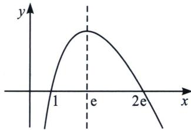

> [!faq]- 《导数专题(下册)》例题解析
>
> > [!success]- **【答案】** 详见解析
>
> > [!note]- **【解析】**
> > 解析 $b\ln a - a\ln b = a - b \Leftrightarrow \frac{1}{a}\left(1 - \ln \frac{1}{a}\right) = \frac{1}{b}\left(1 - \ln \frac{1}{b}\right)$ ，设 $t_1 = \frac{1}{a}, t_2 = \frac{1}{b}$ . 则问题转化为当 $f(t_1) = f(t_2) = s$ 时，证明 $t_1 + t_2 < e$ . 易知 $0 < t_1 < 1 < t_2 < e$ .
> >
> > 法一：（除法构造单调性调整）：要证明 $t_1 + t_2 < \mathrm{e}$ ，只需 $t_1 + t_2 - \mathrm{e} < 0$ ，只需 $(t_2 - t_1)(t_1 + t_2 - \mathrm{e}) < 0$ ， $(t_2 - t_1)(t_1 + t_2 - \mathrm{e}) < 0 \Leftrightarrow t_2^2 - \mathrm{e}t_2 < t_1^2 - \mathrm{e}t_1 \Leftrightarrow \frac{t_1}{t_2} < \frac{\mathrm{e} - t_2}{\mathrm{e} - t_1}$ ，由于 $\frac{t_1}{t_2} = \frac{1 - \ln t_2}{1 - \ln t_1}$ ，故我们只需证明 $\frac{1 - \ln t_2}{1 - \ln t_1} < \frac{\mathrm{e} - t_2}{\mathrm{e} - t_1}$ ，即证 $\frac{1 - \ln t_2}{\mathrm{e} - t_2} < \frac{1 - \ln t_1}{\mathrm{e} - t_1}$ ，令 $h(x) = \frac{1 - \ln x}{\mathrm{e} - x}$ ， $h'(x) = -\frac{x\ln x - 2x + \mathrm{e}}{x(\mathrm{e} - x)^2}$ ，易证 $h'(x) \leqslant 0$ ，故 $h(x)$ 单调递减，所以 $h(t_2) < h(t_1)$ ，命题得证.
> >
> > 法二：二次函数双根式拟合：令 $x_{1} = \frac{1}{a}, x_{2} = \frac{1}{b}, x_{1} < x_{2}$
> >
> > $f(x)=x(1-\ln x)$ ， $f(e)=0$ ， $\lim_{x\to0}f(x)\to0$ ，极值点为1， $f(1)=1$ ，
> >
> > 令 $g(x)=x(1-\ln x)-\frac{1}{1-\mathrm{e}}x(x-\mathrm{e})=x\left(-\ln x-\frac{x}{1-\mathrm{e}}+\frac{1}{1-\mathrm{e}}\right)$ ,
> >
> > 令 $h(x) = -\ln x - \frac{x}{1 - \mathrm{e}} +\frac{1}{1 - \mathrm{e}}, h^{\prime}(x) = -\frac{1}{x} -\frac{1}{1 - \mathrm{e}} < 0,h(x)$ 单调递减， $h(1) = 0$
> >
> > 所以 $x \in (0, 1)$ , $h(x) > 0$ , $g(x) > 0$ , $x \in (1, e)$ , $h(x) < 0$ , $g(x) < 0$ , 所以 $g(x_1) = x_1(1 - \ln x_1) - \frac{1}{1 - e} x_1(x_1 - e) > 0 \Rightarrow x_1(1 - \ln x_1) > \frac{1}{1 - e} x_1(x_1 - e)$ , $g(x_2) = x_2(1 - \ln x_2) - \frac{1}{1 - e} x_2(x_2 - e) < 0 \Rightarrow x_2(1 - \ln x_2) < \frac{1}{1 - e} x_2(x_2 - e)$ , 所以 $\frac{1}{1 - e} x_1(x_1 - e) < x_1(1 - \ln x_1) = x_2(1 - \ln x_2) < \frac{1}{1 - e} x_2(x_2 - e)$ , 所以 $x_1(x_1 - e) > x_2(x_2 - e) \Rightarrow e(x_2 - x_1) > (x_2 + x_1)(x_2 - x_1)$ , 所以 $\frac{1}{a} + \frac{1}{b} < e$ .
> >
> > ## 例 2 (2022 · 武汉零诊) 已知 $f(x)=(2e-x)\ln x$ .
> >
> > 若 $x_{1}, x_{2} \in (0, 1), (x_{1} < x_{2})$ ，且 $x_{2} \ln x_{1} - x_{1} \ln x_{2} = 2 \mathrm{e} x_{1} x_{2} (\ln x_{1} - \ln x_{2})$ ，证明： $\frac{1}{x_1} + \frac{1}{x_2} < 2 \mathrm{e} + 1.$ 解析 $x_{2} \ln x_{1} - x_{1} \ln x_{2} = 2 \mathrm{e} x_{1} x_{2} (\ln x_{1} - \ln x_{2}) \Leftrightarrow \frac{\ln x_{1}}{x_{1}} - \frac{\ln x_{2}}{x_{2}} = 2 \mathrm{e} (\ln x_{1} - \ln x_{2}) \Leftrightarrow \ln x_{(2 \mathrm{e} - \frac{1}{x_1})} = \ln x_{2}$ $(2 \mathrm{e} - \frac{1}{x_2})$ ，即 $f\left(\frac{1}{x_1}\right) = f\left(\frac{1}{x_2}\right)$ ，令 $t_1 = \frac{1}{x_1}, t_2 = \frac{1}{x_2}, \frac{1}{x_1} + \frac{1}{x_2} < 2 \mathrm{e} + 1$ ，即证 $t_1 + t_2 < 2 \mathrm{e} + 1$
> >
> > 
> >
> > 法一： $f(t_{1})=f(t_{2})=m(m\in(0,\mathrm{e}))$ ，易知 $1<t_{1}<\mathrm{e}<t_{2}<2\mathrm{e}$ 。只需 $t_{1}+t_{2}-2\mathrm{e}-1<0$ ，
> > 相比于上一题，本题有一个区别就是 $f(t)=(2\mathrm{e}-t)\ln t$ ，主体不是 t，而是 $2e-t$ ，要证 $t_{1}+t_{2}-2e-1<0$ ，故需构造 $2e-t_{1}+2e-t_{2}>2e-1$ ， $(2e-t_{1}-2e+t_{2})(2e-t_{1}+2e-t_{2}-2e+1)>0$ ， $(2e-t_{2})^{2}-$ $(2 \mathrm{e} - 1)(2 \mathrm{e} - t_{2}) < (2 \mathrm{e} - t_{1})^{2} - (2 \mathrm{e} - 1)(2 \mathrm{e} - t_{1}), \frac{2 \mathrm{e} - t_{1}}{2 \mathrm{e} - t_{2}} < \frac{2 \mathrm{e} - t_{2} - 2 \mathrm{e} + 1}{2 \mathrm{e} - t_{1} - 2 \mathrm{e} + 1} = \frac{t_{2} - 1}{t_{1} - 1}$ , 由于 $\frac{2 \mathrm{e} - t_{1}}{2 \mathrm{e} - t_{2}} = \frac{\ln t_{2}}{\ln t_{1}}$ , 故我们只需证明 $\frac{t_{2} - 1}{\ln t_{2}} > \frac{t_{1} - 1}{\ln t_{1}}$ , 构造 $h(t) = \frac{t - 1}{\ln t} (t > 1)$ 易证 $h(t)$ 单调递增, 故 $h(t_{2}) > h(t_{1})$ , 命题得证.
> >
> > 法二： $g(x)=(2e-x)\ln x-a(x-1)(x-2e)$ ， $y=a(x-1)(x-2e)$ 过(e，e)， $a=\frac{1}{1-e}$
> >
> > $$
> > g (x) = (2 \mathrm{e} - x) \ln x - \frac {1}{1 - \mathrm{e}} (x - 1) (x - 2 \mathrm{e}) = (x - 2 \mathrm{e}) \left[ - \ln x + \frac {1}{1 - \mathrm{e}} (1 - x) \right],
> > $$
> >
> > $$
> > h (x) = - \ln x - \frac {x}{1 - \mathrm{e}} + \frac {1}{1 - \mathrm{e}}, h ^ {\prime} (x) = - \frac {1}{x} - \frac {1}{1 - \mathrm{e}} = 0, x = \mathrm{e} - 1,
> > $$
> >
> > $x \in (1, e-1)$ , $h(x)$ 递增, $x \in (e-1, 2e)$ , $h(x)$ 递减, $h(e) = 0$ , $x \in (1, e)$ , $h(x) > 0$ , $g(x) > 0$ , $h(e) = 0$ , $x \in (e, e+1)$ , $h(x) < 0$ , $g(x) < 0$ , $g(x_1) > 0$ , $g(x_2) < 0$ , $\frac{1}{1-e}(x_1 - 1)(x_1 - 2e) < (2e - x_1)\ln x_1 = (2e - x_2)\ln x_2 < \frac{1}{1-e}(x_2 - 1)(x_2 - 2e)$ , 所以 $(x_1 - 1)(x_1 - 2e) > (x_2 - 1)(x_2 - 2e) \Rightarrow x_1 + x_2 < 2e + 1$ .
