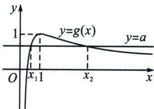

<!-- question-source:start -->
例8 (24-25高三下·江西·开学考试)已知函数 $f(x) = \frac{1}{2} ax^2 - x\ln x$ .

(1) 若 $f(x) \geqslant 0$ 恒成立，求实数 a 的取值范围；

(2) 若 $f(x)$ 有 $x_{1}$ , $x_{2}(x_{1}<x_{2})$ 两个极值点

①求实数 a 的取值范围；

②证明： $x_{1}+x_{2}>\frac{2-\ln a}{a}.$

(1) $f(x)=\frac{1}{2}ax^{2}-x\ln x\geqslant0$ 恒成立，则 $\frac{a}{2}\geqslant\left(\frac{\ln x}{x}\right)_{\max}$ ，令 $\varphi(x)=\frac{\ln x}{x}$ ，则 $\varphi'(x)=\frac{1-\ln x}{x^{2}}>0$ ，得0<x<e； $\varphi'(x)=\frac{1-\ln x}{x^{2}}<0$ ，得x>e。所以 $\varphi(x)$ 在(0，e)上单调递增，在(e，+∞)单调递减，故 $\varphi(x)_{\max}=\varphi(e)=\frac{1}{e}$ ，所以 $\frac{a}{2}\geqslant\frac{1}{e}$ ，即 $a\geqslant\frac{2}{e}$ 。

(2)① $f(x)$ 有 $x_{1}$ ， $x_{2}(x_{1}<x_{2})$ 两个极值点，则 $f'(x)=ax-\ln x-1=0$ ，即 $a=\frac{1+\ln x}{x}$ 有两个不同根，令 $g(x)=\frac{1+\ln x}{x}$ ，则 $g'(x)=-\frac{\ln x}{x^{2}}$ ， $g'(x)=-\frac{\ln x}{x^{2}}>0$ ，则 $0<x<1$ ； $g'(x)=-\frac{\ln x}{x^{2}}<0$ ，则 $x>1$ ，所以 $g(x)=\frac{1+\ln x}{x}$ 在 $(0,1)$ 上单调递增，在 $(1,+\infty)$ 上单调递减.

$g(x)_{\max}=g
(1)=1$ ，当 $x\to0^{+}$ 时， $g(x)\to-\infty$ ；当 $x\to+\infty$ 时， $g(x)\to0$ ，如图所以 $a\in(0,1)$ .

$$
\left\{ \begin{array}{l} f ^ {\prime} \left(x _ {1}\right) = 0 \\ f ^ {\prime} \left(x _ {2}\right) = 0 \end{array} \Rightarrow \left\{ \begin{array}{l} a x _ {1} = \ln x _ {1} + 1 \\ a x _ {2} = \ln x _ {2} + 1 \end{array} \Rightarrow \frac {1}{a} = \frac {x _ {1} - x _ {2}}{\ln x _ {1} - \ln x _ {2}}, a \left(x _ {1} + x _ {2}\right) = \ln \left(x _ {1} x _ {2}\right) + 2, \right. \right.
$$

要证 $x_{1} + x_{2} > \frac{2 - \ln a}{a}$ 即证 $a(x_{1} + x_{2}) > 2 - \ln a$ ，即 $\ln (x_1x_2) + 2 > 2 - \ln a$ ，即证 $x_{1}x_{2} > \frac{1}{a}$

只需证 $x_{1}x_{2} > \frac{x_{1} - x_{2}}{\ln x_{1} - \ln x_{2}} (0 < x_{1} < 1 < x_{2})$ ，即证 $\ln x_{2} + \frac{1}{x_{2}} > \ln x_{1} + \frac{1}{x_{1}}$ ，由于 $a = \frac{1 + \ln x_{1}}{x_{1}} = \frac{1 + \ln x_{2}}{x_{2}}$ ，即证 $\frac{1 + \ln x_{2}}{x_{2}} + \ln x_{2} + \frac{1}{x_{2}} > \frac{1 + \ln x_{1}}{x_{1}} + \ln x_{1} + \frac{1}{x_{1}}$ ，令 $h(x) = \frac{2 + \ln x}{x} + \ln x, x > 0$ ，则 $h'(x) = \frac{x - 1 - \ln x}{x^{2}}$ ，令 $H(x) = x - 1 - \ln x, H'(x) = 1 - \frac{1}{x} = \frac{x - 1}{x}$ ，

当 $x \in (0, 1)$ 时， $H'(x) < 0$ ，当 $x \in (1, +\infty)$ 时， $H'(x) > 0$ ，则 $H(x) \geqslant H
(1) = 0$ ，则 $h'(x) = \frac{x - 1 - \ln x}{x^2} \geqslant 0$ 在 $(0, +\infty)$ 上恒成立，所以 $h(x)$ 在 $(0, +\infty)$ 上单调递增，

因为 $0 < x_{1} < 1 < x_{2}$ ，所以 $h(x_{2}) > h(x_{1})$ ，即 $\frac{1 + \ln x_2}{x_2} + \ln x_2 + \frac{1}{x_2} > \frac{1 + \ln x_1}{x_1} + \ln x_1 + \frac{1}{x_1}$ 成立.

## 3. 积型函数单调性调整

积型 $x_{1}x_{2} < m$ 构造 $F(x) = x + \frac{m}{x} +\lambda f(x)$ 单调减函数

① $x_{1}x_{2} < m \Leftrightarrow x_{1} + \frac{m}{x_{1}} > x_{2} + \frac{m}{x_{2}}$ ，我们需要构造处于同一极值点的函数 $f(x)$ ，即此函数满足条件 $f'(\sqrt{m}) = 0$ ，此时我们构造 $F(x) = x + \frac{m}{x} + \lambda f(x)$ ，利用导函数的极点效应构造单调递减的函数 $F(x) = x + \frac{m}{x} + \lambda f(x)$ ，锁定 $\lambda$ .

②当 $x_{2}>x_{1}>0$ 时，要证 $x_{1}x_{2}>m$ ，只需证 $x_{1}^{2}x_{2}^{2}>m^{2}$ ，此类型方法就是处理一些积型偏移，原函数含参，但是偏移乘积型的不含参，所以要想办法把参数消除，所以通过参变分离，这样求导以后参数就变成常数的导数消除了，当然，ALG 构造消除参数也可以.
<!-- question-source:end -->

![[高中/总复习/专题/2026版高中《mst老唐说题》导数专题（数学）/下册/第09章_导数与双变量/第二节_极值点偏移/例题/answers/Q00046782A1.md]]
