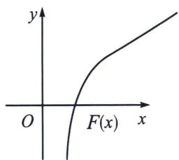
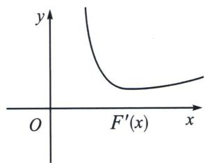

> [!faq]- 《导数专题(下册)》例题解析
>
> > [!success]- **【答案】** 详见解析
>
> > [!note]- **【分析】**
> > 本题未单列分析。
>
> > [!note]- **【解析】**
> > 解析 即转化为 $\frac{1}{x_1^2} = \frac{\ln x_1}{x_1} - a, \frac{1}{x_2^2} = \frac{\ln x_2}{x_2} - a,$
> > (参变分离消参): 由已知 $x_{1} x_{2} > 2 \mathrm{e}^{2} \Leftrightarrow x_{1}^{2} x_{2}^{2} > 4 \mathrm{e}^{4} \Leftrightarrow x_{2}^{2} + \frac{4 \mathrm{e}^{4}}{x_{2}^{2}} > x_{1}^{2} + \frac{4 \mathrm{e}^{4}}{x_{1}^{2}}$ ,
> > 故只需证 $x_{2}^{2} + 4\mathrm{e}^{4}\left(\frac{\ln x_{2}}{x_{2}} -a\right) > x_{1}^{2} + 4\mathrm{e}^{4}\left(\frac{\ln x_{1}}{x_{1}} -a\right)$ ，即证 $x_{2}^{2} + 4\mathrm{e}^{4}\frac{\ln x_{2}}{x_{2}} >x_{1}^{2} + 4\mathrm{e}^{4}\frac{\ln x_{1}}{x_{1}}.$
> > $F(x)=x^{2}+4e^{4}\frac{\ln x}{x}$ （如下图），则 $F'(x)=2x+4e^{4}\frac{1-\ln x}{x^{2}}=\frac{2}{x^{2}}(x^{3}-2e^{4}\ln x+2e^{4})$ ，令 $h(x)=x^{3}-2e^{4}\ln x+2e^{4}$ ， $h'(x)=\frac{3x^{3}-2e^{4}}{x}$ ， $h(x)$ 在 $(0,\sqrt[3]{\frac{2}{3}e^{4}})$ 单调递减，在 $\sqrt[3]{\frac{2}{3}e^{4}}$ ， $+\infty)$ 单调递增，
> > $h(x)\geqslant h(\sqrt[3]{\frac{2}{3}e^{4}})=-\frac{2}{3}e^{4}\ln\frac{2}{3}>0$ ，即 $F'(x)>0$ ， $F(x)$ 单调递增，命题得证.
> > 
> > 
