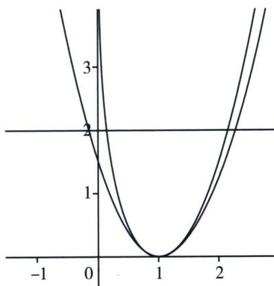

> [!faq]- 《导数专题(下册)》例题解析
>
> > [!success]- **【答案】** 详见解析
>
> > [!note]- **【解析】**
> > 解析 因为 $a = 1, x_{1}, x_{2}$ 是 $f(x) = \frac{\ln x + 1}{\mathrm{e}^{x}}$ 的解，即 $x_{1}, x_{2}$ 是方程 $x^{2} - x - \ln x - 1 = 0$ 的两根，设 $x_{1} < x_{2}$ ，要证 $x_{1} + x_{2} > 2$ ，即 $x_{2}^{2} - 2x_{2} > x_{1}^{2} - 2x_{1}$ ，令 $g(x) = x^{2} - 2x + \lambda (x^{2} - x - \ln x), g'(x) = 2x - 2 + \lambda (2x - 1 - \frac{1}{x}), g'(1) = 0, g''(x) = 2 + \lambda (2 + \frac{1}{x^2}), g''(1) = 0$ ，所以 $\lambda = -\frac{2}{3}$ 所以 $g(x) = x^{2} - 2x - \frac{2}{3}(x^{2} - x - \ln x), g'(x) = 2x - 2 - \frac{2}{3}(2x - 1 - \frac{1}{x}) = \frac{2}{3}(x + \frac{1}{x}) - \frac{4}{3} \geqslant 0$ 所以 $g(x)$ 单调递增，所以 $g(x_{2}) > g(x_{1})$ ，即 $x_{2}^{2} - 2x_{2} - \frac{2}{3}(x_{2}^{2} - x_{2} - \ln x_{2}) > x_{1}^{2} - 2x_{1} - \frac{2}{3}(x_{1}^{2} - x_{1} - \ln x_{1})$ ，所以 $x_{2}^{2} - 2x_{2} > x_{1}^{2} - 2x_{1}$ ，即 $x_{1} + x_{2} > 2$ 得证！
> >
> > 
> >
> > 我们的本意是得到 $x_{1} + x_{2} > x_{1}^{\prime} + x_{2}^{\prime} = 2$ ，故需要拟合一个比原函数(绿色)先小后大的共极值点二次函数(红色)，但是倍数该如何调整呢？我们发现做差之后， $h(x) = m(x) - \lambda (x^{2} - 2x + 1)$ 是越来越小的，即 $h(x)$ 单调递减，由共极值点可知 $h^{\prime}(1) = 0$ ，故1不为函数极值点，而是拐点的横坐标，即 $h''(1) = 0$ 从而锁定参数.
> >
> > 法二：令 $h(x) = x^{2} - x - \ln x - 1$ ， $h^{\prime}(x) = 2x - 1 - \frac{1}{x} h^{\prime \prime}(x) = 2 + \frac{1}{x^{2}}$ ， $h^{\prime \prime \prime}(x) = -\frac{2}{x^3} < 0$
> >
> > 所以 $h'(x)$ 为凸函数，由阿达玛积分不等式： $h'\left(\frac{x_{1}+x_{2}}{2}\right)\geqslant\frac{1}{x_{2}-x_{1}}\int_{x_{1}}^{x_{2}}h'(x)dx=\frac{h(x_{2})-h(x_{1})}{x_{2}-x_{1}}=0=$
> >
> > $h'(1)$ ，所以 $\frac{x_{1}+x_{2}}{2}>1$ ，所以 $x_{1}+x_{2}>2$ 得证！
> >
> > 法三： $x^{2} - x - \ln x = x^{2} - 2x + x - \ln x$ ，拟合先小后大在1处取等，即 $\ln x$ 的先大后小，尝试： $x_{1}^{2} - x_{1} - \frac{2(x_{1} - 1)}{x_{1} + 1} < x_{1}^{2} - x_{1} - \ln x_{1} = x_{2}^{2} - x_{2} - \ln x_{2} < x_{2}^{2} - x_{2} - \frac{2(x_{2} - 1)}{x_{2} + 1},$ 结构比较丑，考虑泰勒展开： $\left\{ \begin{array}{l}\ln (x + 1) <   x - \frac{1}{2} x^2,\\ \ln (x + 1) > x - \frac{1}{2} x^2, \end{array} \right.\Rightarrow \left\{ \begin{array}{l}\ln x <   x - 1 - \frac{1}{2}(x - 1)^{2},\\ \ln x > x - 1 - \frac{1}{2}(x - 1)^{2}, \end{array} \right.$ ， $x_{1}^{2} - x_{1} - [x_{1} - 1 - \frac{1}{2}(x_{1} - 1)^{2}] <   x_{1}^{2} - x_{1} - \ln x_{1} = x_{2}^{2} - x_{2} - \ln x_{2} <   x_{2}^{2} - x_{2} - [x_{2} - 1 - \frac{1}{2}(x_{2} - 1)^{2}],$ 即 $\frac{3}{2} (x_1^2 -2x_1) <   \frac{3}{2} (x_2^2 -2x_2)\Rightarrow x_1 + x_2 > 2$ 得证！
> >
> > ## 例 2 (24-25 高三下·河南驻马店·开学考试)已知函数 $f(x)=x\ln x-ax+1$ .
> >
> > (1)若函数 $g(x)=xf(x)$ 单调递增，求实数 a 的取值范围；
> >
> > (2)若函数 $f(x)$ 有两个零点 $x_{1}$ ， $x_{2}$ .
> > - **①**：求实数 a 的取值范围；
> > - **②**：证明： $x_{1}+x_{2}>2x_{1}x_{2}$
> >
> > 解析 (1)由 $g(x) = x^{2}\ln x - ax^{2} + x$ ，有 $g'(x) = 2x\ln x + x - 2ax + 1$
> >
> > 若函数 $g(x)$ 单调递增，必有 $2x\ln x + x - 2ax + 1 \geqslant 0$ 恒成立，不等式可化为 $2a \leqslant 2\ln x + \frac{1}{x} + 1$ ，
> >
> > 令 $h(x) = 2\ln x + \frac{1}{x} + 1$ ，有 $h'(x) = \frac{2}{x} - \frac{1}{x^2} = \frac{2x - 1}{x^2}$ ，可得函数 $h(x)$ 的减区间为 $\left(0, \frac{1}{2}\right)$ ，增区间为 $\left(\frac{1}{2}, +\infty\right)$ ，可得 $h(x)_{\min} = h\left(\frac{1}{2}\right) = 3 - 2\ln 2$ ，有 $2a \leqslant 3 - 2\ln 2$ ，可得 $a \leqslant \frac{3}{2} - \ln 2$ 故实数 $a$ 的取值范围为 $\left(-\infty, \frac{3}{2} - \ln 2\right]$ ；
> >
> > (2)(i)由 $f'(x)=\ln x+1-a$ 令 $f'(x)>0$ ，可得 $x>\mathrm{e}^{a-1}$ ，可得函数 $f(x)$ 的减区间为 $(0,\mathrm{e}^{a-1})$
> >
> > $$
> > \left(\mathrm{e} ^ {a - 1}, + \infty\right)
> > $$
> >
> > $$
> > f (x) _ {\min} = f \left(\mathrm{e} ^ {a - 1}\right) = \mathrm{e} ^ {a - 1} \ln \mathrm{e} ^ {a - 1} - a \mathrm{e} ^ {a - 1} + 1 = 1 - \mathrm{e} ^ {a - 1}
> > $$
> >
> > 若函数 $f(x)$ 有两个零点 $x_{1}$ ， $x_{2}$ ，必有 $f(x)_{\min}=1-\mathrm{e}^{a-1}<0$ ，可得 a>1，又由 $f(\mathrm{e}^{a})=\mathrm{e}^{a}\ln\mathrm{e}^{a}-a\mathrm{e}^{a}+1=1>0$ ，
> >
> > $f(\mathrm{e}^{-a}) = \mathrm{e}^{-a}\ln \mathrm{e}^{-a} - ae^{-a} + 1 = 1 - 2ae^{-a} = \frac{\mathrm{e}^a - 2a}{\mathrm{e}^a} >\frac{\mathrm{e}a - 2a}{\mathrm{e}^a} = \frac{(\mathrm{e} - 2)a}{\mathrm{e}^a} >0$ （利用不等式 $\mathrm{e}^x\geqslant \mathrm{e}x$ （当且仅当 $x = 1$ 时取等号))，
> >
> > 又由 $e^{-a}<e^{a-1}<e^{a}$ ，故若函数 $f(x)$ 有两个零点 $x_{1}, x_{2}$ ，则实数 a 的取值范围为 $(1, +\infty)$ ;
> >
> > (ii) 法一：(对均)由函数 $f(x)$ 有两个零点 $x_1, x_2$ ，有 $\begin{cases} x_1 \ln x_1 - ax_1 + 1 = 0 \\ x_2 \ln x_2 - ax_2 + 1 = 0 \end{cases}$ ，
> >
> > 有 $\left\{ \begin{array}{l} \ln x_{1} + \frac{1}{x_{1}} = a, \\ \ln x_{2} + \frac{1}{x_{2}} = a, \end{array} \right. \Rightarrow \frac{\frac{1}{x_{2}} - \frac{1}{x_{1}}}{\ln \frac{1}{x_{2}} - \ln \frac{1}{x_{2}}} = 1 < \frac{\frac{1}{x_{2}} + \frac{1}{x_{1}}}{2} \Rightarrow x_{1} + x_{2} > 2x_{1}x_{2}$ 得证！
> >
> > 法二：（单调性调整）令 $\frac{1}{x}=t$ ，则 $a=t-\ln t,\quad g(t)=t^{2}-2t+\lambda(t-\ln t),\quad g'(t)=2t-2+\lambda\left(1-\frac{1}{t}\right)$ ， $g''(t)=2+\frac{\lambda}{t^{2}},\quad g''(1)=2+\lambda=0\Rightarrow\lambda=-2$ ，此时 $g'(t)=2t-4+\frac{2}{t}\geqslant0$ 恒成立， $g(t)$ 单调递增，
> > 故 $g(t_{2})>g(t_{1})\Leftrightarrow t_{2}^{2}-2t_{2}>t_{1}^{2}-2t_{1}\Rightarrow t_{1}+t_{2}>2$ ，故 $x_{1}+x_{2}>2x_{1}x_{2}$ 得证！
