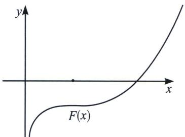
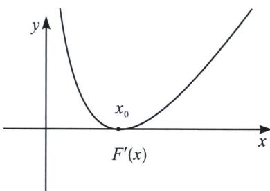
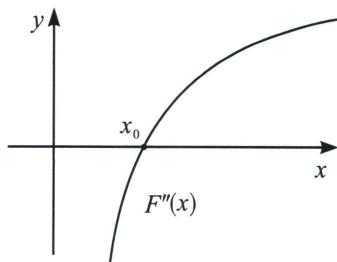

## 四、单调性调整与阿达玛积分不等式

1. 和型 $x_{1} + x_{2} > 2x_{0}$ 构造 $F(x) = x^{2} - 2x_{0}x + \lambda f(x)$

极值点偏移构造 $x_{2}^{2}-2x_{0}x_{2}>x_{1}^{2}-2x_{0}x_{1}$ 单调调整函数 $F(x)=x^{2}-2x_{0}x+\lambda f(x)$

若要证明 $x_{2}^{2}-2x_{0}x_{2}>x_{1}^{2}-2x_{0}x_{1}$ ，则需要在 $f(x)=0$ 为前提的条件下，构造含有 $x^{2}-2x_{0}x$ 的单调增函数，不妨令 $F(x)=x^{2}-2x_{0}x+\lambda f(x)$ ，通过 $\left\{\begin{aligned}F'(x_{0})&=0\\ F''(x_{0})&=0\end{aligned}\right.$ 来锁定系数 $\lambda$ ，从而证明 $F'(x)\geqslant0$ 恒成立，也可以构造 $F(x)=x^{2}-2x_{0}x+\lambda\mathrm{e}^{f(x)}$ 或者 $F(x)=x^{2}-2x_{0}x+\lambda\ln[f(x)+1]$ 等一系列待证调整式.

积型 $x_{1}x_{2} < m$ 构造 $F(x) = x + \frac{m}{x} +\lambda f(x)$ 单调减函数

$x_{1}x_{2}<m\Leftrightarrow x_{1}+\frac{m}{x_{1}}>x_{2}+\frac{m}{x_{2}}$ ，这也是前面我们介绍对勾拟合的时候介绍到的，我们需要构造处于同一极值点的函数 $f(x)$ ，即此函数满足条件 $f'(\sqrt{m})=0$ ，此时我们构造 $F(x)=x+\frac{m}{x}+\lambda f(x)$ ，利用导函数极点效应构造单调递减函数 $F(x)=x+\frac{m}{x}+\lambda f(x)$ ，锁定 $\lambda$ .

2. 阿达玛积分不等式

如果一个函数 $y=f(x)$ 是凸函数，即： $f''(x)<0$ ，则在区间 $(a,b)$ 上，不等式

$$
f \left(\frac {a + b}{2}\right) \geqslant \frac {1}{b - a} \int_ {a} ^ {b} f (x) d x = \frac {f (b) - f (a)}{b - a} \geqslant \frac {f (a) + f (b)}{2};
$$

如果一个函数 $y=f(x)$ 是凹函数，即： $f''(x)>0$ ，则在区间 $(a,b)$ 上，不等式

$$
f \Big (\frac {a + b}{2} \Big) \leqslant \frac {1}{b - a} \int_ {a} ^ {b} f (x) d x = \frac {f (b) - f (a)}{b - a} \leqslant \frac {f (a) + f (b)}{2};
$$

注意: 证明极值点偏移时需要把导函数当做原函数, 求三阶导判断导函数凹凸性, 阿达玛积分不等式一般应用在待证式不含参的标准偏移中.

单调性调整的思想本质为拟合思想，以下题为例。

①代征式不含参，直接调整

![[高中/总复习/专题/2026版高中《mst老唐说题》导数专题（数学）/下册/第09章_导数与双变量/第二节_极值点偏移/四_单调性调整与阿达玛积分不等式/例题/Q00052832.md]]
![[高中/总复习/专题/2026版高中《mst老唐说题》导数专题（数学）/下册/第09章_导数与双变量/第二节_极值点偏移/四_单调性调整与阿达玛积分不等式/例题/Q00052833.md]]
![[高中/总复习/专题/2026版高中《mst老唐说题》导数专题（数学）/下册/第09章_导数与双变量/第二节_极值点偏移/四_单调性调整与阿达玛积分不等式/例题/Q00052834.md]]
![[高中/总复习/专题/2026版高中《mst老唐说题》导数专题（数学）/下册/第09章_导数与双变量/第二节_极值点偏移/四_单调性调整与阿达玛积分不等式/例题/Q00052835.md]]
![[高中/总复习/专题/2026版高中《mst老唐说题》导数专题（数学）/下册/第09章_导数与双变量/第二节_极值点偏移/四_单调性调整与阿达玛积分不等式/例题/Q00052836.md]]
![[高中/总复习/专题/2026版高中《mst老唐说题》导数专题（数学）/下册/第09章_导数与双变量/第二节_极值点偏移/四_单调性调整与阿达玛积分不等式/例题/Q00052837.md]]
![[高中/总复习/专题/2026版高中《mst老唐说题》导数专题（数学）/下册/第09章_导数与双变量/第二节_极值点偏移/四_单调性调整与阿达玛积分不等式/例题/Q00052838.md]]
![[高中/总复习/专题/2026版高中《mst老唐说题》导数专题（数学）/下册/第09章_导数与双变量/第二节_极值点偏移/四_单调性调整与阿达玛积分不等式/例题/Q00047454.md]]
![[高中/总复习/专题/2026版高中《mst老唐说题》导数专题（数学）/下册/第09章_导数与双变量/第二节_极值点偏移/四_单调性调整与阿达玛积分不等式/例题/Q00047455.md]]
