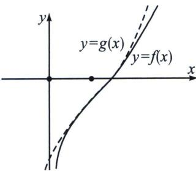

<!-- question-source:start -->
例1 (2025·四川攀枝花·三模)已知函数 $f(x)=\frac{x^{2}}{2}+\ln x-2ax(a>0)$ .

(1)若曲线 $y = f(x)$ 在点(1, $f (1)$ )处的切线在 $x$ 轴上的截距为 $\frac{3}{2}$ ，求实数 $a$ 的值；

(2)设数列 $\{a_{n}\}$ 的前n项和为 $S_{n}$ ，若对任意的正整数n，当 $a=\frac{a_{n}+2}{2}$ 时，函数 $f(x)$ 均存在两个极值点 $x_{n1}$ ， $x_{n2}$ ，且满足 $\left|x_{n2}-x_{n1}\right|=(n+1)a_{n}$ ，求 $S_{n}$ ;

(3)当 0 < a < 1 时，如果存在两个不同的正实数 m，n，满足 $f(m) + f(n) = 1 - 4a$ ，

$$
m + n > 2
$$

(1) $y = f(x)$ 在(1, $f (1)$ )处的切线为： $y - \left(\frac{1}{2} - 2a\right) = (2 - 2a)(x - 1)$ ，令 $y = 0$ 可得： $x = 1 - \frac{\frac{1}{2} - 2a}{2 - 2a} = \frac{3}{2}$ ，则 $a = \frac{1}{2}$ ，

(2)由 $f'(x)=x+\frac{1}{x}-2a=\frac{x^{2}-2ax+1}{x}$ ，因为当 $a=\frac{a_{n}+2}{2}$ 时，函数 $f(x)$ 均存在两个极值点 $x_{n1}, x_{n2}$ ，则有 $f'(x)=\frac{x^{2}-(a_{n}+2)x+1}{x}=0$ 有两个根 $x_{n1}, x_{n2}$ ，即 $\left|x_{n2}-x_{n1}\right|=\sqrt{(a_{n}+2)^{2}-4}=(n+1)a_{n}$ ，则 $(a_{n}+2)^{2}-4=(n+1)^{2}a_{n}^{2}$ ，因式分解得： $a_{n}\left[(n^{2}+2n)a_{n}-4\right]=0$ ，当 $a_{n}=0$ 时， $a=\frac{a_{n}+2}{2}=1$ ，此时 $f'(x)=\frac{x^{2}-2x+1}{x}=0$ 没有两个不等实根，故舍去，则 $(n^{2}+2n)a_{n}-4=0\Rightarrow a_{n}=\frac{4}{n^{2}+2n}=\frac{4}{n(n+2)}=2\left(\frac{1}{n}-\frac{1}{n+2}\right)$ ，所以 $S_{n}=a_{1}+a_{2}+a_{3}+a_{4}+\cdots+a_{n-1}+a_{n}=2\left(\frac{1}{1}-\frac{1}{3}\right)+2\left(\frac{1}{2}-\frac{1}{4}\right)+2\left(\frac{1}{3}-\frac{1}{5}\right)+2\left(\frac{1}{4}-\frac{1}{6}\right)+\cdots+2\left(\frac{1}{n-1}-\frac{1}{n+1}\right)+2\left(\frac{1}{n}-\frac{1}{n+2}\right)=2+2\times\frac{1}{2}+2\left(-\frac{1}{n+1}\right)+2\left(-\frac{1}{n+2}\right)=3-\frac{2}{n+1}-\frac{2}{n+2}$

(3) 因为 $f
(1)=\frac{1}{2}-2a$ ，所以 $f(m)+f(n)=1-4a=2f (1)$ ，由 $f'(x)=x+\frac{1}{x}-2a=\frac{x^{2}-2ax+1}{x}$ ，因为 0<a<1，满足 $\Delta=4a^{2}-4<0$ ，所以 $f'(x)=\frac{x^{2}-2ax+1}{x}>0$ ，即此时 $f(x)=\frac{x^{2}}{2}+\ln x-2ax$ 在 $(0,+\infty)$ 上单调递增，根据 $f(m)+f(n)=2f (1)$ ，因为存在两个不同的正实数 m，n，所以不妨设 0<m<1<n，则要证明 $m+n>2$ ，即证 n>2-m>1，因为 $f(x)=\frac{x^{2}}{2}+\ln x-2ax$ 在 $(0,+\infty)$ 上单调递增，所以只需要证 $f(n)>f(2-m)$ ，

又因为 $f(m)+f(n)=1-4a$ ，所以只需要证： $1-4a-f(m)>f(2-m)$ ，即证明 $f(m)+f(2-m)<1-4a(0<m<1)$ ，记 $F(x)=f(x)+f(2-x)$ ， $x\in(0,1)$ ，则 $F'(x)=f'(x)+f'(2-x)=x+\frac{1}{x}-2a-\left(2-x+\frac{1}{2-x}-2a\right)=2x-2+\frac{1}{x}-\frac{1}{2-x}=2(x-1)+\frac{2-2x}{x(2-x)}=2(x-1)\left[1-\frac{1}{x(2-x)}\right]=$ $-2\frac{(x-1)^{3}}{x(2-x)}$ ，所以当 $x\in(0,1)$ 时， $F'(x)>0$ ，即 $F(x)$ 在 $x\in(0,1)$ 时单调递增，即 $F(x)<F
(1)=2f (1)=1-4a$ ，所以 $f(m)+f(2-m)<1-4a(0<m<1)$ 恒成立，即 $m+n>2$ 得证！

法二：三次函数拟合，结合图像，构造与 $f(x)=\frac{x^{2}}{2}+\ln x-2ax$ 共拐点(1, $f
(1)$ )的恒大函数，即 $f(x)=\frac{x^{2}}{2}+\ln x-2ax<x-1-\frac{(x-1)^{2}}{2}+\frac{1}{3}(x-1)^{3}+\frac{x^{2}}{2}-2ax=g(x)$ ，(自证单调性)，设 $f(m)=g(m_{1})$ ， $f(n)=g(n_{1})$ ，则 $f(m)+f(n)=g(m_{1})+g(n_{1})=2g (1)$ ， $m+n>m_{1}+n_{1}=2$ 得证！

<!-- question-source:end -->

![[高中/总复习/专题/2026版高中《mst老唐说题》导数专题（数学）/下册/第09章_导数与双变量/第五节_拐点偏移/例题/answers/Q00046821A1.md]]
