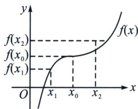
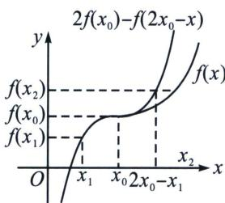

## 第五节 拐点偏移

拐点偏移定义：若函数 $f(x)$ 在定义域内连续且二阶可导，且 $f''(x_0) = 0, f'''(x_0) \neq 0$ 则 $(x_0, f(x_0))$ 是函数

$f(x)$ 的一个拐点．极值点是一阶导数 $f'(x_0)=0$ 的零点；拐点是二阶导数 $f''(x)$ 的零点；拐点是一阶导数 $f'(x)=0$ 的极值点．若 $f(x_1)+f(x_2)=2f(x_0)$ ，有 $x_0=\frac{x_1+x_2}{2}$ ，则拐点不偏移；若 $f(x_1)+f(x_2)=2f(x_0)$ ，有 $x_0>\frac{x_1+x_2}{2}$ ，则称拐点右偏；若 $f(x_1)+f(x_2)=2f(x_0)$ ，有 $x_0<\frac{x_1+x_2}{2}$ ，则称拐点左偏.

如我们熟悉的三次函数 $f(x)=x^{3}$ 的拐点为坐标原点.

作直线 $y=f(x_{0})+h$ 与函数 $y=f(x_{0})-h$ 分别交于 $A(x_{1}, f(x_{0})+h)$ ， $B(x_{2}, f(x_{0})-h)$ ，则 AB 的中点坐标为 $M\left(\frac{x_{1}+x_{2}}{2}\right)$ ， $f(x_{0})$ 。对于三次函数 $f(x)=x^{3}$ ，拐点的横坐标为 $x_{0}=\frac{x_{1}+x_{2}}{2}$ ，此时认为拐点居中，没有偏离中点。同样，我们可以发现对于三次函数，若其在定义域内单调，其拐点也居中，没有偏离中点。

然而很多含拐点的单调函数，由于拐点左、右的“增减速度”不同，函数图象不具有中心对称的性质，常常会有拐点 $x_0 \neq \frac{x_1 + x_2}{2}$ 的情况，这样就出现了拐点向左或向右偏移的情况。如右图所示：

  
无偏移

  
偏移之后

思路如下：如果需要判断 $x_{1} + x_{2}$ 与 $2x_{0}$ 的大小关系，则就需要判断 $x_{2}$ 与 $2x_{0} - x_{1}$ 的大小关系，也就需要判断 $f(x_{2})$ 与 $f(2x_{0} - x_{1})$ 的大小关系。而 $f(x_{1}) + f(x_{2}) = 2f(x_{0})$ ，因此就需要判断 $2f(x_{0}) - f(x_{1})(f(x_{2}) = f(x_{0}) - f(x_{1}))$ 与 $f(2x_{0} - x_{1})$ 的大小关系，也就需要判断 $f(x_{1}) + f(2x_{0} - x_{1})$ 与 $2f(x_{0})$ 的大小关系，于是就构建函数 $g(x) = f(x) + f(2x_{0} - x)$ 进行分析，或者利用三次函数拟合。仅以上右图为例，此时拐点左偏，在拐点处呈上升趋势， $x_{1}+x_{2}>2x_{0}\Rightarrow x_{1}+x_{2}>x^{\prime}_{1}+x^{\prime}_{2}=2x_{0}$ ，故可在拐点处拟合先大后大的三次函数，在拐点处取等即可，通常的方法有泰勒展开与待定系数法.

![[高中/总复习/专题/2026版高中《mst老唐说题》导数专题（数学）/下册/第09章_导数与双变量/第五节_拐点偏移/例题/Q00047489.md]]
![[高中/总复习/专题/2026版高中《mst老唐说题》导数专题（数学）/下册/第09章_导数与双变量/第五节_拐点偏移/例题/Q00047490.md]]
![[高中/总复习/专题/2026版高中《mst老唐说题》导数专题（数学）/下册/第09章_导数与双变量/第五节_拐点偏移/例题/Q00047491.md]]
![[高中/总复习/专题/2026版高中《mst老唐说题》导数专题（数学）/下册/第09章_导数与双变量/第五节_拐点偏移/例题/Q00047492.md]]
![[高中/总复习/专题/2026版高中《mst老唐说题》导数专题（数学）/下册/第09章_导数与双变量/第五节_拐点偏移/例题/Q00047493.md]]
