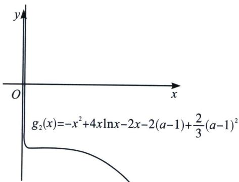

> [!faq]- 《导数专题(下册)》例题解析
>
> > [!success]- **【答案】** 详见解析
>
> > [!note]- **【解析】**
> > 解析 (1) $f'(x)=\frac{x-1}{x}(x>0)$ ，当0<x<1时， $f'(x)<0$ ， $f(x)$ 单调递减，当x>1时， $f'(x)>0$ ， $f(x)$ 单调递增；要使函数 $f(x)=x-\ln x-a$ 有两个相异零点，必有 $f(1)=1-a<0$ ，故a>1，当a>1时， $f(x)>-\ln x-a=0$ ，取 $x=e^{-a}$ ，且 $e^{-a}<1$ ，得函数 $f(x)$ 在 $(e^{-a},1)$ 有一个零点，又由于 $f(2a)=a-\ln 2a>0$ ，得函数 $f(x)$ 在 $(1,2a)$ 有一个零点，故a的取值范围为 $(1,+\infty)$ .
> >
> > (2)要证 $x_{1} + x_{2} < \frac{4a + 2}{3}$ , 故需要 $x_{1}^{2} - \frac{4a + 2}{3} x_{1} > x_{2}^{2} - \frac{4a + 2}{3} x_{2}$ , 只需 $3x_{1}^{2} - (4a + 2)x_{1} > 3x_{2}^{2} - (4a + 2)x_{2}$ , 由于 $a = x - \ln x$ , $3x_{1}^{2} - (4x_{1} - 4\ln x_{1} + 2)x_{1} > 3x_{2}^{2} - (4x_{2} - 4\ln x_{2} + 2)x_{2}$ , 构造 $g(x) = 3x^{2} - (4x - 4\ln x + 2)x$ , 显然 $g(x)$ 为非单调函数, 故需要进行泰勒追加, 令 $g_{1}(x) = -x^{2} + 4x\ln x - 2x + m$ , 即 $g_{1}(x) = -[(x - 1) + 1]^{2} + 4[(x - 1) + 1]\ln x - 2(x - 1) - 2 + m$ , 所以 $g(x) \sim -(x - 1)^{2} + 4(x - 1)^{2} - 4\frac{(x - 1)^{2}}{2} = (x - 1)^{2}$ , $g(x)$ 的二阶泰勒展开为 $(x - 1)^{2}$ , 而 $a = x - \ln x \sim x - \left((x - 1) - \frac{(x - 1)^{2}}{2}\right) = 1 + \frac{(x - 1)^{2}}{2}$ , 所以 $(x - 1)^{2} \sim 2(x - \ln x - 1) = 2(a - 1)$ , 故泰勒追加抵消掉二阶 $(x - 1)^{2}$ 的函数为: $g_{1}(x) = 3x^{2} - (4x - 4\ln x + 2)x - 2(a - 1) = -x^{2} + 4x\ln x - 4x + 2\ln x + 2$ , 此函数还是不单调, 故需要在 $g_{1}(x)$ 的基础下继续追加, $g_{1}(x)$ 的泰勒展开二阶系数已经在刚才的追加下变为0. $g_{1}(x) = -x^{2} + 4x\ln x - 2x - 2a + 2 = -x^{2} - 4x + 2 + (4x + 2)\ln x$ , 我们分析泰勒四阶含 $(x - 1)^{4}$ 部分, 能产生四阶的变量就是 $(4x + 2)\ln x = (4x - 4)\ln x + 6\ln x = 4(x - 1)\frac{(x - 1)^{3}}{3} - 6\frac{(x - 1)^{4}}{4}$ , 故 $g(x)$ 泰勒展开的 $(x - 1)^{4}$ 系数为 $-\frac{1}{6}$ , 由于 $(x - 1)^{2} \sim 2(a - 1)$ , 故 $4(a - 1)^{2} \sim (x - 1)^{4}$ , 即 $-\frac{2}{3}(a - 1)^{2} \sim -\frac{1}{6}(x - 1)^{4}$ , 于是追加: $g_{2}(x) = g_{1}(x) + \frac{2}{3}(a - 1)^{2}$ , $g_{2}(x) = -x^{2} + 4x\ln x - 2x - 2(a - 1) + \frac{2}{3}(a - 1)^{2}$ , 展开得: $g_{2}(x) = -x^{2} + 4x\ln x - 2x - 2(x - \ln x - 1) + \frac{2}{3}(x - \ln x - 1)^{2}$ , 如图, 此时单调. 所以 $3x_{1}^{2} - (4a + 2)x_{1} - 2(a + 1) + \frac{2}{3}(a - 1)^{2} > 3x_{2}^{2} - (4a + 2)x_{2} - 2(a + 1) + \frac{2}{3}(a - 1)^{2}$ , 即 $x_{1} + x_{2} < \frac{4a + 2}{3}$ .
> >
> > 
> >
> > 注意: 单调的判定依据是: 追加后的连续三阶泰勒求导后提取的二次函数因式的 $\Delta < 0$ , 则单
> >
> > 调．一般单峰函数泰勒追加到二阶即可，双峰函数，则要追加到四阶.
> >
> > 本题上一节介绍了单调性调整，无论是泰勒追加，还是单调性调整，我们发现构造的函数是一致的(除了常数项不同，但不影响单调性)到最后比拼的就是算力，高考中不会以高精度的极值点偏移作为命题主导方向，高考重视思维逻辑，并非机械算力。所以参加高考的同学们没必要沉迷于高精度极值点偏移。
