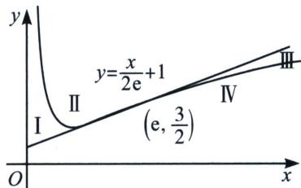
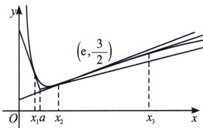

<!-- question-source:start -->
例 3 (2022 · 浙江) 设函数 $f(x)=\frac{e}{2x}+\ln x(x>0)$ .

(1)求 $f(x)$ 的单调区间；

(2)已知 $a, b \in \mathbb{R}$ , 曲线 $y = f(x)$ 上不同的三点 $(x_1, f(x_1)), (x_2, f(x_2)), (x_3, f(x_3))$ 处的切线都经过点 $(a, b)$ . 证明:

(i) 若 a > e，则 $0 < b - f(a) < \frac{1}{2}\left(\frac{a}{e} - 1\right)$ ;

(ii) 若 $0 < a < e, x_{1} < x_{2} < x_{3}$ , 则 $\frac{2}{e} + \frac{e - a}{6e^{2}} < \frac{1}{x_{1}} + \frac{1}{x_{3}} < \frac{2}{a} - \frac{e - a}{6e^{2}}$ .

(注： $e=2.71828\cdots$ 是自然对数的底数)

(1) 因为函数 $f(x) = \frac{e}{2x} + \ln x (x > 0)$ ，所以 $f'(x) = -\frac{e}{2x^2} + \frac{1}{x} = \frac{2x - e}{2x^2}$ ， $(x > 0)$ ，由 $f'(x) = \frac{2x - e}{2x^2} > 0$ ，得 $x > \frac{e}{2}$ ，所以 $f(x)$ 在 $(\frac{e}{2}, +\infty)$ 上单调递增；由 $f'(x) = \frac{2x - e}{2x^2} < 0$ ，得 $0 < x < \frac{e}{2}$ ，所

以 $f(x)$ 在 $\left(0, \frac{e}{2}\right)$ 上单调递减.

(2)(i)思路分析: 本题考查了切线界定, 根据《秒二》提到的拐点切线界定, 由 $y = f(x)$ 拐点 $\left(e, \frac{3}{2}\right)$ 处切线和 $y = f(x)$ 将平面划分为 I、II、III、IV 四个区域, 如图, 当 $x > e$ 时, 位于区域 III 内的任意一点能作 $y = f(x)$ 三条切线, 所以满足 $f(a) < b < \frac{a}{2e} + 1 < \frac{a}{2e} - \frac{1}{2} + f(a)_{\min} = \frac{a}{2e} + 1 + \frac{1}{2} \ln \frac{4}{e}$ .

证明：因为过 $(a, b)$ 有三条不同的切线，设切点分别为 $(x_{1}, f(x_{1}))$ ， $(x_{2}, f(x_{2}))$ ， $(x_{3}, f(x_{3}))$ ，所以 $f(x_{i}) - b = f'(x_{i})(x_{i} - a)$ ， $(i = 1, 2, 3)$ ，所以方程 $f(x) - b = f'(x)(x - a)$ 有 3 个不同的根，该方程整理为 $\left(\frac{1}{x} - \frac{e}{2x^{2}}\right)(x - a) - \frac{e}{2x} - \ln x + b = 0$ ，设 $g(x) = \left(\frac{1}{x} - \frac{e}{2x^{2}}\right)(x - a) - \frac{e}{2x} - \ln x + b$ ，则 $g'(x) = \frac{1}{x} - \frac{e}{2x^{2}} + \left(-\frac{1}{x^{2}} + \frac{e}{x^{3}}\right)(x - a) - \frac{1}{x} + \frac{e}{2x^{2}} = -\frac{1}{x^{3}}(x - e)(x - a)$ ，当 $0 < x < e$ 或 $x > a$ 时， $g'(x) < 0$ ；当 $e < x < a$ 时， $g'(x) > 0$ ，所以 $g(x)$ 在 $(0, e)$ ， $(a, +\infty)$ 上为减函数，在 $(e, a)$ 上为增函数，因为 $g(x)$ 有 3 个不同的零点，所以 $g(e) < 0$ 且 $g(a) > 0$ ，所以 $\left(\frac{1}{e} - \frac{e}{2e^2}\right)(e - a) - \frac{e}{2e} - \ln e + b < 0$ ，且 $\left(\frac{1}{a} - \frac{e}{2a^2}\right)(a - a) - \frac{e}{2a} - \ln a + b > 0$ ，整理得到 $b < \frac{a}{2e} + 1$ 且 $b > \frac{e}{2a} + \ln a = f(a)$ ，即 $b < \frac{a}{2e} + 1$ ，且 $b > \frac{e}{2a} + \ln a = f(a)$ ， $b - f(a) - \frac{1}{2}\left(\frac{a}{e} - 1\right) < \frac{a}{2e} + 1 - \left(\frac{e}{2a} + \ln a\right) - \frac{e}{2a} - \ln a + b > 0$ 整理得 $b < \frac{a}{2e} + 1$ ，且 $b > \frac{e}{2a} + \ln a = f(a)$ ， $b - f(a) - \frac{1}{2}\left(\frac{a}{e} - 1\right) < \frac{a}{2e} + 1 - \left(\frac{e}{2a} + \ln a\right) - \frac{a}{2e} + \frac{1}{2} = \frac{3}{2} - \frac{e}{2a} - \ln a$ ，设 $\mu(a)$ 为 $(e, +\infty)$ 上的减函数，所以 $\mu(a) < \frac{3}{2} - \frac{e}{2e} - \ln e = 0$ ，所以 $0 < b - f(a) < \frac{1}{2}\left(\frac{a}{e} - 1\right)$ .

(ii) 当 0 < a < e 时，同 (i) 讨论，得： $g(x)$ 在 $(0, a)$ ， $(e, +\infty)$ 上为减函数，在 $(a, e)$ 上为增函数，不妨设 $x_{1} < x_{2} < x_{3}$ ，则 $0 < x_{1} < a < x_{2} < e < x_{3}$ （如图），因为 $x_{1} < x_{2} < x_{3}$ ，所以 $0 < x_{1} < a < x_{2} < e < x_{3}$ ，

因为 $g(x)=1-\frac{a+e}{x}+\frac{ea}{2x^{2}}-\ln x+b$ ，设 $t=\frac{1}{x}$ ，则 $1-\frac{a+e}{x}+\frac{ea}{2x^{2}}-\ln x+b=0$ ，即： $\frac{ea}{2}t^{2}-(a+e)t+1+\ln t+b=0$ ，记 $t_{1}=\frac{1}{x_{1}}$ ， $t_{2}=\frac{1}{x_{2}}$ ， $t_{3}=\frac{1}{x_{3}}\left(\frac{t_{1}}{t_{3}}=\frac{x_{3}}{x_{1}}> \frac{e}{a}\right)$ ，

要证： $\frac{2}{e} +\frac{e - a}{6e^2} <  \frac{1}{x_1} +\frac{1}{x_3} <  \frac{2}{a} -\frac{e - a}{6e^2}$ ，即证 $\frac{2}{e} +\frac{e - a}{6e^2} <  t_1 + t_3 <   \frac{2}{a} -\frac{e - a}{6e^2},$

$\left\{ \begin{array}{l} \frac{ea}{2} t_1^2 - (a + e) t_1 + \ln t_1 + b + 1 = 0① \\ \frac{ea}{2} t_3^2 - (a + e) t_3 + \ln t_3 + b + 1 = 0② \end{array} \right.$ ，作差得： $\frac{ea}{2}(t_1^2 - t_3^2) - (a + e)(t_1 - t_3) + \ln \frac{t_1}{t_3} = 0③$ ，要构造 $t_1 +$

$t_{3}$ 的二次不等式，则必须齐次化构造，同乘以 $\frac{t_{1}+t_{3}}{t_{1}-t_{3}}$ ，得： $\frac{ea}{2}(t_{1}+t_{3})^{2}-(a+e)(t_{1}+t_{3})+\frac{t_{1}+t_{3}}{t_{1}-t_{3}}\ln\frac{t_{1}}{t_{3}}=0$ ，即 $(t_{1}+t_{3})^{2}-\left(\frac{2}{a}+\frac{2}{e}\right)(t_{1}+t_{3})+\frac{2}{a}e\frac{t_{1}+t_{3}}{t_{1}-t_{3}}\ln\frac{t_{1}}{t_{3}}=0$ ;

要满足 $\frac{2}{e} +\frac{e - a}{6e^2} <  t_1 + t_3 <   \frac{2}{a} -\frac{e - a}{6e^2}$ ，则需 $\left(t_{1} + t_{3} - \frac{2}{e} -\frac{e - a}{6e^{2}}\right)\left(t_{1} + t_{3} - \frac{2}{a} +\frac{e - a}{6e^{2}}\right) <   0$ ，展开得：

$$
(t _ {1} + t _ {3}) ^ {2} - \left(\frac {2}{a} + \frac {2}{e}\right) (t _ {1} + t _ {3}) + \frac {4}{a e} + \frac {e - a}{6 e ^ {2}} \left(\frac {2}{a} - \frac {2}{e}\right) - \frac {(e - a) ^ {2}}{3 6 e ^ {4}} <   0;
$$

故只需证 $2 + \frac{(e - a)^2}{6e^2} -\frac{(e - a)^2}{36e^4}\cdot \frac{ae}{2} <  \frac{t_1 + t_3}{t_1 - t_3}\ln \frac{t_1}{t_3} = \frac{\frac{t_1}{t_3} + 1}{\frac{t_1}{t_3} - 1}\ln \frac{t_1}{t_3},$ 令 $s = \frac{t_1}{t_3}$

根据帕德逼近 $R_{2,2}(x) = \frac{3(x^2 - 1)}{x^2 + 4x + 1}$ ，且 $x > 1$ 时， $\ln x > \frac{3(x^2 - 1)}{x^2 + 4x + 1}$ ，所以 $\frac{s + 1}{s - 1} \ln s > \frac{3(s + 1)^2}{s^2 + 4s + 1} = 3\left(1 - \frac{2s}{s^2 + 4s + 1}\right)$ ，由于 $s > \frac{e}{a} = s_0$ ，由于 $g(x) = \frac{x + 1}{x - 1} \ln x$ 单调递增（证明参考上题），

故只需证 $3\left(1 - \frac{2s_0}{s_0^2 + 4s_0 + 1}\right) > 2 + \frac{(s_0 - 1)^2}{6s_0^2} - \frac{(s_0 - 1)^2}{72s_0^3}$ ，只需证 $72s_0^3 > (s_0^2 + 4s_0 + 1)(12s_0 - 1)$ ，即证 $60s_0^3 - 47s_0^2 - 8s_0 + 1 > 0$ ，当 $s_0 = \frac{e}{a} > 1$ 时，显然成立，命题得证.

注意: $60s_{0}^{3}-47s_{0}^{2}-8s_{0}+1>0$ , 可令 $r=\frac{1}{s_{0}}$ , 即 $r^{3}>8r^{2}+47r-60$ 对 $r \in(0,1)$ 恒成立, 所以根据简单的二次三次函数图像即可判断, 这样缩小范围来判断恒成立问题也是处理三次函数的常见手段. 关于构造函数 $g(x)=\frac{x+1}{x-1} \cdot \ln x$ , 本题省略了, 大家可以参考例 2 补齐步骤.

## 二、泰勒展开与加强

我们根据泰勒展开， $e^{x}=1+x+\frac{x^{2}}{2}+\frac{x^{3}}{6}+\frac{x^{4}}{4!}+\cdots$ ，同理， $e^{-x}=1-x+\frac{x^{2}}{2}-\frac{x^{3}}{6}+\frac{x^{4}}{4!}\cdots$ ，我们可得 $\left\{\begin{aligned}e^{x}>1+x+\frac{x^{2}}{2}+\frac{x^{3}}{6}+\frac{x^{4}}{4!(x>0)}①\\ e^{-x}<1-x+\frac{x^{2}}{2}-\frac{x^{3}}{6}+\frac{x^{4}}{4!(x>0)}②\end{aligned}\right.$ 两式相减，可得，当x>0时， $e^{x}-e^{-x}>2x+\frac{x^{3}}{3}$ ，令 $e^{x}=t$ ，故 $t-\frac{1}{t}>2\ln t+\frac{(\ln t)^{3}}{3}(t>1)$ ，同理，我们也可以推出 $t-\frac{1}{t}<2\ln t+\frac{(\ln t)^{3}}{3}(0<t<1)$ .

利用对数的泰勒展开 $\ln(1+x)=x-\frac{x^{2}}{2}+\frac{x^{3}}{3}-\frac{x^{4}}{4}+\frac{x^{5}}{5}\cdots$ ，同理 $\ln(1-x)=-x-\frac{x^{2}}{2}-\frac{x^{3}}{3}-\frac{x^{4}}{4}-\frac{x^{5}}{5}\cdots$ ，
即 $\left\{\begin{aligned}\ln(1+x)>x-\frac{x^{2}}{2}+\frac{x^{3}}{3}-\frac{x^{4}}{4}(x>0)\textcircled{①}\\ \ln(1-x)<-x-\frac{x^{2}}{2}-\frac{x^{3}}{3}-\frac{x^{4}}{4}(x>0)\textcircled{②}\end{aligned}\right.$ ，两式相减得： $\ln\frac{1+x}{1-x}>2x+\frac{2x^{3}}{3}(x>0)$ ，令 $\frac{1+x}{1-x}=t(t>1)$ ，则有 $x=\frac{t-1}{t+1}$ ，故 $\ln t>\frac{2(t-1)}{t+1}+\frac{2(t-1)^{3}}{3(t+1)^{3}}(t>1)$ ，同理也能证明 $\ln t<\frac{2(t-1)}{t+1}+\frac{2(t-1)^{3}}{3(t+1)^{3}}(0<t<1)$ .

这类型加强的不等式，继帕德逼近之后，也能用来解答22年浙江卷压轴题的压轴问.
<!-- question-source:end -->

![[高中/总复习/专题/2026版高中《mst老唐说题》导数专题（数学）/下册/第09章_导数与双变量/第六节_浙江风格的双变量/例题/answers/Q00046828A1.md]]
