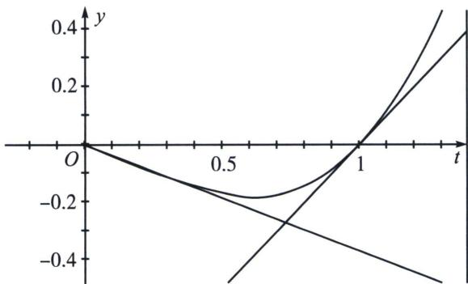

> [!faq]- 《导数专题(下册)》例题解析
>
> > [!success]- **【答案】** 详见解析
>
> > [!note]- **【解析】**
> > 解析 (1) $f'(x)=\frac{1}{x}-2x+1=-\frac{(2x+1)(x-1)}{x}$ ，x>0，当 $x\in(0,1)$ 时， $f'(x)>0$ ，当 $x\in(1,+\infty)$ 时， $f'(x)<0$ ，所以 $f(x)$ 的单调递增区间为(0,1)，单调递减区间为(1, $+\infty$ ).
> >
> > (2)由(1)知, \(f(x)\) 的最大值为 \(f(1)=0\), 要使 \(f(f(x)+1) \geqslant 0\) 成立, 则只可能是 \(f(f(x)+1)=0\) 成立, 由(1)知, 此时需要 \(f(x)+1=1\), 所以 \(f(x)=0\), 所以 \(x=1\), 即 \(x\) 的取值范围是 \(\{1\}\). 前两问已经属于送分, 第三问就是 \(\ln x = mx^{2} (m \in \mathbb{R})\) 两个解满足 \((x\_{1}^{2} + x\_{2}^{2}) \left(1 + \frac{1}{x\_{2}} - \frac{1}{x\_{1}}\right) > e+1\), 本题结论部分没有参数 \(m\), 并且由和式 \((x\_{1}^{2} + x\_{2}^{2})\) 与差式 \(\left(1 + \frac{1}{x\_{2}} - \frac{1}{x\_{1}}\right)\) 两部分构成, 显然需要分开处理, 和式部分乐意考虑 ALG 不等式, 即 \(\ln x\_{2} - \ln x\_{1} = m(x\_{2}^{2} - x\_{1}^{2}) \Leftrightarrow \frac{(x\_{2}^{2} - x\_{1}^{2})}{\ln x\_{2}^{2} - \ln x\_{1}^{2}} = \frac{1}{2m} < \frac{x\_{1}^{2} + x\_{2}^{2}}{2} \Rightarrow x\_{1}^{2} + x\_{2}^{2} > \frac{1}{m}\); 根据题意, 只需证明 \(1 + \frac{1}{x\_{2}} - \frac{1}{x\_{1}} > (e+1)m\), 一看是大于的形式, 就容易想到割线夹, 实则不然, 因为 \(\frac{1}{x\_{2}} - \frac{1}{x\_{1}} < 0\), 故本题应该转化为 \(\frac{1}{x\_{1}} - \frac{1}{x\_{2}} < 1 - (e+1)m\), 这就转化为一个关于参数 \(m(y\) 的值)的一次线性函数, 这就很明显的切线夹特征 (两个交点被两条切线卡在中间), 不妨换元, 令 \(t\_{1}=\frac{1}{x\_{2}}\), \(t\_{2}=
> >
> > $$
> > \frac {1}{x _ {1}}
> > $$
> >
> > $$
> > t ^ {2} \ln t = - m \left(0 <   m <   \frac {1}{2 e}\right)
> > $$
> >
> > $$
> > t _ {1} - t _ {2} <   1 - (\mathrm{e} + 1) m
> > $$
> >
> > $f(t)=t^{2}\ln t,\quad f^{\prime}(t)=2t\ln t+t,\quad f^{\prime\prime}(t)=2\ln t+3$ ，显然，当 $t=e^{-\frac{3}{2}}$ 时 $f^{\prime\prime}(t)=0$ ，本题出现了拐点，显然在 $t<e^{-\frac{3}{2}}$ ， $f^{\prime\prime}(t)<0$ ，切点位于此区间的切线位于函数 $f(t)=t^{2}\ln t$ 上方，当 $t>e^{-\frac{3}{2}}$ ， $f^{\prime\prime}(t)>0$ ，切点位于此区间的切线位于函数 $f(t)=t^{2}\ln t$ 下方，所以本题就需要根据右边零点t=1处的切线y=t-1，即构造 $t^{2}\ln t\geqslant t-1$ ，当 $t_{3}-1=-m\Rightarrow t_{3}=1-m$ ，根据 $t_{1}-t_{2}<t_{3}-t_{4}=1-(e+1)m$ ，则 $t_{4}=em$ ，所以另外一条切线夹为 $-m=y=-\frac{t}{e}$ ，即需证明 $t^{2}\ln t\geqslant-\frac{t}{e}\Leftrightarrow t\ln t\geqslant-\frac{1}{e}$ ，显然成立；接下来就是千篇一律的书学过程：
> >
> > (3)由 $f(x)=(m-1)x^{2}+x$ ，得 $\ln x=mx^{2}(m\in\mathbb{R})$ ，若 $f(x)=(m-1)x^{2}+x$ 有两个不同的实数解 $x_{1}$ ， $x_{2}(x_{1}<x_{2})$ ，则 $\ln x_{1}=mx_{1}^{2}$ ， $\ln x_{2}=mx_{2}^{2}$ ，两式相减得 $\ln x_{2}-\ln x_{1}=m(x_{2}^{2}-x_{1}^{2})$ ，所以 $\frac{2(x_{2}^{2}-x_{1}^{2})}{\ln x_{2}^{2}-\ln x_{1}^{2}}=\frac{1}{m}$ ，不妨设 $g(x)=\ln x-\frac{2(x-1)}{x+1}$ ， $x\in(1,+\infty)$ ，则 $g'(x)=\frac{1}{x}-\frac{4}{(x+1)^{2}}=\frac{(x-1)^{2}}{x(x+1)^{2}}>0$ ，所以 $g(x)$ 在 $(1,+\infty)$ 上单调递增，此时 $g(x)>g(1)=0$ ，所以 $\ln x>\frac{2(x-1)}{x+1}$ ，所以 $\ln\frac{x_{2}^{2}}{x_{1}^{2}}>\frac{2\left(\frac{x_{2}^{2}}{x_{1}^{2}}-1\right)}{\frac{x_{2}^{2}}{x_{1}^{2}}+1}$ ，即 $x_{2}^{2}+x_{1}^{2}>\frac{2(x_{2}^{2}-x_{1}^{2})}{\ln x_{2}^{2}-\ln x_{1}^{2}}$ ，所以 $x_{2}^{2}+x_{1}^{2}>\frac{1}{m}①$ ，由 $f(x)=(m-1)x^{2}+x$ ，得 $\frac{\ln x}{x^{2}}=m(m\in\mathbb{R})$ 有两个不同的实数解 $x_{1},x_{2}(x_{1}<x_{2})$ ，令 $\varphi(x)=\frac{\ln x}{x^{2}},\varphi'(x)=\frac{1-2\ln x}{x^{3}}$ ，当 $0<x<e^{\frac{1}{2}}$ 时， $\varphi'(x)>0,\varphi(x)$ 单调递增，当 $x>e^{\frac{1}{2}}$ 时， $\varphi'(x)<0,\varphi(x)$ 单调递减且恒大于0，由 $\varphi(e^{\frac{1}{2}})=\frac{1}{2e},\varphi(1)=0$ ，所以 $1<x_{1}<e^{\frac{1}{2}}<x_{2},0<m<\frac{1}{2e}$ 。令 $t=\frac{1}{x}$ ，则方程 $t^{2}\ln t=-m$ 有两个不同的实数解 $t_{1}=\frac{1}{x_{2}},t_{2}=\frac{1}{x_{1}}$ ，由(2)知 $f(x)=\ln x-x^{2}+x\leqslant0$ ，则有 $t^{2}\ln t\leqslant t-1$ 。设 $h(t)=t\ln t,t\in(0,+\infty)$ ，则 $h'(t)=\ln t+1$ ，当 $0<t<\frac{1}{e}$ 时， $h'(t)<0,h(t)$ 单调递减，当 $t>\frac{1}{e}$ 时， $h'(t)>0,h(t)$ 单调递增，此时 $h(t)\geqslant h\left(\frac{1}{e}\right)=-\frac{1}{e}$ ，即 $t\ln t\geqslant-\frac{1}{e}$ ，故 $t^{2}\ln t\geqslant-\frac{1}{e}t$ ，当且仅当 $t=\frac{1}{e}$ 时等号成立。不妨设直线y=-m与直线 $y=-\frac{1}{e}t,y=t-1$ 交点的横坐标分别为 $t_{1}'$ ， $t_{2}'$ ，则 $t_{2}-t_{1}<t_{2}'-t_{1}'=1-m-em=1-(e+1)m$ ，所以 $1+\frac{1}{x_{2}}-\frac{1}{x_{1}}>(e+1)m②$ 。综上，结合①②可得： $(x_{1}^{2}+x_{2}^{2})(1+\frac{1}{x_{2}}-\frac{1}{x_{1}})\gt\frac{1}{m}\cdot(e+1)m=e+1.$
> >
> > 
