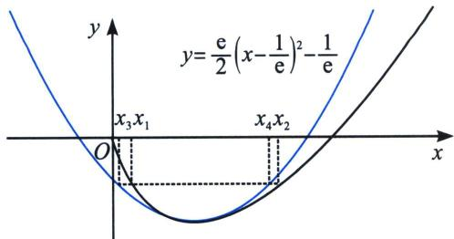
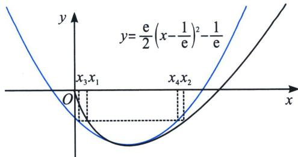
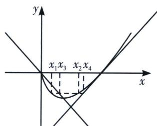

> [!faq]- 《导数专题(下册)》例题解析
>
> > [!success]- **【答案】** 详见解析
>
> > [!note]- **【分析】**
> > 先构左边： $g_{1}(x)=a_{1}\left(x-\frac{1}{\mathrm{e}}\right)^{2}-\frac{1}{\mathrm{e}}$ ，令 $h(x)=f(x)-g_{1}(x)$ ，极值点处二阶导 $h''\left(\frac{1}{\mathrm{e}}\right)=0$ ，得出 $a_{1}=\frac{\mathrm{e}}{2}$ ，所以构造 $h(x)=f(x)-g_{1}(x)=x\ln x-\frac{\mathrm{e}}{2}\left(x-\frac{1}{\mathrm{e}}\right)^{2}+\frac{1}{\mathrm{e}}$ ，如下左图；再构右边： $g_{2}(x)=a_{2}x(x-1)$ ，代入点 $\left(\frac{1}{\mathrm{e}},-\frac{1}{\mathrm{e}}\right)$ 得： $a_{2}=\frac{\mathrm{e}}{\mathrm{e}-1}$ ，构造 $m(x)=f(x)-g_{2}(x)=x\ln x-\frac{\mathrm{e}}{\mathrm{e}-1}x(x-1)$ ，如下右图.
> >
> > 
> >
> > 
>
> > [!note]- **【解析】**
> > 解析：设顶点为 $\left(\frac{1}{\mathrm{e}}, -\frac{1}{\mathrm{e}}\right)$ 的二次函数为 $g_{1}(x) = \frac{\mathrm{e}}{2}\left(x - \frac{1}{\mathrm{e}}\right)^{2} - \frac{1}{\mathrm{e}}$ ， $h(x) = f(x) - g_{1}(x) = x\ln x - \frac{\mathrm{e}}{2}\left(x - \frac{1}{\mathrm{e}}\right)^{2} + \frac{1}{\mathrm{e}}$ ， $h'(x) = \ln x - \mathrm{e}\left(x - \frac{1}{\mathrm{e}}\right)$ ， $h''(x) = \frac{1}{x} - \mathrm{e}$ ， $h''\left(\frac{1}{\mathrm{e}}\right) = 0$ ， $h''(x)$ 在 $\left(0, \frac{1}{\mathrm{e}}\right)$ 恒正， $h'(x)$ 单调递增， $h''(x)$ 在 $\left(\frac{1}{\mathrm{e}}, +\infty\right)$ 恒负， $h'(x)$ 单调递减；故 $h'(x) \leqslant h'(1) = 0$ ，则 $h(x)$ 在 $(0, +\infty)$ 单调递减，由于 $h\left(\frac{1}{\mathrm{e}}\right) = 0$ ，故 $x \in \left(0, \frac{1}{\mathrm{e}}\right)$ 时， $h(x) > 0$ ，即 $x\ln x > \frac{\mathrm{e}}{2}\left(x - \frac{1}{\mathrm{e}}\right)^{2} - \frac{1}{\mathrm{e}}$ ； $x \in \left(\frac{1}{\mathrm{e}}, +\infty\right)$ 时， $h(x) < 0$ ，即 $x\ln x < \frac{\mathrm{e}}{2}\left(x - \frac{1}{\mathrm{e}}\right)^{2} - \frac{1}{\mathrm{e}}$ ；
> >
> > 由于 $f(x_{1})-m=f(x_{2})-m=0,\quad0<x_{1}<\frac{1}{e}<x_{2}<1$ ，故有 $\left\{\begin{aligned} &x\ln x-m>\frac{e}{2}\left(x-\frac{1}{e}\right)^{2}-\frac{1}{e}-m=0\left(0<x<\frac{1}{e}\right)\\ &x\ln x-m<\frac{e}{2}\left(x-\frac{1}{e}\right)^{2}-\frac{1}{e}-m=0\left(x>\frac{1}{e}\right)\end{aligned}\right.$ $\frac{e}{2}\left(x_{2}-\frac{1}{e}\right)^{2}>\frac{e}{2}\left(x_{1}-\frac{1}{e}\right)^{2}\Rightarrow x_{1}+x_{2}>\frac{2}{e}$ 得证，令 $g_{2}(x)=\frac{e}{e-1}x(x-1), h(x)=f(x)-g_{2}(x)=x\ln x-\frac{e}{e-1}x(x-1)=x\left[\ln x-\frac{e}{e-1}(x-1)\right], m(x)=\ln x-\frac{e}{e-1}(x-1), m'(x)=\frac{1}{x}-\frac{e}{e-1}$ ，易知 $m'(x)$ 单调递减，当 $x\in\left(0,\frac{e-1}{e}\right)$ 时， $m'(x)>0$ ，此时 $m(x)$ 单调递增，当 $x\in\left(\frac{e-1}{e},1\right)$ 时， $m'(x)<0,\quad m(x)$ 单调递减，由于 $x\to0$ 时， $m(x)\to-\infty,\quad h(x)\to0,\quad h(1)=0,\quad h(1)=0,\quad m\left(\frac{1}{e}\right)=0$ ，故当 $x\in\left(0,\frac{1}{e}\right)$ 时， $h(x)<0$ ；当 $x\in(1,e)$ 时， $h(x)<0$ ，
> >
> > 即 $\left\{ \begin{array}{l} x \ln x - m < \frac{\mathrm{e}}{\mathrm{e} - 1} x (x - 1) - m = 0 \left(0 < x < \frac{1}{\mathrm{e}}\right) \\ x \ln x - m > \frac{\mathrm{e}}{\mathrm{e} - 1} x (x - 1) - m = 0 \left(\frac{1}{\mathrm{e}} < x < 1\right) \end{array} \right.$ ，分别取 $\left\{ \begin{array}{l} x_3 = \frac{1}{2} - \frac{\sqrt{\mathrm{e}^2 - 4me(e - 1)}}{2\mathrm{e}} \\ x_4 = \frac{1}{2} + \frac{\sqrt{\mathrm{e}^2 - 4me(e - 1)}}{2\mathrm{e}} \end{array} \right.$ （做差也可），所以 $x_1 < x_3 < \frac{1}{\mathrm{e}} < x_2 < x_4$ ，即 $x_1 + x_2 < x_3 + x_4 = 1$ 。
> >
> > 注意: 本题我们给了找点的模式, 虽然求出的 $x_{3} 、 x_{4}$ 比较丑, 但是能客观卡点, 其实在拟合的二次函数构造出来的那一刻, 本类型题就已经大结局了. 如果本题不找点, 我们可以尝试一下操作: 左边: 由 $0 < x_{1} < \frac{1}{\mathrm{e}} < x_{2} < 1$ , $g_{1}(x_{1}) < f(x_{1}) = f(x_{2}) < g_{1}(x_{2})$ , 故 $g_{1}(x_{2}) - g_{1}(x_{1}) > 0$ , 即 $\frac{\mathrm{e}}{2}\left(x_{2} - \frac{1}{\mathrm{e}}\right)^{2} - \frac{\mathrm{e}}{2}\left(x_{1} - \frac{1}{\mathrm{e}}\right)^{2} > 0$ , 即 $(x_{2} - x_{1})\left(x_{1} + x_{2} - \frac{2}{\mathrm{e}}\right) > 0$ , 又 $x_{2} > x_{1} > 0$ , 即 $x_{1} + x_{2} > \frac{2}{\mathrm{e}}$ . 原式得证.
> >
> > 右边：由于 $f(x_{1}) = f(x_{2})$ ， $0 < x_{1} < \frac{1}{\mathrm{e}} < x_{2} < 1$ ，故有 $g_{2}(x_{1}) > f(x_{1}) = f(x_{2}) > g_{2}(x_{2})$ ， $\frac{\mathrm{e}}{\mathrm{e} - 1} x_{1}$ $(x_{1} - 1) > \frac{\mathrm{e}}{\mathrm{e} - 1} x_{2}(x_{2} - 1) \Leftrightarrow \left(x_{1} - \frac{1}{2}\right)^{2} - \left(x_{2} - \frac{1}{2}\right)^{2} = (x_{1} - x_{2})(x_{1} + x_{2} - 1) > 0$ 又 $x_{2} > x_{1}$ 故 $x_{1} + x_{2}$ $< 1$ 原式得证.
> >
> > 本题右边不等式还能构造绝对值函数进行切割线拟合，本章已经介绍了，我们尝试一下操作. $\left\{ \begin{array}{l} x \ln x - m < -x - m = 0 \left(0 < x < \frac{1}{\mathrm{e}}\right) \\ x \ln x - m > x - 1 - m = 0 \left(\frac{1}{\mathrm{e}} < x < 1\right) \end{array} \right.$ ，分别取 $\left\{ \begin{array}{l} x_3 = -m \\ x_4 = 1 + m \end{array} \right.$ ，所以 $x_1 < x_3 < \frac{1}{\mathrm{e}} < x_2 < x_4$ ，即 $x_1 + x_2 < x_3 + x_4 = 1$ ；
> >
> > 
> >
> > 凡是能用绝对值函数(割线)拟合的, 用二次函数一定能拟合, 但是能用二次函数拟合的, 用绝对值函数(割线)就不一定能拟合, 因为二次函数是一个比绝对值函数更紧密更精细的拟合函数.
