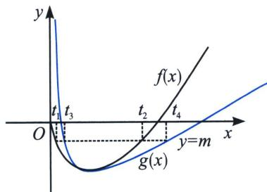

<!-- question-source:start -->
例4 (2021年新高考Ⅰ卷改编)已知函数 $f(x)=x(\ln x-1)$ . 设a, b为两个不相等的正数，且 $b\ln a-a\ln b=a-b$ ，证明：ab>1.

(1) = -1$ ，则 $x \ln x \geqslant x - 1$ ，且 $f(e) = 0$ ，故 $0 < x < 1$ 时， $f(x) \in (-1,0)$ ， $1 < x < e$ 时， $f(x) \in (-1,0)$ ，若 $b \ln a - a \ln b = a - b$ ，则 $\frac{1}{b} (\ln \frac{1}{b} - 1) = \frac{1}{a} (\ln \frac{1}{a} - 1) \Rightarrow f(\frac{1}{a}) = f(\frac{1}{b})$ ，令 $t_1 = \frac{1}{a}$ ， $t_2 = \frac{1}{b}$ ，则证 $t_1 t_2 < 1$ 即可， $f(t_1) = f(t_2) = m$ ，易知 $0 < t_1 < 1 < t_2 < e$ .

(1)=0$ ， $h''(x)=\frac{1}{x}-\frac{2a}{x^{3}}$ ， $h'' (1)=1-2a=0\Rightarrow a=\frac{1}{2}$

(1)=0,\quad h''(x)=\frac{1}{x}-\frac{1}{x^{3}}$ ，当 0<x<1 时， $h''(x)<0,\quad h'(x)$ 单调递减，当 x>1 时， $h''(x)>0,\quad h'(x)$ 单调递增， $h'(x)\geqslant h' (1)=0,\quad h(x)$ 在 $(0,+\infty)$ 单调递增， $h (1)=0$ ，当 0<x<1 时 $h(x)<0$ ，当 x>1 时， $h(x)>0$ ，即 $\left\{\begin{aligned}t_{1}&\cdot\ln t_{1}-t_{1}-m<\frac{1}{2}\left(t_{1}+\frac{1}{t_{1}}\right)-2-m\\ t_{2}&\cdot\ln t_{2}-t_{2}-m>\frac{1}{2}\left(t_{2}+\frac{1}{t_{2}}\right)-2-m\end{aligned}\right.$ ，作差得 ab>1。
<!-- question-source:end -->

![[高中/总复习/专题/2026版高中《mst老唐说题》导数专题（数学）/下册/第09章_导数与双变量/第四节_拟合体系/二_极值点积型偏移与对勾函数构造/例题/answers/Q00047471A1.md]]
