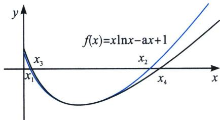

> [!faq]- 《导数专题(下册)》例题解析
>
> > [!success]- **【答案】** 详见解析
>
> > [!note]- **【分析】**
> > 本题未单列分析。
>
> > [!note]- **【解析】**
> > 解析 $f^{\prime}(x) = \ln x + 1 - a = 0$ ，所以 $x = \mathrm{e}^{a - 1}$ ，当 $x\in (0,\mathrm{e}^{a - 1})$ 时， $f^{\prime}(x) <   0$ ， $f(x)$ 单调递减，当 $x$ $\in (\mathrm{e}^{a - 1}, + \infty)$ 时， $f^{\prime}(x) > 0$ ， $f(x)$ 单调递增，故 $f(x)_{\min} = f(\mathrm{e}^{a - 1}) = (a - 1)\mathrm{e}^{a - 1} - ae^{a - 1} + 1 <   0,$ 即 $a > 1$ ，当 $x\to 0$ 时， $f(x)\rightarrow 1 > 0$ ，当 $x\rightarrow +\infty$ 时， $f(\mathrm{e}^a) > 0$ ，所以 $f(x)$ 有两不同的零点 $x_{1}$ ， $x_{2}$ 我们发现要证明 $x_{1} + x_{2} <   3\mathrm{e}^{a - 1} - 1$
> > 一个跟极值点有关的式子，故我们要构造先大后小的函数，且得到两个零点分别为 $x_{3} > x_{1}$ ， $x_{4} > x_{2}$ ，且 $x_{3} + x_{4} = 3\mathrm{e}^{a - 1} - 1$ ，我们发现 $\ln x$ 的帕德逼近符合条件的有 $R_{2,0}(x) = \frac{-x^2 + 4x - 3}{2}$ （泰勒展开），以及 $R_{1,1}(x) = \frac{2(x - 1)}{x + 1}$ ，但是由于 $R_{2,0}(x) = \frac{-x^2 + 4x - 3}{2}$ 会导致 $x\ln x = \frac{-x^3 + 4x^2 - 3x}{2}$ ，三次函数显然不符合拟合最佳选择，故我们选择 $R_{1,1}(x) = \frac{2(x - 1)}{x + 1}$ ，又因为 $\ln x$ 的帕德逼近是在 $x = 1$ 处，故
> > 将 $\left\{ \begin{array}{l} \ln x > \frac{2(x - 1)}{x + 1} (x > 1) \\ \ln x < \frac{2(x - 1)}{x + 1} (0 < x < 1) \end{array} \right.$ 替换为 $\left\{ \begin{array}{l} \ln \frac{x}{\mathrm{e}^{a - 1}} > \frac{2\left(\frac{x}{\mathrm{e}^{a - 1}} - 1\right)}{\frac{x}{\mathrm{e}^{a - 1}} + 1} (x > \mathrm{e}^{a - 1}) \\ \ln \frac{x}{\mathrm{e}^{a - 1}} < \frac{2\left(\frac{x}{\mathrm{e}^{a - 1}} - 1\right)}{\frac{x}{\mathrm{e}^{a - 1}} + 1} (0 < x < \mathrm{e}^{a - 1}) \end{array} \right.$ 所以我们将 $f(x) = 0$ 拟合
> > $$
> > \text {成} \left\{ \begin{array}{l l} f (x) <   \frac {2 x (x - \mathrm{e} ^ {a - 1})}{x + \mathrm{e} ^ {a - 1}} - x + 1 = 0 (x <   \mathrm{e} ^ {a - 1}) \\ f (x) > \frac {2 x (x - \mathrm{e} ^ {a - 1})}{x + \mathrm{e} ^ {a - 1}} - x + 1 = 0 (x > \mathrm{e} ^ {a - 1}) \end{array} , \right.
> > $$
> > 
> > 取 $\left\{\begin{aligned}x_{3}&=\frac{3\mathrm{e}^{a-1}-1-\sqrt{9\mathrm{e}^{2a-2}-10\mathrm{e}^{a-1}+1}}{2}\\ x_{4}&=\frac{3\mathrm{e}^{a-1}-1+\sqrt{9\mathrm{e}^{2a-2}-10\mathrm{e}^{a-1}+1}}{2}\end{aligned}\right.$ ，故 $\exists x_{1}\in(0,x_{3})$ ，使 $f(x_{1})=0,\exists x_{2}\in(\mathrm{e}^{a-1},x_{4})$ ，使
> > $f(x_{2})=0$ （如图），所以 $x_{1}+x_{2}<x_{3}+x_{4}=3e^{a-1}-1$ .
