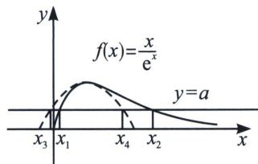

<!-- question-source:start -->
例1 (2010·天津卷)已知函数 $f(x)=xe^{-x}$ ，如果 $x_{1}\neq x_{2}$ 且 $f(x_{1})=f(x_{2})$ ，证明： $x_{1}+x_{2}>2$ .

(1) = 0$ ， $h'(x) = \frac{1 - x}{\mathrm{e}^x} + \frac{x - 1}{\mathrm{e}} = \mathrm{e}^x (x - 1)(\mathrm{e}^{x - 1} - 1) \geqslant 0$ ， $h' (1) = 0$ ， $h(x)$ 单调递增，故我们可得知 $\left\{\begin{aligned}\frac{x}{\mathrm{e}^{x}}&>-\frac{(x-1)^2}{2\mathrm{e}}+\frac{1}{\mathrm{e}}(x>1)\\ \frac{x}{\mathrm{e}^{x}}&<-\frac{(x-1)^2}{2\mathrm{e}}+\frac{1}{\mathrm{e}}(x<1)\end{aligned}\right.$ ，即 $\left\{\begin{aligned}\frac{x_{2}}{\mathrm{e}^{x_{2}}}&>-\frac{(x_{2}-1)^{2}}{2\mathrm{e}}+\frac{1}{\mathrm{e}}\\ \frac{x_{1}}{\mathrm{e}^{x_{1}}}&<-\frac{(x_{1}-1)^{2}}{2\mathrm{e}}+\frac{1}{\mathrm{e}}\end{aligned}\right.\Rightarrow (x_{2}-1)^{2}>(x_{1}-1)^{2}, x_{1}+x_{2}>2$ 得证！

<!-- question-source:end -->

![[高中/总复习/专题/2026版高中《mst老唐说题》导数专题（数学）/下册/第09章_导数与双变量/第四节_拟合体系/例题/answers/Q00046800A1.md]]
