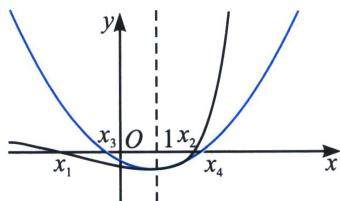
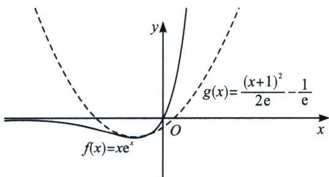
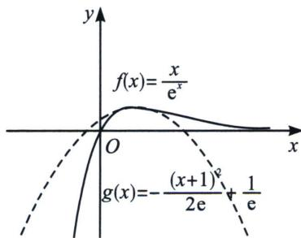

<!-- question-source:start -->
例2 (2016·新课标 I 理)已知函数 $f(x)=(x-2)\mathrm{e}^{x}+a(x-1)^{2}$ 有两个零点.

(1) 求 a 的取值范围；

(2)设 $x_{1}$ ， $x_{2}$ 是 $f(x)$ 的两个零点，证明： $x_{1}+x_{2}<2$ .

(1) 由 $f(x) = (x - 2)e^x + a(x - 1)^2$ ，可得 $f'(x) = (x - 1)e^x + 2a(x - 1) = (x - 1)(e^x + 2a)$ ，当 $a \geqslant 0$ 时，由 $f'(x) > 0$ ，得 $x > 1$ ；由 $f'(x) < 0$ ，得 $x < 1$ ，即有 $f(x)$ 在 $(-\infty, 1)$ 递减；在 $(1, +\infty)$ 递增

当 a<0 时， $f'(x)=(x-1)(e^{x}+2a)=0$ ，x=1 或 $x=\ln(-2a)$ ;

i：若 $\ln(-2a)=1$ ，即 $a=-\frac{e}{2}$ ， $f'(x)\geqslant0$ 恒成立，即有 $f(x)$ 在 R 上递增；

ii：若 $a < -\frac{\mathrm{e}}{2}$ 时，由 $f'(x) > 0$ ，得 $x < 1$ 或 $x > \ln (-2a)$ ；由 $f'(x) < 0$ ，得 $1 < x < \ln (-2a)$ 。即有 $f(x)$ 在 $(- \infty ,1)$ ， $(\ln (-2a), + \infty)$ 单调递增；在 $(1,\ln (-2a))$ 单调递减；

iii：若 $-\frac{e}{2}<a<0$ ，由 $f'(x)>0$ ，得 $x<\ln(-2a)$ 或x>1；由 $f'(x)<0$ ，得 $\ln(-2a)<x<1$ 。即有 $f(x)$ 在 $(-∞, ∫(-2a))$ ， $(1, +∞)$ 递增；在 $(\ln(-2a), 1)$ 递减；

①当 a>0 时，由于 x<1，由于 $(x-2)\mathrm{e}^{x}\in(-\mathrm{e},0)$ ，故 $f(x)=(x-2)\mathrm{e}^{x}+a(x-1)^{2}>-\mathrm{e}+a(x-1)^{2}=0$ ，取 $x=1-\sqrt{\frac{e}{a}}$ ，一定有 $f(1-\sqrt{\frac{e}{a}})>0$ ，且 $f
(1)=-\mathrm{e}<0$ ，故 $\exists x_{1}\in(1-\sqrt{\frac{e}{a}},1)$ ，使 $f(x_{1})=0$ ； $f
(2)=a>0$ ，故 $\exists x_{2}\in(1,2)$ 使 $f(x_{2})=0$ ；故 $f(x)$ 有两个零点；

②当 a=0 时， $f(x)=(x-2)e^{x}$ ，所以 $f(x)$ 只有一个零点 $x_{1}=2$ ，不符合题意；

③当 a<0 时， $f(\ln(-2a))=a[\ln^{2}(-2a)-4\ln(-2a)+5]<0$ ， $f
(1)=-e<0$ ，由于极大值和极小值均小于零，故最多只有一个零点，不符合题意。综上可得，a 的取值范围为 $(0,+\infty)$ 。

证明：
(2)构造函数令 $h(x) = (x - 2)\mathrm{e}^{x} - \frac{\mathrm{e}}{2} (x - 1)^{2} + \mathrm{e}$ ，易知 $h
(1) = 0$ ， $h'(x) = (x - 1)(\mathrm{e}^x - \mathrm{e})$ ， $h' (1) = 0$ ， $h'(x) \geqslant 0$ 恒成立， $h(x)$ 单调递增，所以 $x < 1$ 时， $h(x) < 0$ ，此时有 $(x_{1} - 2)\mathrm{e}^{x_{1}} + a(x_{1} - 1)^{2} < \left(\frac{\mathrm{e}}{2} + a\right)(x_{1} - 1)^{2} - \mathrm{e}$ ， $x > 1$ 时，此时有 $(x_{2} - 2)\mathrm{e}^{x_{2}} + a(x_{2} - 1)^{2} > \left(\frac{\mathrm{e}}{2} + a\right)(x_{2} - 1)^{2} - \mathrm{e}$ ，即 $\left(\frac{\mathrm{e}}{2} + a\right)(x_{1} - 1)^{2} > \left(\frac{\mathrm{e}}{2} + a\right)(x_{2} - 1)^{2}$ ，即 $x_{1} + x_{2} < 2$ ，因此原命题得证.

注意: $f(x) = (x - 1)\mathrm{e}^{x}$ 的二次切线函数 $g(x) = \frac{1}{2} x^{2} - 1$ , 在近几年的高考当中考查甚广, 本题我们可以通过构造求二阶导，也可以利用 $(x - 2)\mathrm{e}^{x} = \mathrm{e}(x - 2)\mathrm{e}^{x - 1}$ ，其拟合二次函数为 $\frac{\mathrm{e}}{2} (x - 1)^2 -\mathrm{e}$ 我们可以根据这个二次切线不等式来进行一系列同构不等式构造，如下： $① x\mathrm{e}^{x} = \frac{1}{\mathrm{e}}\cdot x\mathrm{e}^{x + 1}\geqslant \frac{1}{2\mathrm{e}} [(x + 1)^{2} - 2] = \frac{(x + 1)^{2}}{2\mathrm{e}} -\frac{1}{\mathrm{e}}$ 对 $x\geqslant -1$ 恒成立，同理 $x\mathrm{e}^x\leqslant \frac{(x + 1)^2}{2\mathrm{e}} -\frac{1}{\mathrm{e}}$ 对 $x\leqslant -1$ 恒成立（如图）； $② \frac{x}{\mathrm{e}^x} = -(-x\mathrm{e}^{-x})\geqslant -\frac{1}{2\mathrm{e}} [(x - 1)^2 +2] = -\frac{(x - 1)^2}{2\mathrm{e}} +\frac{1}{\mathrm{e}}$ 对 $x\geqslant 1$ 恒成立，同理 $\frac{x}{\mathrm{e}^x}\leqslant -\frac{(x - 1)^2}{2\mathrm{e}} +$ $\frac{1}{\mathrm{e}}$ 对 $x\leqslant 1$ 恒成立（如图）；

<!-- question-source:end -->

![[高中/总复习/专题/2026版高中《mst老唐说题》导数专题（数学）/下册/第09章_导数与双变量/第四节_拟合体系/例题/answers/Q00046801A1.md]]
