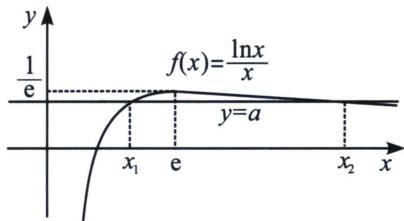

<!-- question-source:start -->
例7 已知函数 $f(x) = \frac{\ln x}{x}$ ，若 $f(x) = a$ 有两个不同的零点 $x_{1}, x_{2}$ ，且 $x_{1} < x_{2}$ ，

求 a 的取值范围.

(1) = a > 0$ ，所以 $\exists x_1 \in \left(1, \frac{1}{a}\right)$ ，使 $g(x_1) = 0$ ；当 $x > \frac{1}{a}$ 时，由于 $g(x) = \sqrt{x} \left(a\sqrt{x} - \frac{\ln x}{\sqrt{x}}\right) > \sqrt{x} \left(a\sqrt{x} - \frac{2}{e}\right) = 0$ ，故取 $x = \frac{4}{a^2 e^2}$ ，所以 $\exists x_2 \in \left(\frac{1}{a}, \frac{4}{a^2 e^2}\right)$ ，使 $g(x_2) = 0$ ；综上，当 $f(x) = a$ 有两个不同的零点时， $0 < a < \frac{1}{e}$ .

考点1：常数的极值点

(2) $x_{1}+x_{2}>2e$ ;
(3) $x_{1}x_{2}>e^{2}$ ;
(4) $\frac{3}{a}-e<x_{1}+x_{2}$ ;
(5) $x_{1}x_{2}>\frac{e}{a}$

(2)和
(3)这类减弱型的偏移问题，直接用对数均值不等式或者二次(对勾)拟合均可。

## 考点 2：含参的极值点

$$
(6) x _ {1} + x _ {2} > \frac {1 - \ln a}{a};
(7) x _ {1} x _ {2} > \frac {2 + \ln a}{a ^ {2}}
$$

(8) $x_{1}+x_{2}<\frac{-2\ln a}{a};$
(9) $x_{1}x_{2}<\frac{1}{a^{2}}$
<!-- question-source:end -->

![[高中/总复习/专题/2026版高中《mst老唐说题》导数专题（数学）/下册/第09章_导数与双变量/第四节_拟合体系/例题/answers/Q00046806A1.md]]
