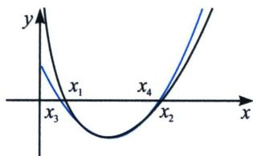
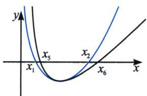

<!-- question-source:start -->
例13 (2023·浙江模拟)已知函数 $f(x)=(x-1)\ln x+(a-1)(x^{2}-2x)$ 有两个零点

(1)求 a 的取值范围；
(2)记 $x_{1}$ ， $x_{2}$ 为 $f(x)$ 的两个零点，证明： $2 < x_{1} + x_{2} < 3 - \frac{1}{a}$

(1) $f'(x)=\ln x+1-\frac{1}{x}+2(a-1)(x-1)$ ， $f' (1)=0$ ， $f''(x)=\frac{1}{x}+\frac{1}{x^2}+2(a-1)$ ，当a>1时， $f''(x)>0$ ， $f'(x)$ 单调递增，由于 $f' (1)=0$ ，故 $x\in(0,1)$ 时， $f'(x)<0$ ， $f(x)$ 单调递减， $x\in(1,+\infty)$ 时， $f'(x)>0$ ， $f(x)$ 单调递增， $f(x)_{\min}=f (1)=1-a<0$ ，当0<x<1时， $f(x)=(x-1)\ln x+(a-1)(x^2-2x)>-\ln x-(a-1)-\frac{1}{e}=0$ ，取 $x=e^{-a-\frac{1}{e}+1}$ ，当x>1时， $f
(2)=\ln2>0$ ，所以存在 $x_1\in(e^{-a-\frac{1}{e}+1},1)$ ，使 $f(x_1)=0$ ， $x_2\in(1,2)$ ，使 $f(x_2)=0$ 。当 $a\leqslant1$ 时，当0<x<2时， $(x-1)\ln x>0$ ， $(a-1)(x^2-2x)>0$ ，不存在零点， $f' (2)=2a+\ln2-\frac{3}{2}$ ，当 $f' (2)>0$ 时，由于 $x\to+\infty$ 时， $f'(x)<0$ ，所以 $f(x)$ 先增后减，不可能出现两个零点，当 $f' (2)<0$ 时， $f(x)$ 一直递减，也不可能出现两个零点，矛盾，综上，a>1。

(2)分析: 由于 $(a - 1)(x^2 - 2x)$ 是对称轴为 1 的不偏移函数, 所以我们仅仅需要构造 $(x - 1)\ln x$ 部分, 此题类似于 2016 年全国你一卷那道题逻辑, 我们先分析左边, 如图, 我们需要构造先小后大的函数, 由于 $(x - 1)\ln x$ 是 $(x - 1)$ 与 $\ln x$ 共零点 $x = 1$ , 也就意味着这里的 $\ln x$ 必须要构造恒大于的式子, 这里就找到帕德逼近的 $R_{1,0}(x) = x - 1$ , $R_{1,2}(x) = \frac{12(x - 1)}{-x^2 + 8x + 5}$ (导致四次方, 排除), $R_{2,1}(x) = \frac{x^2 + 4x - 5}{4x + 2}$ (导致三次方, 排除), 所以选择 $\ln x \leqslant x - 1$ , 同理, 右边需要构造先大后小的函数, 即需要构造恒小于 $\ln x$ 的式子, 我们根据 $\ln x \leqslant x - 1 \Rightarrow \ln \frac{1}{x} \leqslant \frac{1}{x} - 1 \Rightarrow \ln x \geqslant 1 - \frac{1}{x}$ , 则有将 $(x - 1)\ln x$ 拟合成 $(x - 1)\left(1 - \frac{1}{x}\right) = \frac{(x - 1)^2}{x}$ , 这是一个对勾函数, 所以我们要构造齐次式, 才能解出我们需要的点, 故我们将二次函数部分 $(a - 1)(x^2 - 2x)$ 也进行对勾拟合, 根据我们上一讲提到的方法, 在最值相等处且二阶导相等, $\left\{ \begin{array}{l} x^2 - 2x < m\left(x + \frac{1}{x} - 3\right) (\text {当 } 0 < x < 1) \\ x^2 - 2x > m\left(x + \frac{1}{x} - 3\right) (\text {当 } x > 1) \end{array} \right.$ , 求得 $m = 1$

<!-- question-source:end -->

![[高中/总复习/专题/2026版高中《mst老唐说题》导数专题（数学）/下册/第09章_导数与双变量/第四节_拟合体系/例题/answers/Q00046812A1.md]]
