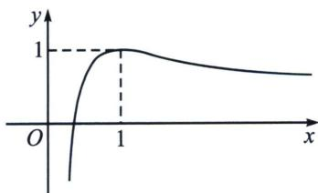

<!-- question-source:start -->
例2 (2024·上饶一模)已知函数 $f(x)=\frac{\ln x+1}{x}$ ，若a为实数，且方程 $f(x)=a$ 有两个不同的实数根 $x_{1}, x_{2}$ .

(1) 求 a 的取值范围;

(2)(i)证明：对任意的 $x \in \left(\frac{1}{\mathrm{e}}, 1\right)$ 都有 $f(x) > \frac{\mathrm{e}x - 1}{\mathrm{e} - 1}$ ;

(ii) 求证： $\left|x_{1}-x_{2}\right|>\sqrt{2(1-a)}+(1-a)\left(1-\frac{1}{e}\right)$ .

(1) 因为已知函数 $f(x) = \frac{\ln x + 1}{x}$ ， $x > 0$ ，所以 $f'(x) = -\frac{\ln x}{x^2}$ ， $x > 0$ ，所以 $f(x)$ 在 (0, 1) 上单调递增，在 $(1, +\infty)$ 上单调递减，

因为 $f\left(\frac{1}{e}\right)=0$ ， $f
(1)=1$ ，且当 $x\to+\infty$ 时， $f(x)\to0$ ，所以函数 $f(x)$ 的图像如下所示：

因为方程 $f(x)=a$ 有 $x_{1}$ ， $x_{2}$ ，所以 $a\in(0,1)$ 。故a的取值范围为 $(0,1)$ 。

(2)证明：（i）记 $g(x)=f(x)-\frac{\mathrm{e}x-1}{\mathrm{e}-1}=\frac{\ln x+1}{x}-\frac{\mathrm{e}x-1}{\mathrm{e}-1}, x\in\left(\frac{1}{\mathrm{e}},1\right)$ ，则 $g'(x)=-\frac{\ln x}{x^{2}}-\frac{\mathrm{e}}{\mathrm{e}-1}, x\in\left(\frac{1}{\mathrm{e}},1\right)$ ，设 $t(x)=-\frac{\ln x}{x^{2}}-\frac{\mathrm{e}}{\mathrm{e}-1}, x\in\left(\frac{1}{\mathrm{e}},1\right)$ ，则 $t'(x)=\frac{2\ln x-1}{x^{3}}<0$ ，所以 $g'(x)$ 在 $x\in\left(\frac{1}{\mathrm{e}},1\right)$ 上为减函数，因为 $g'\left(\frac{1}{\mathrm{e}}\right)=\mathrm{e}^{2}-\frac{\mathrm{e}}{\mathrm{e}-1}>0, g'
(1)=-\frac{\mathrm{e}}{\mathrm{e}-1}<0$ ，所以存在 $x_{0}\in\left(\frac{1}{\mathrm{e}},1\right)$ ，使得 $g'(x_{0})=0$ ，所以当 $x\in\left(\frac{1}{\mathrm{e}},x_{0}\right)$ 时， $g'(x)>0$ ；当 $x\in(x_{0},1)$ 时， $g'(x)<0$ ，又因为 $g\left(\frac{1}{\mathrm{e}}\right)=0, g (1)=0$ ，所以 $g(x)>0$ ，即对任意的 $x\in\left(\frac{1}{\mathrm{e}},1\right)$ 都有 $f(x)>\frac{\mathrm{e}x-1}{\mathrm{e}-1}$ .

(ii）不妨设 $x_{1}<x_{2}$ ，则 $\frac{1}{\mathrm{e}}<x_{1}<1<x_{2}$ ，由
(1)知： $f(x_{1})>\frac{\mathrm{e}x_{1}-1}{\mathrm{e}-1}$ ，

又因为 $f(x_{1})=a$ ，所以 $a>\frac{\mathrm{e}x_{1}-1}{\mathrm{e}-1}$ ，所以 $x_{1}<\frac{1}{\mathrm{e}}+a\left(1-\frac{1}{\mathrm{e}}\right)$ ，

要证： $|x_{1}-x_{2}|>\sqrt{2(1-a)}+(1-a)\left(1-\frac{1}{\mathrm{e}}\right)$ ，即证： $x_{2}-x_{1}>\sqrt{2(1-a)}+(1-a)\left(1-\frac{1}{\mathrm{e}}\right)$ ，

需证： $x_{2}-\frac{1}{\mathrm{e}}-a\left(1-\frac{1}{\mathrm{e}}\right)>\sqrt{2(1-a)}+(1-a)\left(1-\frac{1}{\mathrm{e}}\right)$ ，

需证： $x_{2}>\sqrt{2(1-a)}+1$ ，需证： $(x_{2}-1)^{2}>2(1-a)$ ，即 $a>-\frac{(x_{2}-1)^{2}}{2}+1$ ，

需证： $f(x_{2})>-\frac{(x_{2}-1)^{2}}{2}+1$ ，需证： $\frac{\ln x_{2}+1}{x_{2}}>-\frac{(x_{2}-1)^{2}}{2}+1$ ，

需证： $\ln x_{2}+1>-\frac{(x_{2}-1)^{2}}{2}x_{2}+x_{2}$ ，需证： $\ln x_{2}+\frac{1}{2}x_{2}^{3}-x_{2}^{2}-\frac{1}{2}x_{2}+1>0.$

于是构造函数 $h(x)=\ln x+\frac{1}{2}x^{3}-x^{2}-\frac{1}{2}x+1,\quad x>1$ ，所以 $h'(x)=\frac{1}{x}+\frac{3}{2}x^{2}-2x-\frac{1}{2}=\frac{(x-1)^{2}(3x+2)}{2x}>0$ ，所以 $h(x)$ 在 $(1,+\infty)$ 上为增函数，所以 $h(x)>h
(1)=0$ ，所以 $h(x_{2})>0$ 成立，所以 $\left|x_{1}-x_{2}\right|>\sqrt{2(1-a)}+(1-a)\left(1-\frac{1}{e}\right)$ 成立.

本题一侧用直线拟合, 一侧用曲线拟合, 完全打破了我们对于切割线夹的认知, 但是兵来将挡水来土掩, 看出了关于参数的结构的次数, 对于此类题也能迎刃而解.
<!-- question-source:end -->

![[高中/总复习/专题/2026版高中《mst老唐说题》导数专题（数学）/下册/第09章_导数与双变量/第四节_拟合体系/例题/answers/Q00046815A1.md]]
