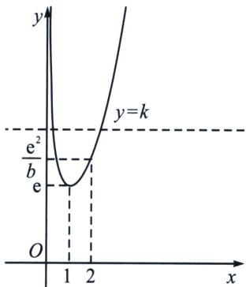

<!-- question-source:start -->
例7 (2024·石家庄期末)已知函数 $f(x)=\frac{\mathrm{e}^{x}}{x^{2}}-k\left(\frac{2}{x}+\ln x\right)$ 有三个极值点 $x_{1}, x_{2}, x_{3}$ ，且 $x_{1}<x_{2}<x_{3}$ .

(1)求实数 k 的取值范围；

(2) 若 2 是 $f(x)$ 的一个极大值点，证明： $\frac{f(x_3) - f(x_1)}{x_3 - x_1} < \frac{k^2}{\mathrm{e}} - k.$

(1) 根据题意可知, 函数 $f(x)$ 的定义域为 $(0, +\infty)$ , 则 $f'(x) = \frac{\mathrm{e}^x \cdot x^2 - \mathrm{e}^x \cdot 2x}{x^4} - k$ $\left(-\frac{2}{x^2} + \frac{1}{x}\right) = \frac{\mathrm{e}^x (x - 2)}{x^3} - k \cdot \frac{x - 2}{x^2} = (x - 2) \cdot \frac{\mathrm{e}^x - kx}{x^3}$ , 由函数 $f(x)$ 有三个极值点 $x_1, x_2, x_3$ 可知, $f'(x) = (x - 2) \cdot \frac{\mathrm{e}^x - kx}{x^3} = 0$ 在 $(0, +\infty)$ 上至少有三个实数根, 显然 $f'
(2) = 0$ , 则需方程 $\frac{\mathrm{e}^x - kx}{x^3} = 0$ , 也即 $\mathrm{e}^x - kx = 0$ 有两个不等于 2 的不相等的实数根.

由 $e^{x}-kx=0$ ，可得 $k=\frac{e^{x}}{x}$ ， $x\in(0,+\infty)$ ，令 $g(x)=\frac{e^{x}}{x}$ ， $x\in(0,+\infty)$ ，则 $g'(x)=\frac{e^{x}(x-1)}{x^{2}}$ ， $x\in(0,+\infty)$ ，显然当 $x\in(0,1)$ 时， $g'(x)<0$ ，即 $g(x)$ 在 $(0,1)$ 上单调递减；当 $x\in(1,+\infty)$ 时， $g'(x)>0$ ，即 $g(x)$ 在 $(1,+\infty)$ 上单调递增；所以 $g(x)\geqslant g
(1)=e$ ，画出函数 $g(x)=\frac{e^{x}}{x}$ ， $x\in(0,+\infty)$ 与函数 y=k 在同一坐标系下的图象，如下图所示：

由图，可得 $k > \mathrm{e}$ 且 $k \neq \frac{\mathrm{e}^2}{2}$ 时， $k = \frac{\mathrm{e}^x}{x}$ 在 $(0, +\infty)$ 上有两个不等于2的相异的实数根，

经检验可知，当 $k \in \left(\mathrm{e}, \frac{\mathrm{e}^2}{2}\right) \cup \left(\frac{\mathrm{e}^2}{2}, +\infty\right)$ 时，导函数 $f'(x) = (x - 2) \cdot \frac{\mathrm{e}^x - kx}{x^3}$ 在 $x_1, x_2, x_3$ 左右符号不同，即 $x_1, x_2, x_3$ 均是 $f'(x) = 0$ 的变号零点，满足题意；因此实数 $k$ 的取值范围时 $\left(\mathrm{e}, \frac{\mathrm{e}^2}{2}\right) \cup \left(\frac{\mathrm{e}^2}{2}, +\infty\right)$ .

(2)证明：根据题意结合
(1)中的图象，由 $x_{1} < x_{2} < x_{3}$ 可知， $x_{1} \neq 2$ ，若2是 $f(x)$ 的一个极大值点，易知函数 $f(x)$ 在 $(0, x_1)$ 上单调递减，则 $x_2 = 2$ ，因此 $x_1, x_3$ 是方程 $e^x = kx$ 的两个不相等的实数根，即 $e^{x_1} = kx_1, e^{x_3} = kx_3$ ，所以 $f(x_3) = \frac{e^{x_3}}{x_3^2} - k\left(\frac{2}{x_3} + \ln x_3\right) = \frac{k}{x_3} - \frac{2k}{x_3} - k\ln x_3 = -k\left(\frac{1}{x_3} + \ln x_3\right)$ ，同理 $f(x_1) = -k\left(\frac{1}{x_1} + \ln x_1\right)$ ，

所以 $\frac{f(x_3) - f(x_1)}{x_3 - x_1} = \frac{-k\left(\frac{1}{x_3} + \ln x_3\right) + k\left(\frac{1}{x_1} + \ln x_1\right)}{x_3 - x_1} = \frac{-k\left(\frac{1}{x_3} + \ln x_3 - \frac{1}{x_1} - \ln x_1\right)}{x_3 - x_1} = \frac{-k\left(\frac{x_1 - x_3}{x_1x_3} + \ln \frac{x_3}{x_1}\right)}{x_3 - x_1},$ 由 $\mathrm{e}^{x_1} = kx_1$ ， $\mathrm{e}^{x_3} = kx_3$ 可知， $\ln \frac{x_3}{x_1} = \ln \frac{\frac{\mathrm{e}^{x_3}}{k}}{\frac{\mathrm{e}^{x_1}}{k}} = \ln \frac{\mathrm{e}^{x_3}}{\mathrm{e}^{x_1}} = \ln \mathrm{e}^{x_3 - x_1} = x_3 - x_1$ ，所以 $\frac{f(x_3) - f(x_1)}{x_3 - x_1} =$ $\frac{-k\left(\frac{x_1 - x_3}{x_1x_3} + \ln \frac{x_3}{x_1}\right)}{x_3 - x_1} = \frac{-k\left(\frac{x_1 - x_3}{x_1x_3} + x_3 - x_1\right)}{x_3 - x_1} = k\left(\frac{1}{x_1x_3} - 1\right)$ ，又 $k\in \left(\mathrm{e},\frac{\mathrm{e}^2}{2}\right)\cup \left(\frac{\mathrm{e}^2}{2}, + \infty\right)$ ，要证 $\frac{f(x_3) - f(x_1)}{x_3 - x_1} <   \frac{k^2}{\mathrm{e}} -k$ ，即证 $k\left(\frac{1}{x_1x_3} -1\right) <   \frac{k^2}{\mathrm{e}} -k$ ，所以 $\frac{1}{x_1x_3} <  \frac{k}{\mathrm{e}}$ ，只需证 $x_{1}x_{3} > \frac{\mathrm{e}}{k}$ ，属于经典的反向构造型，正向是 $x_{1}x_{3} <   1$ (ALG可以证明，这里不详细说明）

要证 $x_{1}x_{3} > \frac{\mathrm{e}}{k}$ ，只需 $\ln x_1 + \ln x_3 > 1 - \ln k$ ，只需证 $(\ln x_1)^2 -(1 - \ln k)\ln x_1 <   (\ln x_3)^2 -(1 - \ln k)\ln x_3,$ $k = \frac{\mathrm{e}^{x_1}}{x_1} = \frac{\mathrm{e}^{x_2}}{x_2}\Leftrightarrow \ln k = x_1 - \ln x_1 = x_3 - \ln x_3$ ，所以 $(\ln x_1)^2 -(1 - x_1 + \ln x_1)\ln x_1 <   (\ln x_3)^2 -(1 - x_3+$ $\ln x_3)\ln x_3$ ，只需证 $x_{3}\ln x_{3} - \ln x_{3} > x_{1}\ln x_{1} - \ln x_{1}$ ，显然 $h(x) = (x - 1)\ln x,h^{\prime}(x) = \ln x + 1 - \frac{1}{x},$ $h^{\prime}
(1) = 0$ ，故构造 $F(x) = (x - 1)\ln x + \lambda (x - \ln x),F^{\prime \prime} (1) = 0,\lambda = -2$ ，所以 $F(x) = x\ln x + \ln x - 2,$ $F^{\prime}(x) = \ln x + 1 - \frac{1}{x}\geqslant 0$ ，所以 $F(x_{3}) > F(x_{1})$ ，命题得证.

## 例 8 (24 高三上·辽宁·开学考试) 设方程 $(x-2)^{2}e^{x}=a$ 有三个实数根 $x_{1}, x_{2}, x_{3}(x_{1}<x_{2}<x_{3})$ .

(1) 求 a 的取值范围；

(2)请在以下两个问题中任选一个进行作答, 注意选的序号不同, 该题得分不同. 若选①则该小问满分 4 分, 若选②则该小问满分 9 分.

①证明： $(x_{1}-2)(x_{2}-2)<4;$

②证明： $x_{1}+x_{2}+x_{3}+\frac{1}{x_{1}}+\frac{1}{x_{2}}+\frac{1}{x_{3}}<\frac{3e}{2}.$

(1)由题意设 $f(x) = (x - 2)^2\mathrm{e}^x (x \in \mathbb{R})$ ，则 $f'(x) = x(x - 2)\mathrm{e}^x, x \in \mathbb{R}$ ，令 $f'(x) = 0$ ，得 $x = 0$ 或 $x = 2$ ，当 $x < 0$ 或 $x > 2$ 时， $f'(x) > 0$ ，所以 $f(x)$ 在 $(- \infty, 0), (2, +\infty)$ 上单调递增；当 $0 < x < 2$ 时， $f'(x) < 0$ ，所以 $f(x)$ 在 $(0, 2)$ 上单调递减；

又 $f
(2) = 0$ ， $f(0) = 4$ ， $f
(3) = \mathrm{e}^{3} > 4$ ，且 $f(x) = (x - 2)^{2}\mathrm{e}^{x}\geqslant 0$ ，当 $x$ 趋向于 $+\infty$ 时， $f(x)$ 也趋向于 $+\infty$ ，又方程 $(x - 2)^{2}\mathrm{e}^{x} = a$ 有三个实数根 $x_{1}$ ， $x_{2}$ ， $x_{3}(x_{1} <   x_{2} <   x_{3})$

等价于直线 y=a 与 $y=f(x)$ 有三个交点，即 0<a<4，所以 a 的取值范围为 $(0,4)$ .

(2)选①，证明如下：由
(1)得： $x_{1}<0<x_{2}<2$ ，则 $x_{1}-2<-2<x_{2}-2<0$ ，设 $t_{1}=x_{1}-2$ ， $t_{2}=x_{2}-$

2, 则 $t_1 < -2 < t_2 < 0$ , 不妨设 $k = \frac{t_1}{t_2} > 1$ , 则 $t_1 = kt_2 (k > 1)$ , 又 $(x_1 - 2)^2 e^{x_1} = (x_2 - 2)^2 e^{x_2} = a$ , 即 $t_1^2 e^{t_1 + 2} = t_2^2 e^{t_2 + 2} = a$ , 故 $k^2 t_2^2 e^{kt_2} = t_2^2 e^{t_2} = \frac{a}{e^2} > 0$ , 即 $k^2 e^{kt_2} = e^{t_2}$ , 所以 $t_2 = \frac{2 \ln k}{1 - k}$ , $t_1 = kt^2 = \frac{2k \ln k}{1 - k}$ , $k > 1$ , 则 $(x_1 - 2)(x_2 - 2) = t_1 t_2 = k \cdot \left(\frac{2 \ln k}{1 - k}\right)^2 = \left[\frac{\sqrt{k} \cdot 2 \ln (\sqrt{k})^2}{1 - (\sqrt{k})^2}\right]^2 = \left[\frac{4 \ln \sqrt{k}}{\sqrt{k} - \frac{1}{\sqrt{k}}}\right]^2$ , 设 $g(x) = 2 \ln x - x + \frac{1}{x}$ , $x > 1$ , 则 $g'(x) = \frac{2}{x} - 1 - \frac{1}{x^2} = -\frac{(x - 1)^2}{x^2} \leqslant 0$ , 所以 $g(x)$ 在 $(1, +\infty)$ 上单调递减, 即 $g(x) < g
(1) = 0$ , 因为 $\sqrt{k} > 1$ , 则 $2 \ln \sqrt{k} - \sqrt{k} + \frac{1}{\sqrt{k}} < 0$ , 即 $2 \ln \sqrt{k} < \sqrt{k} - \frac{1}{\sqrt{k}}$ , 又 $\sqrt{k} - \frac{1}{\sqrt{k}} > 0$ , 则 $\frac{4 \ln \sqrt{k}}{\sqrt{k} - \frac{1}{\sqrt{k}}} < 2$ , 故 $(x_1 - 2)(x_2 - 2) = t_1 t_2 = \left[\frac{4 \ln \sqrt{k}}{\sqrt{k} - \frac{1}{\sqrt{k}}}\right]^2 < 4$ . 选②, 证明如下: 由 (1)得: $x_1 < 0 < x_2 < 2$ , 则 $x_1 - 2 < -2 < x_2 - 2 < 0$ , 设 $t_1 = x_1 - 2$ , $t_2 = x_2 - 2$ , 则 $t_1 < -2 < t_2 < 0$ , 不妨设 $k = \frac{t_1}{t_2} > 1$ , 则 $t_1 = kt_2 (k > 1)$ , 又 $(x_1 - 2)^2 e^{x_1} = (x_2 - 2)^2 e^{x_2} = a$ , 即 $t_{1}^{2} e^{t_{1} + 2} = t_{2}^{2} e^{t_{2} + 2} = a$ , 故 $k^2 t_2^2 e^{kt_2} = t_2^2 e^{t_2} = \frac{a}{e^2} > 0$ , 即 $k^2 e^{kt_2} = e^{t_2}$ , 所以 $t_2 = \frac{2 \ln k}{1 - k}$ , $t_1 = kt^{2} = \frac{2k \ln k}{1 - k}(k > 1)$ , 则 $(x_1 - 2)(x_2 - 2) = t_1 t_2 = k \cdot \left(\frac{2 \ln k}{1 - k}\right)^{2} = \left[\frac{\sqrt{k} \cdot 2 \ln (\sqrt{k})^2}{1 - (\sqrt{k})^2}\right]^2 = \left[\frac{4 \ln \sqrt{k}}{\sqrt{k} - \frac{1}{\sqrt{k}}}\right]^2 (\sqrt{k} > 1)$ , 设 $g(x) = 2 \ln x - x + \frac{1}{x}$ , $x > 1$ , 则 $g'(x) = \frac{2}{x} - 1 - \frac{1}{x^2} = -\frac{(x - 1)^2}{x^2} \leqslant 0$ , 所以 $g(x)$ 在 $(1, +\inon)$ 上单调递减, 即 $g(x) < g (1) = 0$ , 因为 $\sqrt{k} > 1$ , 则 $2 \ln \sqrt{k} - \sqrt{k} + \frac{1}{\sqrt{k}} < 0$ , 即 $2 \ln \sqrt{k} < \sqrt{k} - \frac{1}{\sqrt{k}}$ , 又 $\sqrt{k}-\frac{1}{\sqrt{k}}>0$ , 则 $\frac{4 \ln \sqrt{k}}{\sqrt{k}-\frac{1}{\sqrt{k}}} < 2$ , 故 $(x_1 - 2)(x_2 - 2) = t_1 t_2 = \left[\frac{4 \ln \sqrt{k}}{\sqrt{k}-\frac{1}{\sqrt{k}}}\right]^2 < 4$ . 所以 $(x_1 - 2)(x_2 - 2) = x_1 x_2 - 2(x_1 + x_2) + 4 < 4$ , 则 $x_1 x_2 < 2(x_1 + x_2)$ , 又因为 $x_1 < 0 < x_2 < 2$ , 所以 $x_1 x_2 < 0$ , 从而 $\frac{2(x_1 + x_2)}{x_1 x_2} = 2\left(\frac{1}{x_1} + \frac{1}{x_2}\right) < 1$ , 故 $\frac{1}{x_1} + \frac{1}{x_2} < \frac{1}{2}$ ①, 下证 $x_1 + x_2 < 0$ , 有 $x_1 + x_2 = t_1 + t_2 + 4 = \frac{2 \ln k}{1 - k} + \frac{2k \ln k}{1 - k} + 4 < 0 (k > 1)$ , 即证 $k > 1$ 时, $(k+1) \ln k > 2(k-1)$ , 即 $\ln k > \frac{2(k-1)}{k+1} = 2 - \frac{4}{k+1}$ , 即证 $\ln k + \frac{4}{k+1} > 2(k>1)$ , 设 $h(x) = \ln x + \frac{4}{x+1}(x>1)$ , 则 $h'(x) = \frac{1}{x} - \frac{4}{(x+1)^2} = \frac{(x-1)^2}{x(x+1)^2}$ , 当 $x > 1$ 时, $h'(x) > 0$ , 所以 $h(x)$ 在 $(1, +\infty)$ 上单调递增, 则 $h(x) > h (1) = 2$ , 所以 $x_1 + x_2 < 0$ ②, 又 $f
(3) = e^3 > f(0)$ , 所以得 $2 < x_3 < 3$ , 设 $\varphi(x) = x + \frac{1}{x}, (2 < x < 3)$ , 则 $\varphi'(x) = 1 - \frac{1}{x^2}$ , 当 $2 < x < 3$ 时, $\varphi'(x) > 0$ , 所以 $\varphi(x)$ 在(2, 3)上单调递增，则 $x_{3} + \frac{1}{x_{3}} < \frac{10}{3}$ ③，联立①②③得： $\frac{1}{x_1} + \frac{1}{x_2} + x_1 + x_2 + x_3 + \frac{1}{x_3} < \frac{1}{2} + 0 + \frac{10}{3} = \frac{23}{6} < 4 < \frac{3e}{2}$ ，故 $x_{1} + x_{2} + x_{3} + \frac{1}{x_{1}} + \frac{1}{x_{2}} + \frac{1}{x_{3}} < \frac{3e}{2}$ .

## 八、变量转化为单调函数的调整函数

## 例8 (2024·天津卷压轴)设函数 $f(x)=x\ln x$ .

(3) 若 $x_{1}, x_{2} \in (0, 1)$ ，证明 $\left|f(x_{1}) - f(x_{2})\right| \leqslant \left|x_{1} - x_{2}\right|^{\frac{1}{2}}$
<!-- question-source:end -->

![[高中/总复习/专题/2026版高中《mst老唐说题》导数专题（数学）/下册/第09章_导数与双变量/第四节_拟合体系/例题/answers/Q00046820A1.md]]
