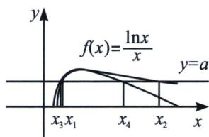

> [!faq]- 《导数专题(下)》例题解析
>
> > [!success]- **【答案】** 详见解析
>
> > [!note]- **【分析】**
> > 本题未单列分析。
>
> > [!note]- **【解析】**
> > 解析 如图，易知 $0 < a < \frac{1}{\mathrm{e}}$ （图形不能作为证明依据，必须要找点）.
> > 证明：由 $f(x)=\frac{\ln x}{x}=a$ 得： $ax=\ln x$ ，令 $g(x)=ax-\ln x$ ， $g'(x)=a-\frac{1}{x}$
> > i) 当 $a \leqslant 0$ 时， $g'(x) \leqslant 0$ ， $g(x)$ 单调递减，不可能出现两个零点；
> > ii) 当 $a > 0$ 时，易知 $g'\left(\frac{1}{a}\right) = 0$ ，当 $0 < x < \frac{1}{a}$ 时， $g'(x) < 0$ ，则 $g(x)$ 单调递减，当 $x > \frac{1}{a}$ 时， $g'(x)$
> > >0，则 $g(x)$ 单调递增， $g(x)_{\min}=g\left(\frac{1}{a}\right)=1-\ln\frac{1}{a}<0$ ，所以 $0<a<\frac{1}{e}$ ;
> > 当 $x < \frac{1}{a}$ 时，由于 $g(x) = ax - \ln x > \ln x = 0$ ，故取 $x = 1$ ， $g
> > 解析：由于 $f(x)=\frac{\ln x}{x}$ 的极值点是x=e，在证明 $x_{1}+x_{2}>x_{3}+x_{4}=2e$ 和 $x_{1}x_{2}>x_{3}x_{4}=e^{2}$ ，故我们需要构造 $f(x)$ 的先大后小的拟合函数(如图)，即构造 $\ln x$ 的先大后小函数 $\frac{2(x-1)}{x+1}$ ，拟合需要在极值点两侧进行
> > 构造，故我们由于利用 $\left\{ \begin{array}{l} \frac{2(x - 1)}{x + 1} < \ln x (x > 1) \\ \ln x < \frac{2(x - 1)}{x + 1} (0 < x < 1) \end{array} \right.$ 得： $\left\{ \begin{array}{l} \ln \frac{x}{\mathrm{e}} < \frac{2\left(\frac{x}{\mathrm{e}} - 1\right)}{\frac{x}{\mathrm{e}} + 1} (0 < x < \mathrm{e}) \\ \frac{2\left(\frac{x}{\mathrm{e}} - 1\right)}{\frac{x}{\mathrm{e}} + 1} < \ln \frac{x}{\mathrm{e}} (x > \mathrm{e}) \end{array} \right. \Rightarrow \left\{ \begin{array}{l} \ln x < \frac{3x - \mathrm{e}}{x + \mathrm{e}} (0 < x < \mathrm{e}) \\ \ln x > \frac{3x - \mathrm{e}}{x + \mathrm{e}} (x > \mathrm{e}) \end{array} \right.$
> > 
> > 当 $1 < x < \mathrm{e}$ 时， $f(x) = \frac{\ln x}{x} = a \Rightarrow ax - \frac{3x - \mathrm{e}}{x + \mathrm{e}} < 0$ ，取 $x_{3} = \frac{3 - ae - \sqrt{a^{2}e^{2} - 10ae + 9}}{2a}$ ，故 $\exists x_{1} \in (x_{3}, e)$ 使 $f(x_{1}) = a$ ；当 $x > \mathrm{e}$ 时， $f(x) = \frac{\ln x}{x} = a \Rightarrow ax - \frac{3x - \mathrm{e}}{x + \mathrm{e}} > 0$ ，取 $x_{4} = \frac{3 - ae + \sqrt{a^{2}e^{2} - 10ae + 9}}{2a}$ ，故 $\exists x_{2} \in (x_{4}, +\infty)$ 使 $f(x_{2}) = a$ ；
> > 所以 $x_{1}+x_{2}>x_{3}+x_{4}=\frac{3}{a}-e>2e,\quad x_{1}x_{2}>x_{3}x_{4}=\frac{e}{a}>e^{2}.$
> > 注意: 这四个问题可以通过一个拟合函数的零点: $ax - \frac{3x - e}{x + e} = 0$ , 即转化为二次方程: $ax^2 +$ $(ae - 3)x + e = 0$ 。一个加强的偏移不等式可以证明弱化型的不等式，不过关于
> > 解析：参变不分离的函数 $g(x) = ax - \ln x$ 的极值点是 $x = \frac{1}{a}$ ，通过前面的二次拟合以及对勾拟合后发现，构造 $x = \frac{1}{a}$ 的函数更为紧密（因为 $\frac{1}{a} > e$ ），
> > 由于 $1 < x_{1} < \frac{1}{a} < x_{2}$ 利用 $\left\{ \begin{array}{l} \frac{2(x - 1)}{x + 1} < \ln x (x > 1) \\ \ln x < \frac{2(x - 1)}{x + 1} (0 < x < 1) \end{array} \right.$ 得： $\left\{ \begin{array}{l} \ln ax < \frac{2(ax - 1)}{ax + 1} (0 < x < \frac{1}{a}) \\ \frac{2(ax - 1)}{ax + 1} < \ln ax (x > \frac{1}{a}) \end{array} \right.$ ，化简后
> > $$
> > \text {得:} \left\{ \begin{array}{l l} \ln x <   \frac {2 (a x - 1)}{a x + 1} - \ln a \left(0 <   x <   \frac {1}{a}\right) \\ \frac {2 (a x - 1)}{a x + 1} - \ln a <   \ln x \left(x > \frac {1}{a}\right) \end{array} \Rightarrow \left\{ \begin{array}{l l} a x - \ln x > a x - \frac {2 (a x - 1)}{a x + 1} + \ln a = 0 \left(0 <   x <   \frac {1}{a}\right) \\ a x - \ln x <   a x - \frac {2 (a x - 1)}{a x + 1} + \ln a = 0 \left(x > \frac {1}{a}\right) \end{array} \text {当} 1 <   x <   \frac {1}{a} \right. \right.
> > $$
> > 时，取 $x_{3} = \frac{1 - \ln a - \sqrt{\ln^{2}a - 6\ln a - 7}}{2a}$ ，故 $\exists x_{1}\in \left(x_{3},\frac{1}{a}\right)$ 使 $g(x_{1}) = 0$ ；当 $x > \frac{1}{a}$ 时，取 $x_{4} =$ $\frac{1 - \ln a + \sqrt{\ln^2a - 6\ln a - 7}}{2a}$ ，故 $\exists x_2\in (x_4, + \infty)$ 使 $g(x_{2}) = 0$
> > 所以 $x_{1} + x_{2} > x_{3} + x_{4} = \frac{1 - \ln a}{a}, x_{1}x_{2} > x_{3}x_{4} = \frac{2 + \ln a}{a^{2}}.$
> > 解析：参变不分离，利用飘带不等式另一半， $\left\{ \begin{array}{l} \frac{1}{2}\left(x - \frac{1}{x}\right) <   \ln x(0 <   x <   1)\\ \ln x <   \frac{1}{2}\left(x - \frac{1}{x}\right)(x > 1) \end{array} \right.$ $\Rightarrow \left\{ \begin{array}{l}\frac{1}{2}\left(ax - \frac{1}{ax}\right) <   \ln ax\left(0 <   x <   \frac{1}{a}\right)\\ \ln ax <   \frac{1}{2}\left(ax - \frac{1}{ax}\right)\left(x > \frac{1}{a}\right) \end{array} \right.,$ 则 $\left\{ \begin{array}{l}ax - \ln x <   ax - \frac{1}{2}\left(ax - \frac{1}{ax}\right) + \ln a = 0\left(0 <   x <   \frac{1}{a}\right)\\ ax - \ln x > ax - \frac{1}{2}\left(ax - \frac{1}{ax}\right) + \ln a = 0\left(x > \frac{1}{a}\right) \end{array} \right.\Rightarrow$
> > $\left\{ \begin{array}{l} ax_{1}^{2} + 2x_{1}\ln a + \frac{1}{a} < 0 \\ ax_{2}^{2} + 2x_{2}\ln a + \frac{1}{a} > 0 \end{array} \right.$ 当 $1 < x < \frac{1}{a}$ 时，取 $x_{3} = \frac{-\ln a - \sqrt{\ln^{2}a - 1}}{a}$ ，故 $\exists x_{1} \in (1, x_{3})$ 使 $g(x_{1}) = 0$ ；当 $x > \frac{1}{a}$ 时，取 $x_{4} = \frac{-\ln a + \sqrt{\ln^{2}a - 1}}{a}$ ，故 $\exists x_{2} \in \left(\frac{1}{a}, x_{4}\right)$ 使 $g(x_{2}) = 0$ ；
> > 所以 $x_{1} + x_{2} <   x_{3} + x_{4} = \frac{-2\ln a}{a},  x_{1}x_{2} <   x_{3}x_{4} = \frac{1}{a^{2}}.$
