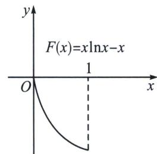
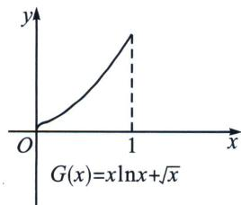

> [!faq]- 《导数专题(下)》例题解析
>
> > [!success]- **【答案】** 详见解析
>
> > [!note]- **【分析】**
> > 本题未单列分析。
>
> > [!note]- **【解析】**
> > 解析
> > 解析
> > 解析 由 $|f(x_1) - f(x_2)| \leqslant |x_1 - x_2|^{\frac{1}{2}}$ 可得： $-\sqrt{x_2 - x_1} \leqslant |f(x_1) - f(x_2)| \leqslant \sqrt{x_2 - x_1}$ ( $1 > x_2 > x_1 > 0$ )，展开可得： $-\sqrt{x_2 - x_1} \leqslant x_1 \ln x_1 - x_2 \ln x_2 \leqslant \sqrt{x_2 - x_1}$ ，显然不能直接构造同构函数进行单调性调整，需要先放缩，拆分为单独含有 $x_1$ 和 $x_2$ 的项，再进行单调性构造调整。
> > 由于 $1 > x_{2} > x_{1} > 0$ ，需要构造 $\sqrt{x_2 - x_1}\geqslant |\sqrt{x_2} -\sqrt{x_1} |$ ，或者 $\sqrt{x_2 - x_1}\geqslant |x_2 - x_1|$ 显然符合题意条件的有：①- $\sqrt{x_2 - x_1} < -(x_2 - x_1) < x_1\ln x_1 - x_2\ln x_2 < (x_2 - x_1) < \sqrt{x_2 - x_1}$
> > $$
> > - **②**：- \sqrt {x _ {2} - x _ {1}} <   - (\sqrt {x _ {2}} - \sqrt {x _ {1}}) <   x _ {1} \ln x _ {1} - x _ {2} \ln x _ {2} <   \sqrt {x _ {2}} - \sqrt {x _ {1}} <   \sqrt {x _ {2} - x _ {1}};
> > $$
> > - **对于①**：， $x_{2}\ln x_{2}+x_{2}>x_{1}\ln x_{1}+x_{1}$ ， $F_{1}(x)=x\ln x+x$ 或者 $x_{2}\ln x_{2}-x_{2}<x_{1}\ln x_{1}-x_{1}$ ， $F_{2}(x)=x\ln x-x$ ，由于 $F_{1}'(x)=\ln x+2$ 不单调，不符合题意； $F_{2}'(x)=\ln x<0$ ， $F_{2}(x_{2})<F_{2}(x_{1})$ ；
> > - **对于②**：， $x_{2}\ln x_{2}+\sqrt{x_{2}}>x_{1}\ln x_{1}+\sqrt{x_{1}}$ ， $G_{1}(x)=x\ln x+\sqrt{x}$ 或者 $x_{2}\ln x_{2}-\sqrt{x_{2}}<x_{1}\ln x_{1}-\sqrt{x_{1}}$ $G_{2}(x)=x\ln x-\sqrt{x}$ ，由于 $G_{1}'(x)=\ln x+1+\frac{1}{2\sqrt{x}}=\frac{1}{\sqrt{x}}\left[\sqrt{x}(\ln x+1)+\frac{1}{2}\right]=$ $\frac{1}{\sqrt{x}}\left(\frac{1}{2\sqrt{\mathrm{e}}}\sqrt{\mathrm{e}x}\ln\sqrt{\mathrm{e}x}+\frac{1}{2}\right)\geqslant\frac{1}{\sqrt{x}}\left(-\frac{1}{2\mathrm{e}\sqrt{\mathrm{e}}}+\frac{1}{2}\right)>0$ ，故 $G_{1}(x_{1})<G_{1}(x_{2})$ 符合题意；
> > $G_{2}^{\prime}(x) = \ln x + 1 - \frac{1}{2\sqrt{x}}$ ，不单调，不符合题意；
> > - **①**：先看不等式左边，当 $x_{2}>x_{1}$ ，构造 $x_{2}\ln x_{2}-x_{1}\ln x_{1}\leqslant x_{2}-x_{1}\leqslant\sqrt{x_{2}-x_{1}}$ ，即证 $x_{2}\ln x_{2}-x_{2}<x_{1}\ln x_{1}-x_{1}$ ，令 $F(x)=x\ln x-x$ ， $F'(x)=\ln x<0$ ，易得 $F(x)$ 在区间 $(0,1)$ 单调递减，则 $F(x_{1})>F(x_{2})$ 。
> > 
> > - **②**：再看右边不等式，当 $x_{2}>x_{1}$ ， $\sqrt{x_{2}}-\sqrt{x_{1}}<\sqrt{x_{2}-x_{1}}$ ，只需证 $x_{1}\ln x_{1}-x_{2}\ln x_{2}<\sqrt{x_{2}}-\sqrt{x_{1}}$ ，即证 $x_{2}\ln x_{2}+\sqrt{x_{2}}>x_{1}\ln x_{1}+\sqrt{x_{1}}$ ，令 $G(x)=x\ln x+\sqrt{x}$ ， $G'(x)=\ln x+1+\frac{1}{2\sqrt{x}}=\frac{1}{2\sqrt{x}}$ $\left(\frac{4}{e}e\sqrt{x}\ln e\sqrt{x}+1\right)\geqslant\frac{1}{2\sqrt{x}}\left(-\frac{4}{e^{2}}+1\right)>0$ ，所以 $G(x_{2})>G(x_{1})$ ，
> > 
> > - **③**：当 $x_{1} = x_{2}$ 时， $|f(x_{1}) - f(x_{2})| = |x_{1} - x_{2}|^{\frac{1}{2}} = 0$ ，且 $f(x_{1}) = f(x_{2})$ 时， $|f(x_{1}) - f(x_{2})| = 0 = |x_{1} - x_{2}|^{\frac{1}{2}}$ ；综上，当 $x_{1}, x_{2} \in (0, 1)$ ， $|f(x_{1}) - f(x_{2})| \leqslant |x_{1} - x_{2}|^{\frac{1}{2}}$ 恒成立.
