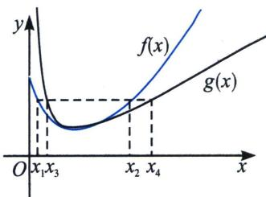
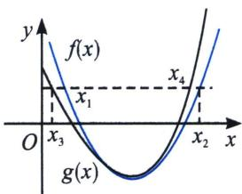

考点1： $f(x)$ 极小值模型

如果我们需要构造 $x_{1} + x_{2} < 2x_{0}$ 以及 $x_{1}x_{2} < x_{0}^{2}$ ，我们需要找到 $f(x)$ 极值点处的先大后小的拟合函数 $g(x)$ ，如左图，且 $g(x_{3}) = g(x_{4})$ 时，一定有 $x_{3} + x_{4} \leqslant 2x_{0}$ 或者 $x_{3}x_{4} \leqslant x_{0}^{2}$ ；

如果我们需要构造 $x_{1}+x_{2}>2x_{0}$ 以及 $x_{1}x_{2}>x_{0}^{2}$ ，我们需要找到 $f(x)$ 极值点处的先小后大的拟合函数 $g(x)$ ，如右图，且 $g(x_{3})=g(x_{4})$ 时，一定有 $x_{3}+x_{4}\geqslant2x_{0}$ 或者 $x_{3}x_{4}\geqslant x_{0}^{2}$ ;
