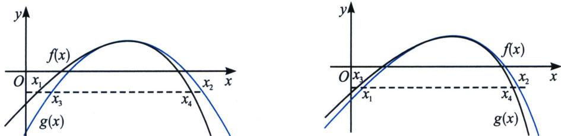

考点 2: $f(x)$ 极大值模型

如果我们需要构造 $x_{1} + x_{2} < 2x_{0}$ 以及 $x_{1}x_{2} < x_{0}^{2}$ ，我们需要找到 $f(x)$ 的先小后大的拟合函数 $g(x)$ ，如左图，且 $g(x_{3}) = g(x_{4})$ 时，一定有 $x_{3} + x_{4} \leqslant 2x_{0}$ 或者 $x_{3}x_{4} \leqslant x_{0}^{2}$ ；

如果我们需要构造 $x_{1}+x_{2}>2x_{0}$ 以及 $x_{1}x_{2}>x_{0}^{2}$ ，我们需要找到 $f(x)$ 的先大后小的拟合函数 $g(x)$ ，如右图，且 $g(x_{3})=g(x_{4})$ 时，一定有 $x_{3}+x_{4}\geqslant2x_{0}$ 或者 $x_{3}x_{4}\geqslant x_{0}^{2}$ ;

如果我们回看高考，就会发现很多高考题都能按照不偏移函数拟合原函数，比如和型不偏移函数就是二次函数 $g(x)=a(x-x_{0})^{2}+y_{0}((x_{0},y_{0})$ 为极值点)，因为极值点所在直线就是对称轴，而积型不偏移函数就是对勾函数 $g(x)=a\left(\frac{x}{x_{0}}+\frac{x_{0}}{x}\right)+y_{0}-2a((x_{0},y_{0})$ 为极值点)，我们分别通过高考题来解读.
