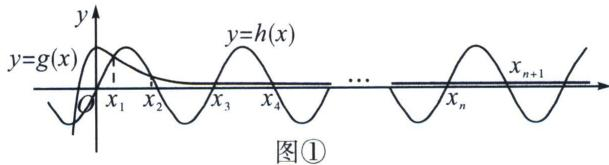
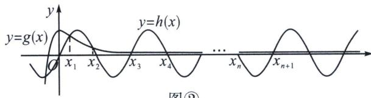

> [!faq]- 《导数专题(下册)》例题解析
>
> > [!success]- **【答案】** D
>
> > [!note]- **【分析】**
> > 本题未单列分析。
>
> > [!note]- **【解析】**
> > 解析 依题意有， $f'(x)=-\sin x+\frac{x+1}{e^{x}}$ ， $f(x)$ 在 $(0,+\infty)$ 上的所有极值点，即函数 $f'(x)$ 在 $(0,+\infty)$ 上的零点，亦即函数 $g(x)=\frac{x+1}{e^{x}}$ 与 $h(x)=\sin x$ 图象交点横坐标，当 x>0 时， $g'(x)=-\frac{x}{e^{x}}<0$ ，函数 $g(x)=\frac{x+1}{e^{x}}$ 在 $(0,+\infty)$ 上单调递减，且恒有 $0<g(x)<1$ ，作出函数 $y=g(x)$ ， $y=h(x)$ 的图象，
> > 
> > 
> > 图②
> > 观察图象知， $0<x_{1}<\frac{\pi}{2}$ ，显然不等式 $\frac{\pi}{2}<x_{1}<\frac{3\pi}{2}$ 不成立，A错误；
> > 显然 $x_{2} - x_{1} < \pi, x_{3} - x_{2} > \pi$ ，B错误；
> > $\left|x_{n}-(n-1)\pi\right|$ 在数轴上表示 $f'(x)$ 的第 n 个零点 $x_{n}$ 与 $(n-1)\pi$ 的距离，由于 $g(x)=\frac{x+1}{e^{x}}$ 在 $(0,+\infty)$ 上单调递减，因此随着 n 的增大， $\left|x_{n}-(n-1)\pi\right|$ 逐渐减小，即 $\left\{\left|x_{n}-(n-1)\pi\right|\right\}$ 为递减数列，D 正确；显然 $x_{1}-0>\pi-x_{2}>x_{3}-2\pi$ ，即有 $x_{1}+x_{2}>\pi$ ， $x_{2}+x_{3}<3\pi$ ，C 错误。
> >
> > 故选 **D**.
