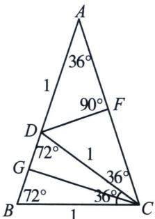

> [!faq]- 《导数专题(下册)》例题解析
>
> > [!success]- **【答案】** 3
>
> > [!note]- **【解析】**
> > 解析 由 $f(x)=\sin2x-2\sin x+x+1$ ，可得 $f'(x)=2\cos2x-2\cos x+1$ ，因为函数 $f(x)$ 的极值点从小到大依次为 $x_{1}, x_{2}, \cdots, x_{n}$ ，所以方程 $2\cos2x-2\cos x+1=0$ ，即 $4\cos^{2}x-2\cos x-1=0$ 的根从小到大依次为 $x_{1}, x_{2}, \cdots, x_{n}$ ，解方程，可得 $\cos x=\frac{1-\sqrt{5}}{4}$ 或 $\cos x=\frac{1+\sqrt{5}}{4}(-\pi\leqslant x\leqslant\pi)$ 。如图，在等腰 $\triangle ABC$ 中，AB=AC， $A=\frac{\pi}{5}$ ，CB=CD=AD=1，F，G分别为AC，BD的中点，
> >
> > 
> >
> > 令 $BD = t$ ，由 $\Delta ABC \sim \Delta CBD$ ，得 $\frac{AB}{CB} = \frac{BC}{BD}$ ，即 $\frac{1 + t}{1} = \frac{1}{t}$ ，由 $t > 0$ ，解得 $t = \frac{\sqrt{5} - 1}{2}$ ，所以在 $\Delta AFD$ 中， $\cos \frac{\pi}{5} = \frac{AF}{AD} = \frac{\frac{1}{2}AC}{AD} = \frac{\frac{1}{2}(1 + t)}{t} = \frac{1 + \sqrt{5}}{4}$ ，在 $\Delta BCG$ 中， $\sin \frac{\pi}{10} = \frac{BG}{BC} = \frac{\frac{1}{2}BD}{BC} = \frac{\frac{1}{2}t}{1} = \frac{\sqrt{5} - 1}{4}$ ，则 $\cos \frac{3\pi}{5} = -\cos \frac{2\pi}{5} = -\sin \frac{\pi}{10} = \frac{1 - \sqrt{5}}{4}$ ，所以 $\cos \left(-\frac{3\pi}{5}\right) = \cos \frac{3\pi}{5} = \frac{1 - \sqrt{5}}{4}$ ， $\cos \left(-\frac{\pi}{5}\right) = \cos \frac{\pi}{5} = \frac{1 + \sqrt{5}}{4}$ ，即 $x_{1} = -\frac{3\pi}{5}$ ， $x_{2} = -\frac{\pi}{5}$ ， $x_{3} = \frac{\pi}{5}$ ， $x_{4} = \frac{3\pi}{5}$ ，所以 $\frac{x_{n} - x_{1}}{x_{n-1} - x_{2}} = \frac{x_{4} - x_{1}}{x_{3} - x_{2}} = \frac{\frac{3\pi}{5} - \left(-\frac{3\pi}{5}\right)}{\frac{\pi}{5} - \left(-\frac{\pi}{5}\right)} = 3.$ 故答案为：3.
