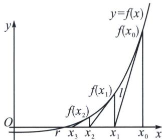

<!-- question-source:start -->
例11（2024·海淀区期中）牛顿和拉弗森在17世纪提出了“牛顿迭代法”，相比二分法可以更快速的给出近似值，至今仍在计算机等学科中被广泛应用。如图，设 $r$ 是方程 $f(x) = 0$ 的根，选取 $x_0$ 作为 $r$ 初始近似值.

过点 $(x_{0}, f(x_{0}))$ 作曲线 $y=f(x)$ 在 $(x_{0}, f(x_{0}))$ 处的切线，切线方程为 $l_{1}$ ，当 $f'(x_{0})\neq0$ 时，称 $l_{1}$ 与 x 轴的交点的横坐标 $x_{1}$ 是 r 的 1 次近似值；

过点 $(x_{1}, f(x_{1}))$ 作曲线 $y=f(x)$ 在 $(x_{1}, f(x_{1}))$ 处的切线，切线方程为 $l_{2}$ ，当 $f'(x_{1})\neq0$ 时，称 $l_{2}$ 与 x 轴的交点的横坐标 $x_{2}$ 是 r 的 2 次近似值；重复以上过程，得到 r 的近似值序列 $\{x_{n}\}$ 。这就是所谓的“牛顿迭代法”。

(1)当 $f^{\prime}(x_{n})\neq 0$ ， $n\in \mathbf{N}^{*}$ 时， $r$ 的 $n + 1$ 次近似值 $x_{n + 1}$ 与 $n$ 次近似值 $x_{n}$ 可建立等式关系： $x_{n + 1}$

=\_\_\_\_;

(2)若取 $x_0 = 2$ 作为 $r$ 的初始近似值，根据牛顿迭代法，计算 $\sqrt{3}$ 的2次近似值为\_\_\_\_（用分数表示）.

<!-- question-source:end -->

![[高中/总复习/专题/2026版高中《mst老唐说题》导数专题（数学）/下册/第10章_导数不等式与数列综合/第一节_导数与数列递推/二_切线方程与数列构造/例题/answers/Q00052882A1.md]]
