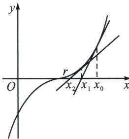

<!-- question-source:start -->
例15 (2024·广州月考)牛顿法(Newton'smethod)是牛顿在17世纪提出的一种用导数求方程近似解的方法, 其过程如下: 如图, 设 $r$ 是 $f(x)=0$ 的根, 选取 $x$ . 作为 $r$ 的初始近似值, 过点 $(x_0, f(x_0))$ 作曲线 $y=f(x)$ 的切线 $L$ , $L$ 的方程为 $y=f(x_0)+f'(x_0)(x-x_0)$ . 如果 $f'(x_0)\neq0$ , 则 $L$ 与 $x$ 轴的交点的横坐标记为 $x_1$ , 称 $x_1$ 为 $r$ 的一阶近似值. 再过点 $(x_1, f(x_1))$ 作曲线 $y=f(x)$ 的切线, 并求出切线与 $x$ 轴的交点横坐标记为 $x_2$ , 称 $x_2$ 为 $r$ 的二阶近似值. 重复以上过程, 得 $r$ 的近似值序列: $x_1, x_2, \cdots, x_n$ , 根据已有精确度 $\varepsilon$ , 当 $|x_n-r|<\varepsilon$ 时, 给出近似解. 对于函数 $f(x)=x+\ln x$ , 已知 $f(r)=0$ .

(1)若给定 $x_{0}=1$ ，求r的二阶近似值 $x_{2}$ ;

(2) 设 $x_{n+1} = g(x_n)$ , $h(x) = -(x + 1)g(x) - \ln x + e^x - e^{-x}$

①试探求函数 $h(x)$ 的最小值 $m$ 与 $r$ 的关系；②证明： $m < \sqrt{e} - \frac{3}{4}$ .

<!-- question-source:end -->

![[高中/总复习/专题/2026版高中《mst老唐说题》导数专题（数学）/下册/第10章_导数不等式与数列综合/第一节_导数与数列递推/二_切线方程与数列构造/例题/answers/Q00052884A1.md]]
