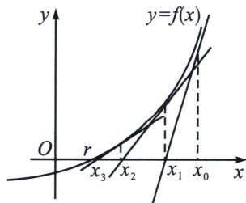

<!-- question-source:start -->
例18（2024·市南区期末）牛顿（1643－1727）给出了牛顿切线法求方程的近似解：如图设 r 是 y=例18 (2024·市南区期末)牛顿(1643-1727)给出了牛顿切线法求方程的近似解: 如图设 $r$ 是 $y = f(x)$ 的一个零点, 任意选取 $x_0$ 作为 $r$ 的初始近似值, 过点 $(x_0, f(x_0))$ 作曲线 $y = f(x)$ 的切线 $l_{1}, l_{1}$ 与 $x$ 轴的交点为横坐标为 $x_{1}$ ，称 $x_{1}$ 为 $r$ 的 1 次近似值，过点 $(x_{1}, f(x_{1}))$ 作曲线 $y = f(x)$ 的切线 $l_{2}, l_{2}$ 与 $x$ 轴的交点为横坐标为 $x_{2}$ ，称 $x_{2}$ 为 $r$ 的 2 次近似值。一般地，过点 $(x_{n}, f(x_{n}))$ 作曲线 $y = f(x)$ 的切线 $l_{n+1}, l_{n+1}$ 与 $x$ 轴的交点为横坐标为 $x_{n+1}$ ，就称 $x_{n+1}$ 为 $r$ 的 $n+1$ 次近似值，称数列 $\{x_{n}\}$ 为牛顿数列。

(1) 若 $f(x)=x^{3}+x-1$ 的零点为 r， $x_{0}=0$ ，请用牛顿切线法求 r 的 2 次近似值；

(2)已知二次函数 $g(x)$ 有两个不相等的实数根 b, $c(c>b)$ ，数列 $\{x_{n}\}$ 为 $g(x)$ 的牛顿数列，数列 $\{c_{n}\}$ 满足 $c_{n}=\frac{x_{n}-b}{x_{n}-c}(n\in\mathbf{N}^{*})$ ，且 $x_{n}>c$ .

(i) 设 $x_{n+1} = h(x_n)$ ，求 $h(x_n)$ 的解析式；

(ii) 证明： $\frac{1}{c_{1}}+\frac{1}{c_{2}}+\cdots+\frac{1}{c_{n}}<\frac{2}{\ln c_{1}}.$

<!-- question-source:end -->

![[高中/总复习/专题/2026版高中《mst老唐说题》导数专题（数学）/下册/第10章_导数不等式与数列综合/第一节_导数与数列递推/二_切线方程与数列构造/例题/answers/Q00052885A1.md]]
