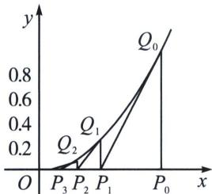
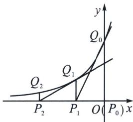

<!-- question-source:start -->
例20 (2024·郑州期末)从函数的观点看, 方程的根就是函数的零点, 设函数的零点为 $r$ . 牛顿在《流数法》一书中, 给出了高次代数方程的一种数值解法——牛顿法. 具体做法如下: 先在 $x$ 轴找初始点 $P_{0}(x_{0}, 0)$ , 然后作 $y = f(x)$ 在点 $Q_{0}(x_{0}, f(x_{0}))$ 处切线, 切线与 $x$ 轴交于点 $P_{1}(x_{1}, 0)$ , 再作 $y = f(x)$ 在点 $Q_{1}(x_{1}, f(x_{1}))$ 处切线 $(Q_{1}P_{1} \perp x$ 轴, 以下同), 切线与 $x$ 轴交于点 $P_{2}(x_{2}, 0)$ , 再作 $y = f(x)$ 在点 $Q_{2}(x_{2}, f(x_{2}))$ 处切线, 一直重复, 可得到一列数: $x_{0}, x_{1}, x_{2}, \cdots, x_{n}$ . 显然, 它们会越来越逼近 $r$ . 于是, 求 $r$ 近似解的过程转化为求 $x_{n}$ , 若设精度为 $\epsilon$ , 则把首次满足 $|x_{n} - x_{n-1}| < \epsilon$ 的 $x_{n}$ . 称为 $r$ 的近似以解.

  
图1

  
图2

(1)设 $f(x)=x^{3}+x^{2}+1$ ，试用牛顿法求方程 $f(x)=0$ 满足精度 $\epsilon=0.5$ 的近似解（取 $x_{0}=-1$ ，且结果保留小数点后第二位）；

(2)如图，设函数 $g(x)=2^{x}$ ;

(i)由以前所学知识，我们知道函数 $g(x) = 2^{x}$ 没有零点，你能否用上述材料中的牛顿法加以解释？

(ii) 若设初始点为 $P_{0}(0,0)$ ，类比上述算法，求所得前 n 个 $\triangle P_{0}Q_{0}P_{1}, \triangle P_{1}Q_{1}P_{2}, \cdots, \triangle P_{n-1}Q_{n-1}P_{n}$ 的面积和.
<!-- question-source:end -->

![[高中/总复习/专题/2026版高中《mst老唐说题》导数专题（数学）/下册/第10章_导数不等式与数列综合/第一节_导数与数列递推/二_切线方程与数列构造/例题/answers/Q00052886A1.md]]
