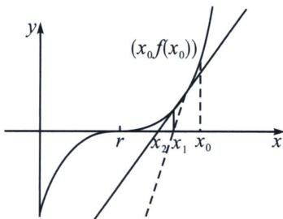

> [!faq]- 《导数专题(下册)》例题解析
>
> > [!success]- **【答案】** ABC
>
> > [!note]- **【分析】**
> > 本题未单列分析。
>
> > [!note]- **【解析】**
> > 解析 $f(x) = \sin x - \cos x, x \in [0, +\infty)$ ，则 $f'(x) = \cos x + \sin x, x \in [0, +\infty)$ ，
> > 设切点坐标 $(x_{n}, f(x_{n}))$ ，则切线斜率 $k=f'(x_{n})=\cos x_{n}+\sin x_{n}$ ，则 $\frac{\sin x_{n}-\cos x_{n}-0}{x_{n}-0}=\cos x_{n}+\sin x_{n}$ ，整理得 $x_{n}=\frac{\sin x_{n}-\cos x_{n}}{\cos x_{n}+\sin x_{n}}=\frac{\tan x_{n}-1}{1+\tan x_{n}}=\tan\left(x_{n}-\frac{\pi}{4}\right)$ ，则选项BC错误；
> > 由 $[f(x_n)]^2 = (\sin x_n - \cos x_n)^2 = 2\sin^2 (x_n - \frac{\pi}{4}) = \frac{2\sin^2(x_n - \frac{\pi}{4})}{\sin^2(x_n - \frac{\pi}{4}) + \cos^2(x_n - \frac{\pi}{4})} = \frac{2\tan^2(x_n - \frac{\pi}{4})}{1 + \tan^2(x_n - \frac{\pi}{4})} =$ $\frac{2x_n^2}{1 + x_n^2}$ ，则选项 $D$ 判断正确；若 $|f(x_n)| = 1$ ，则 $\frac{2x_n^2}{1 + x_n^2} = 1$ ，则 $x_{n} = 1$ ，这与题意矛盾，故选项 $A$ 判断错误．故选：ABC.
> > ## 2. 牛顿法作切线与近似值计算
> > 牛顿迭代法(也称牛顿法)是牛顿在17世纪提出的一种求解方程 $f(x)$ 零点近似值的方法，多数 $f(x)$ 不含求根公式，导致求零点的精度很困难，牛顿利用切线原理来设计迭代法。它的基本思想是从一个初始的近似解出发，过该点作曲线的切线，以切线与x轴交点的横坐标作为下一个更精确的近似解。这样连续不断地做下去，得到一个近似解序列 $\{x_{k}\}$ ，
> > $$
> > x _ {k + 1} = x _ {k} - \frac {f (x _ {k})}{f ^ {\prime} (x _ {k})}, k = 0, 1, 2, \dots
> > $$
> > 证明：曲线 $y = f(x)$ 在点 $(x_{k}, f(x_{k}))$ 处的切线为 $y - f(x_{k}) = f'(x_{k})(x - x_{k})$ ，令 $y = 0$ ，则 $x = x_{k} - \frac{f(x_{k})}{f'(x_{k})}$ ，所以 $x_{k+1} = x_{k} - \frac{f(x_{k})}{f'(x_{k})} (f'(x_{k}) \neq 0)$ .
> > 
