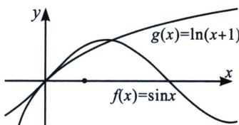

<!-- question-source:start -->
1. 关于 $\sin x$ 与 $\ln (x + 1)$

在比大小章节中，我们给到了一个常见的不等式，当 $x \in (0, 1)$ 时， $\sin x > \ln(1 + x)$ ，其实它们之间满足① $\left\{ \begin{array}{l} \sin x > \ln(1 + x) (-1 < x < 0) \\ \sin x > \ln(1 + x) \left(0 < x \leqslant \frac{\pi}{2}\right) \end{array} \right.$ ，

②当 $x \in \left(\frac{\pi}{2}, e - 1\right)$ 时， $f(x) = \sin x$ 与 $g(x) = \ln (x + 1)$ 有唯一交点；

③当 $x \geqslant e - 1$ 时， $f(x) = \sin x \leqslant 1 < \ln(x + 1)$ ;
<!-- question-source:end -->

![[高中/总复习/专题/2026版高中《mst老唐说题》导数专题（数学）/下册/第11章_三角与导数综合/第一节_三角函数与零点综合/对点训练/answers/Q00046229A1.md]]
