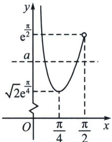
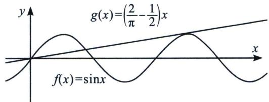

<!-- question-source:start -->
例3 (2023·云南月考)已知函数 $f(x)=\sin x+\frac{1}{x}$ ， $x\in(0,\pi)$ .

(1)求曲线 $y=f(x)$ 在 $x=\frac{\pi}{2}$ 处的切线方程；

(2)若函数 $g(x)=f(x)-ax$ 在 $(0,\pi)$ 上有且仅有一个零点，求 a 的取值范围.

(1)已知 $f(x)=\sin x+\frac{1}{x}$ ，可得 $f'(x)=\cos x-\frac{1}{x^2}$ ，此时 $f'\left(\frac{\pi}{2}\right)=-\frac{4}{\pi^2}$ ，又 $f\left(\frac{\pi}{2}\right)=1+\frac{2}{\pi}$ ，则曲线 $y=f(x)$ 在 $x=\frac{\pi}{2}$ 处的切线方程为 $y-\left(1+\frac{2}{\pi}\right)=-\frac{4}{\pi^2}\left(x-\frac{\pi}{2}\right)$ ，即 $4x+\pi^2y-\pi^2-4\pi=0$ ；
(2)若 $g(x)$ 在 $(0,\pi)$ 上有且仅有一个零点，此时方程 $a=\frac{\sin x}{x}+\frac{1}{x^2}$ 在 $(0,\pi)$ 上有且仅有一个实数根，不妨设 $h(x)=\frac{\sin x}{x}+\frac{1}{x^2}$ ，函数定义域为 $(0,\pi)$ ，可得 $h'(x)=\frac{x\cos x-\sin x}{x^2}-\frac{2}{x^3}=\frac{x(x\cos x-\sin x)-2}{x^3}$ ，不妨设 $k(x)=x\cos x-\sin x$ ，函数定义域为 $(0,\pi)$ ，可得 $k'(x)=-x\sin x<0$ 在 $(0,\pi)$ 上恒成立，所以函数 $k(x)$ 在 $(0,\pi)$ 上单调递减，此时 $k(x)<k(0)=0$ ，则 $h'(x)<0$ 在 $(0,\pi)$ 上恒成立，所以函数 $h(x)$ 在 $(0,\pi)$ 上单调递减，当 $x\to0$ 时， $h(x)\to+\infty$ ，又 $h(\pi)=\frac{1}{\pi^2}$ ，所以函数 $h(x)$ 的值域为 $\left(\frac{1}{\pi^2},+\infty\right)$ ，故a的取值范围为 $\left(\frac{1}{\pi^2},+\infty\right)$ 。

## 例 4 (2025 春·菏泽期中)已知函数 $f(x)=e^{x}+a\cos x$ .

(1)若函数 $f(x)$ 在区间 $\left(0, \frac{\pi}{2}\right)$ 上恰有两个极值点，求实数a的取值范围；

(2) 当 $a \geqslant 1$ 时. 证明:

(i) 若 $x \in \left(0, \frac{\pi}{2}\right)$ ，则 $f(x) > 2 + x$ 恒成立；

(ii) 若 $a \leqslant e^{\frac{\pi}{2}} - 2 - \frac{\pi}{2}, x \in (0, +\infty)$ ，则 $f(x) > 2 + x$ 恒成立.

(1)由已知可得， $f'(x)=e^{x}-a\sin x$ ，

由 $f^{\prime}(x) = e^{x} - a\sin x = 0$ ，可得 $a = \frac{e^x}{\sin x}$ ，令 $g(x) = \frac{e^x}{\sin x}$ ，则 $g^{\prime}(x) = \frac{e^{x}(\sin x - \cos x)}{\sin^{2}x}$ ，当 $0 < x < \frac{\pi}{4}$ 时， $g^{\prime}(x) < 0$ ，所以 $g(x)$ 单调递减．又 $g\left(\frac{\pi}{4}\right) = \frac{e^{\frac{\pi}{4}}}{\sin\frac{\pi}{4}} = \sqrt{2} e^{\frac{\pi}{4}}$ ，所以 $g(x)$ 在 $\left(0, \frac{\pi}{4}\right)$ 上的值域为 $(\sqrt{2} e^{\frac{\pi}{4}}, +\infty)$ ，当 $\frac{\pi}{4} < x < \frac{\pi}{2}$ 时，有 $g^{\prime}(x) > 0$ ，所以 $g(x)$ 单调递增．又 $g\left(\frac{\pi}{2}\right) = \frac{e^{\frac{\pi}{2}}}{\sin\frac{\pi}{2}} = e^{\frac{\pi}{2}}$ ，所以 $g(x)$ 在 $\left(\frac{\pi}{4}, \frac{\pi}{2}\right)$ 上的值域为 $(\sqrt{2} e^{\frac{\pi}{4}}, e^{\frac{\pi}{2}})$ ．作出函数 $g(x) = \frac{e^x}{\sin x}$ 在 $\left(0, \frac{\pi}{2}\right)$ 的图象如下图所示，

由图象可知，当 $\sqrt{2}e^{\frac{\pi}{4}}<a<e^{\frac{\pi}{2}}$ 时， $a=g(x)$ 有两解，

设为 $x_{1}, x_{2}$ , 且 $0 < x_{1} < \frac{\pi}{4}, \frac{\pi}{4} < x_{2} < \frac{\pi}{2}$ , 由图象可知, 当 $0 < x < x_{1}$ 时, 有 $g(x) > a$ , 即 $f'(x) > 0$ ; 当 $x_{1} < x < x_{2}$ 时, 有 $g(x) < a$ , 即 $f'(x) < 0$ ; 当 $x_{2} < x < \frac{\pi}{2}$ 时, 有 $g(x) > a$ , 即 $f'(x) > 0$ , 所以, $f(x)$ 在 $x = x_{1}$ 处取得极大值, 在 $x = x_{2}$ 处取得极小值. 综上所述, $a$ 的取值范围为 $(\sqrt{2} e^{\frac{\pi}{4}}, e^{\frac{\pi}{2}})$ .

(2) 证明：(i) $f(x) = e^{x} + a\cos x > 2 + x, \quad 0 < x \leqslant \frac{\pi}{2}, \quad f(x) = e^{x} + a\cos x > e^{x} + \cos x,$

令 $h(x)=e^{x}+\cos x-2-x,\quad h'(x)=e^{x}-\sin x-1\geqslant x-\sin x\geqslant0,\quad h(x)$ 单调递增， $h(x)>h(0)=0$ 即 $f(x)=e^{x}+a\cos x>e^{x}+\cos x>2+x$ 得证！所以当 $0<x\leqslant\frac{\pi}{2}$ 时，有 $f(x)>x+2;$

(ii) 在 (i) 的条件下，只需讨论 $x \in \left(\frac{\pi}{2}, +\infty\right)$ 上成立，

因为 $1 \leqslant a \leqslant e^{\frac{\pi}{2}} - 2 - \frac{\pi}{2}$ , $\cos x \geqslant -1$ , 所以 $e^{x} + a \cos x \geqslant e^{x} - a \geqslant e^{x} - e^{\frac{\pi}{2}} + 2 + \frac{\pi}{2}$ .

令 $n(x) = e^{x} - x - e^{\frac{\pi}{2}} + \frac{\pi}{2}$ , $n'(x) = e^{x} - 1 > 0$ 在 $\left(\frac{\pi}{2}, +\infty\right)$ 上恒成立, 所以 $n(x)$ 在 $\left(\frac{\pi}{2}, +\infty\right)$ 上单调递增, 所以 $n(x) > n\left(\frac{\pi}{2}\right) = 0$ , 所以当 $x > \frac{\pi}{2}$ 时, 有 $e^{x} - e^{\frac{\pi}{2}} + \frac{\pi}{2} > x$ , 所以 $e^{x} - e^{\frac{\pi}{2}} + \frac{\pi}{2} + 2 > x + 2$ . 又 $e^{x} + a\cos x \geqslant e^{x} - e^{\frac{\pi}{2}} + 2 + \frac{\pi}{2}$ , 所以 $e^{x} + a\cos x > x + 2$ . 综上所述, 在 $(0, +\infty)$ 上, $f(x) > 2 + x$ 恒成立.

## 3. 高精度第二周期见分晓型

如果是在第一个周期，通常是 $x \in (-\pi, \pi)$ 时，甚至是 $x \in \left(-\frac{\pi}{2}, \frac{\pi}{2}\right)$ ，我们常见的 $\frac{2}{\pi} x < \sin x$ $<x$ 切割线放缩，但是到了第二个周期，我们通常会使用一个高精度的放缩 $x \in (\pi, +\infty)$ 时， $\left(\frac{2}{\pi} - \frac{1}{2}\right)x > \sin x$ （如图）.

证明：由于 $x \in \left(0, \frac{\pi}{2}\right]$ 时， $\sin x \geqslant \frac{2x}{\pi}$ ，故 $x \in \left(\frac{\pi}{2}, \pi\right)$ 时， $f\left(\frac{\pi}{2}\right) - g\left(\frac{\pi}{2}\right) > 0$ ， $f(\pi) - g(\pi) < 0$ ， $f(x)$ 与 $g(x)$ 有唯一交点；当 $x \in [\pi, 2\pi]$ 时， $f(x) \leqslant 0 < g(x)$ ， $x \in \left(2\pi, \frac{5\pi}{2}\right)$ 时，两个函数比较靠近，我们将 $f(x)$ 在 $\left(2\pi + \frac{5\pi}{12}, \frac{\sqrt{6} + \sqrt{2}}{4}\right)$ 的切线方程作为中间变量，即 $y - \frac{\sqrt{6} + \sqrt{2}}{4} = \cos \frac{29}{12}\pi$ $\left(x - \frac{29}{12}\pi\right) = \frac{\sqrt{6} - \sqrt{2}}{4}\left(x - \frac{29}{12}\pi\right)$ ，

$x \in \left(2\pi, \frac{5\pi}{2}\right)$ 时，令 $h(x) = \frac{\sqrt{6} - \sqrt{2}}{4} x - \frac{29 \times (\sqrt{6} - \sqrt{2})\pi}{4} + \frac{\sqrt{6} + \sqrt{2}}{4} - \sin x$ ，我们证明切线在函数上方，

$h'(x)=\frac{\sqrt{6}-\sqrt{2}}{4}-\cos x=\cos\frac{29\pi}{12}-\cos x,\quad x\in\left(2\pi,\quad\frac{29\pi}{12}\right),\quad h'(x)<0,\quad h(x)$ 单调递减，

$x \in \left(\frac{29\pi}{12}, \frac{5\pi}{2}\right), h'(x) > 0, h(x)$ 单调递增，所以 $x \in \left(2\pi, \frac{5\pi}{2}\right)$ 时， $\frac{\sqrt{6} - \sqrt{2}}{4} x - \frac{29(\sqrt{6} - \sqrt{2})\pi}{48} + \frac{\sqrt{6} + \sqrt{2}}{4} \geqslant \sin x,$

$m(x) = \left(\frac{2}{\pi} - \frac{1}{2}\right)x - \frac{\sqrt{6} - \sqrt{2}}{4} x + \frac{29 \times (\sqrt{6} - \sqrt{2})\pi}{4} - \frac{\sqrt{6} + \sqrt{2}}{4} = \left(\frac{2}{\pi} - \frac{1}{2} - \frac{\sqrt{6} - \sqrt{2}}{4}\right)x + \frac{29 \times (\sqrt{6} - \sqrt{2})\pi}{4} - \frac{\sqrt{6} + \sqrt{2}}{4} x \in \left(2\pi, \frac{5\pi}{2}\right)$ 时， $g(x) > g\left(\frac{5\pi}{2}\right) > g
(8) > 0$ ，综上所述： $x \in \left(2\pi, \frac{5\pi}{2}\right)$ 时， $\left(\frac{2}{\pi} - \frac{1}{2}\right)x > \sin x.$
<!-- question-source:end -->

![[高中/总复习/专题/2026版高中《mst老唐说题》导数专题（数学）/下册/第11章_三角与导数综合/第一节_三角函数与零点综合/考点1_三角混合_x_sin_x_与_x_cos_x_型/例题/answers/Q00047590A1.md]]
