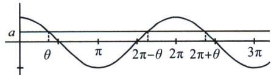
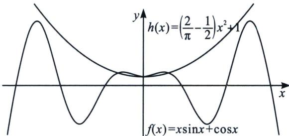

> [!faq]- 《导数专题(下册)》例题解析
>
> > [!success]- **【答案】** 详见解析
>
> > [!note]- **【解析】**
> > 解析 (1) 由 $f(x) = x \sin x + \cos x, x \in [-\pi, \pi]$ ，得 $f'(x) = x \cos x, x \in [-\pi, \pi]$ ，令 $f'(x) = 0$ ，则 $x = 0$ 或 $x = \pm \frac{\pi}{2}$ ，所以当 $-\pi < x < \frac{\pi}{2}$ 或 $0 < x < \frac{\pi}{2}$ 时， $f'(x) > 0$ ；当 $-\frac{\pi}{2} < x < 0$ 或 $\frac{\pi}{2} < x < \pi$ 时， $f'(x) < 0$ ，所以 $f(x)$ 的单调递增区间为 $\left[-\pi, \frac{\pi}{2}\right]$ 和 $\left(0, \frac{\pi}{2}\right]$ ，单调递减区间为 $\left[-\frac{\pi}{2}, 0\right]$ 和 $\left[\frac{\pi}{2}, \pi\right]$ ，所以 $f(x)_{\max} = f\left(-\frac{\pi}{2}\right) = f\left(\frac{\pi}{2}\right) = \frac{\pi}{2}$ ， $f(x)_{\min} = f(-\pi) = f(\pi) = -1$ .
> >
> > (2)证明： $g(x)=f(x)-\frac{1}{2}ax^{2}$ ，则 $g(x)$ 的定义域为 $(-∞,+∞)$ ,
> >
> > 因为 $g(-x)=-x\sin(-x)+\cos(-x)-\frac{1}{2}a(-x)^{2}=x\sin x+\cos x-\frac{1}{2}ax^{2}=g(x)$ ，所以 $g(x)$ 为偶函数，因为 $g(0)=1>0$ ，所以当 $a>\frac{1}{3}$ 时， $g(x)$ 有且仅有两个零点等价于当 $a>\frac{1}{3}$ 时， $g(x)$ 在 $(0,+\infty)$ 上有且仅有一个零点。由 $g(x)=x\sin x+\cos x-\frac{1}{2}ax^{2}$ ，得 $g'(x)=x(\cos x-a)$ ，
> >
> > 法一(隐零点讨论):
> > - **①**：当 $a \geqslant 1$ 时，若 $x > 0$ ，则 $g'(x) < 0$ ，所以 $g(x)$ 在 $(0, +\infty)$ 上单调递减，因为 $g(\pi) = -1 - \frac{1}{2} a\pi^2 < 0$ ，所以 $g(x)$ 在 $(0, +\infty)$ 上有且仅有一个零点，
> >
> > 
> > - **②**：当 $\frac{1}{3}<a<1$ 时，存在 $\theta\in\left(0,\frac{\pi}{2}\right)$ ，使得 $\cos\theta=a$ ，如图，当0<x< $\theta$ 时， $\cos x<a$ ， $g'(x)>0$ ，当 $\theta<x<2\pi-\theta$ ， $g'(x)<0$ ，当 $2\pi-\theta<x<2\pi+\theta$ 时， $g'(x)>0$ ；
> >
> > i．当 $0 < x \leqslant \frac{\pi}{2}$ ，由 $\tan\theta = \sqrt{\frac{1}{a^{2}} - 1}$ ， $\frac{1}{3} < a < 1$ ，可得 $0 < \tan\theta < 2\sqrt{2}$ ，
> >
> > 在区间 $0 < x \leqslant \frac{\pi}{2}$ 时， $g(0) = 1 > 0$ ， $g(\theta) > g(0) > 0$ ， $g\left(\frac{\pi}{2}\right) = \frac{\pi}{2}\left(1 - \frac{a}{2} \cdot \frac{\pi}{2}\right) > 0$ ， $g(x)$ 无零点；
> >
> > ii．当 $\frac{\pi}{2}<x<\pi$ 时， $g'(x)<0,\quad g\left(\frac{\pi}{2}\right)>0,\quad g(\pi)<0$ ，故 $\exists x_{1}\in\left(\frac{\pi}{2},\pi\right)$ ，使得 $g(x_{1})=0;$
> >
> > iii．当 $\pi\leqslant x\leqslant\frac{5\pi}{2}$ 时， $g(x)$ 在 $(\pi,2\pi+\theta)$ 上单调递增，在 $\left(2\pi+\theta,\frac{5\pi}{2}\right)$ 上单调递减，
> >
> > $g(2\pi + \theta) = (2\pi + \theta)\sin (2\pi + \theta) + \cos (2\pi + \theta) - \frac{1}{2} a(2\pi + \theta)^2 = \frac{1}{2}\cos (2\pi + \theta)[2(2\pi + \theta)\tan (2\pi + \theta) + 2 - (2\pi + \theta)^2] = \frac{1}{2} a[-(2\pi + \theta - \tan \theta)^2 + \tan^2 \theta + 2] < \frac{1}{2} a[-(2\pi + \theta - \tan \theta)^2 + 10] < 0,$
> >
> > 判断依据： $\cos \theta = a$ ，当 $a\to \frac{1}{3}$ ，由于 $\sqrt{3} <  \tan \theta <  2 + \sqrt{3} = \tan \left(\frac{5\pi}{12}\right)$ ，所以 $\frac{\pi}{3} <  \theta <  \frac{5\pi}{12},2\pi -\tan \theta +\theta \in$ $\left(\frac{29\pi}{12} -2 - \sqrt{3},\frac{28\pi}{12} -\sqrt{3}\right)$ ，故- $(2\pi -\tan \theta +\theta)^{2} > - 3.\quad 856^{2} = -14.\quad 869;$
> >
> > IV：当 $x > \frac{5\pi}{2}$ 时，当 $x \in \left(\frac{5}{2}\pi, \frac{7}{2}\pi\right)x\sin x + \cos x < x < \frac{1}{6}x^2 < \frac{1}{2}ax^2$ ， $x \in \left[\frac{7}{2}\pi, +\infty\right)$ ， $x\sin x + \cos x < x + 1 < \frac{1}{6}x^2 < \frac{1}{2}ax^2$ ，因此 $g(x)$ 在 $(0, +\infty)$ 上有且仅有一个零点.
> >
> > 法二(分区间放缩):
> > - **①**：当 $a \geqslant 1$ 时，若 $x > 0$ ，则 $g'(x) < 0$ ，所以 $g(x)$ 在 $(0, +\infty)$ 上单调递减，因为 $g(\pi) = -1 - \frac{1}{2} a\pi^2 < 0$ ，所以 $g(x)$ 在 $(0, +\infty)$ 上有且仅有一个零点，
> > - **②**：当 $\frac{1}{3} < a < 1$ 时，存在 $\theta \in \left(0, \frac{\pi}{2}\right)$ ，使得 $\cos \theta = a$ ，当 $0 < x < \theta$ 时， $\cos x < a$ ， $g'(x) > 0$ ，当 $\theta < x <$
> >
> > $2\pi-\theta,\ g'(x)<0$ ，当 $2\pi-\theta<x<2\pi+\theta$ 时， $g'(x)>0$ ;
> >
> > i．当 $0 < x \leqslant \frac{\pi}{2}$ ，由于 $\sin x \geqslant \frac{2}{\pi}x$ ， $\cos x \geqslant 1 - \frac{x^{2}}{2}$ ，所以 $x \sin x + \cos x > \left(\frac{2}{\pi} - \frac{1}{2}\right)x^{2} + 1 > \frac{1}{2}x^{2} > \frac{ax^{2}}{2}$ ，所以在区间 $0 < x \leqslant \frac{\pi}{2}$ 时， $g(x)$ 无零点；
> >
> > 
> >
> > ii．当 $\frac{\pi}{2}<x<\pi$ 时， $g'(x)<0$ ， $g\left(\frac{\pi}{2}\right)>0$ ， $g(\pi)<0$ ，故 $\exists x_{1}\in\left(\frac{\pi}{2},\pi\right)$ ，使得 $g(x_{1})=0$ ；
> > iii．当 $\pi\leqslant x\leqslant2\pi$ 时， $x\sin x+\cos x<1<\frac{1}{6}\pi^{2}<\frac{ax^{2}}{2}$ ，所以在区间 $\pi\leqslant x\leqslant2\pi$ 时， $g(x)$ 无零点；
> > iv．当 $x>2\pi$ 时，构造中间函数 $h(x)=\left(\frac{2}{\pi}-\frac{1}{2}\right)x^{2}+1$ ，当 $\left(\frac{2}{\pi}-\frac{1}{2}\right)x^{2}+1=\frac{1}{6}x^{2}$ 时， $x\approx5.8<2\pi$ 所以 $x>2\pi$ 时，需证 $x\sin x + \cos x < \left(\frac{2}{\pi} - \frac{1}{2}\right)x^{2} + 1 < \frac{1}{6}x^{2} < \frac{1}{2}ax^{2}$ ，只需证 $x\sin x < \left(\frac{2}{\pi} - \frac{1}{2}\right)x^{2}$ ，只需证 $\sin x < \left(\frac{2}{\pi} - \frac{1}{2}\right)x$ 恒成立，参考本讲见的模型，构造 $\sin x$ 在 $\left(\frac{29\pi}{12}, \frac{\sqrt{6} + \sqrt{2}}{4}\right)$ 处的切线， $p(x)=\frac{\sqrt{6}-\sqrt{2}}{4}x-\frac{29\times(\sqrt{6}-\sqrt{2})\pi}{4}+\frac{\sqrt{6}+\sqrt{2}}{4}$ ，再证 $\sin x < p(x) < \left(\frac{2}{\pi} - \frac{1}{2}\right)x$ （具体过程参考本例题前的模型），因此 $g(x)$ 在 $(0, +\infty)$ 上有且仅有一个零点．所以 $g(x)$ 有且仅有两个零点．
> >
> > 注意: 三角的零点问题难度更多在于不等式恒成立, 所以更多篇章我们会在下一章节展开.
