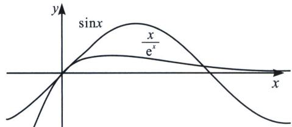
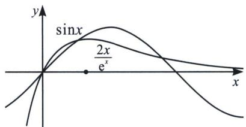
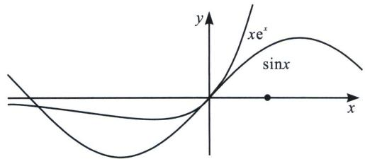
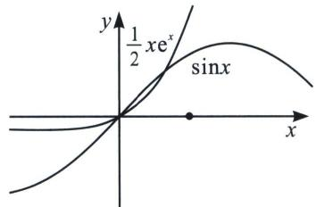

<!-- question-source:start -->
2. 关于 $\frac{x}{e^x}$ 、 $xe^x$ 与 $\sin x$ 零点

由于 y=x 是 $\sin x$ 与 $\frac{x}{e^{x}}$ 以及 $xe^{x}$ 在原点处的公切线，故 $x\in\left(-\frac{\pi}{2},\frac{\pi}{2}\right)$ 时， $xe^{x}\geqslant\sin x\geqslant\frac{x}{e^{x}}$ ;

类似于极点效应，当 $a \neq 1$ 时， $\sin x$ 与 $\frac{ax}{e^x} ax e^x$ 会在 $x \in \left(-\frac{\pi}{2}, \frac{\pi}{2}\right)$ 产生两个交点，临界条件进行端点探路.
<!-- question-source:end -->
