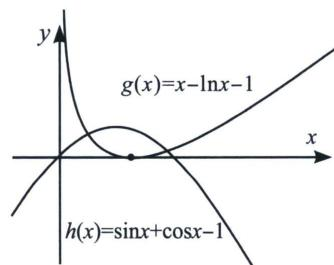

> [!faq]- 《导数专题(下册)》例题解析
>
> > [!success]- **【答案】** 详见解析
>
> > [!note]- **【解析】**
> > 解析（1）因为 $f(x)=x-\sin x-\cos x$ ，所以 $f'(x)=1-\cos x+\sin x=1-\sqrt{2}\cos\left(x+\frac{\pi}{4}\right)$ ， $x\in\left(-\pi,\frac{\pi}{2}\right)$ ，由 $f'(x)=0$ ，可得 $x=-\frac{\pi}{2}$ ，或 x=0，所以 $x\in\left(-\pi,\frac{\pi}{2}\right)$ ， $f'(x)>0$ ， $f(x)$ 递增， $x\in\left(-\frac{\pi}{2},0\right)$ ， $f'(x)<0$ ， $f(x)$ 递减， $x\in\left(0,\frac{\pi}{2}\right)$ ， $f'(x)>0$ ， $f(x)$ 单调递增，所以 $x=-\frac{\pi}{2}$ 时，函数 $f(x)$ 有极大值 $f\left(-\frac{\pi}{2}\right)=1-\frac{\pi}{2}$ ，x=0时，函数 $f(x)$ 有极小值 $f(0)=-1$ ；
> >
> > (2)法一(直接讨论): 因为 $F(x) = f(x) - \ln x = x - \sin x - \cos x - \ln x, x > 0$ , 所以 $h(x) = F'(x) = 1 - \cos x + \sin x - \frac{1}{x}, x > 0$ , 所以 $h'(x) = \sin x + \cos x + \frac{1}{x^2} = \sqrt{2} \sin \left( x + \frac{\pi}{4} \right) + \frac{1}{x^2}$ , 由于 $\sin \left( x + \frac{\pi}{4} \right)$ 的正负性在 $\frac{3\pi}{4}$ 处发生反转, 故当 $x \in \left(0, \frac{3\pi}{4}\right)$ 时, $h'(x) > 0$ , $h(x)$ 单调递增, 即 $F'(x)$ 单调递增, 又 $F'\left(\frac{\pi}{4}\right) = 1 - \frac{4}{\pi} < 0$ , $F'\left(\frac{\pi}{2}\right) = 2 - \frac{2}{\pi} > 0$ , 故存在 $x_0 \in \left(\frac{\pi}{4}, \frac{\pi}{2}\right)$ , $F'(x_0) = 0$ , 所以 $x \in (0, x_0)$ , $F'(x) < 0$ , $F(x)$ 单调递减, $x \in \left( x_0, \frac{3\pi}{4} \right)$ , $F'(x) > 0$ , $F(x)$ 单调递增, 所以 $x \in \left(0, \frac{3\pi}{4}\right)$ 时, 函数 $F(x)_{\min} = F(x_0) < F(1) = 1 - \sin 1 - \cos 1 < 0$ , $F(e^{-2}) = e^{-2} - \sin^{-2} - \cos e^{-2} + 2 > 0$ , $F\left(\frac{3\pi}{4}\right) = \frac{3\pi}{4} - \ln \frac{3\pi}{4} > 0$ , 故 $x \in \left(0, \frac{3\pi}{4}\right)$ 时, $F(x) = f(x) - \ln x$ 有两个零点, 当 $x \in \left[\frac{3\pi}{4}, \frac{7\pi}{4}\right)$ 时, $\sqrt{2} \sin \left( x + \frac{\pi}{4} \right) \leqslant 0$ , $F(x) = x - \sin x - \cos x - \ln x = x - \sqrt{2} \sin \left( x + \frac{\pi}{4} \right) - \ln x \geqslant x - \ln x$ , 对于函数 $\varphi(x) = x - \ln x$ , 则 $\varphi'(x) = 1 - \frac{1}{x} = \frac{x-1}{x} > 0$ , 又 $\varphi(1) = 1$ , 所以 $x \in \left[\frac{3\pi}{4}, \frac{7\pi}{4}\right)$ , $\varphi(x) > \varphi(1) = 1$ , 即 $F(x) > 1$ , 此时函数 $F(x) = f(x) - \ln x$ 没有零点, 当 $x \in \left[\frac{7\pi}{4}, +\infty\right)$ 时,
> >
> > $$
> > F (x) = x - \sin x - \cos x - \ln x = x - \sqrt {2} \sin \left(x + \frac {\pi}{4}\right) - \ln x \geqslant x - \sqrt {2} - \ln x,
> > $$
> >
> > 由上可知 $F(x) \geqslant \frac{7\pi}{4} - \sqrt{2} - \ln \frac{7\pi}{4} > 0$ ，故当 $x \in \left[\frac{7\pi}{4}, +\infty\right)$ 时，函数 $F(x) = f(x) - \ln x$ 没有零点，综上，函数 $F(x) = f(x) - \ln x$ 有两个零点.
> >
> > 法二(分而治之): 要证 $F(x) = f(x) - \ln x$ 有两个零点, 只需证 $g(x) = x - \ln x - 1$ 与 $h(x) = \sin x + \cos x - 1$ 有两个交点, $g'(x) = 1 - \frac{1}{x}$ , 故 $g(x)$ 在 $(0, 1)$ 单调递减, 在 $(1, +\infty)$ 单调递增, $g(x)_{\min} = g(1) = 0$ , $h(x) = \sqrt{2} \sin \left(x + \frac{\pi}{4}\right) - 1$ , $h(x)$ 在 $\left(0, \frac{\pi}{4}\right)$ 单调递增, 在 $\left(\frac{\pi}{4}, \frac{5}{4}\pi\right)$ 单调递减, $h(0) = 0$ ;
> >
> > 
> >
> > 当 $x \to 0$ 时， $g(x) = x - \ln x - 1 \to +\infty$ ， $h(1) = \sqrt{2} \sin \left(1 + \frac{\pi}{4}\right) - 1 > \sqrt{2} \sin \left(\frac{\pi}{2} + \frac{\pi}{4}\right) - 1 = 0$ ，所以 $\exists x_1 \in (0, 1)$ ，使得 $g(x_1) = h(x_1)$ ；由于 $h\left(\frac{\pi}{2}\right) = \sqrt{2} \sin \left(\frac{\pi}{2} + \frac{\pi}{4}\right) - 1 = 0$ ， $g\left(\frac{\pi}{2}\right) > g(1) = 0$ ，所以 $\exists x_2 \in \left(1, \frac{\pi}{2}\right)$ ，使得 $g(x_2) = h(x_2)$ ；当 $x \geqslant \frac{\pi}{2}$ 时，当 $x \in \left[\frac{\pi}{2}, 2\pi\right]$ ， $g(x) > 0 \geqslant h(x)$ 恒成立，当 $x \in (2\pi, +\infty)$ ， $g(x) > \sqrt{2} - 1 \geqslant h(x)$ ，综上，函数 $F(x) = f(x) - \ln x$ 有两个零点。
> >
> > 3. $x \sin x$ 与 $\ln(x+1)$
> >
> > 
> >
> > 
> >
> > 此类型题除了 $x = 0$ 是零点以外，在区间 $(0, \pi)$ 有两个零点，在任意 $\left(2k\pi, 2k\pi + \frac{\pi}{2}\right)$ 和 $\left(2k\pi \frac{\pi}{2}, 2k\pi + \pi\right)$ 各有一个零点，我们转化为 $g(x) = \frac{\ln(x + 1)}{x}$ 与 $h(x) = \sin x$ 交点，通过数形结合即可理解.
