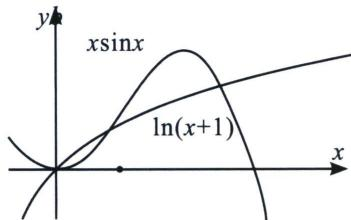
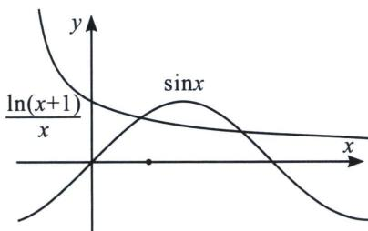

<!-- question-source:start -->
3. $x \sin x$ 与 $\ln(x+1)$

此类型题除了 $x = 0$ 是零点以外，在区间 $(0, \pi)$ 有两个零点，在任意 $\left(2k\pi, 2k\pi + \frac{\pi}{2}\right)$ 和 $\left(2k\pi \frac{\pi}{2}, 2k\pi + \pi\right)$ 各有一个零点，我们转化为 $g(x) = \frac{\ln(x + 1)}{x}$ 与 $h(x) = \sin x$ 交点，通过数形结合即可理解.
<!-- question-source:end -->
