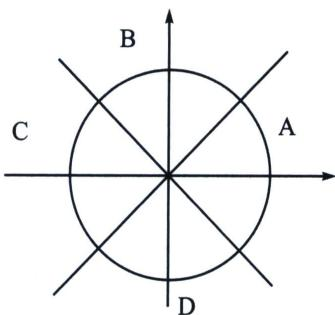

> [!faq]- 《导数专题(下册)》例题解析
>
> > [!success]- **【答案】** 详见解析
>
> > [!note]- **【分析】**
> > 本题未单列分析。
>
> > [!note]- **【解析】**
> > 解析
> > 解法四：
> > 令 $g(x)=5\cos x-\cos(5x+t)$ 当 $t=2k\pi$ 时， $g(x)_{\max}=3\sqrt{3}$ ，即证 t 取其他值时， $\left[5\cos x-\cos(5x+t)\right]_{\max}\geqslant3\sqrt{3}$ ，对 $g(x)$ 求导则有， $g'(x)=-5\sin x+5\sin(5x+t)$ ，令 $g'(x)=0\Rightarrow\sin x=\sin(5x+t)$ ， $15x+t=x+2k\pi$ ，则 $x_{1}=-\frac{t}{4}+\frac{k\pi}{2}$ ，
> > 因此 $g(x_{1})=5\cos x_{1}-\cos(5x_{1}+t)=4\cos x_{1}$ ， $25x+t=\pi-x+2k\pi$ ，则 $x_{2}=-\frac{t}{6}+\frac{k\pi}{3}+\frac{\pi}{6}$
> > $$
> > g \left(x _ {2}\right) = 5 \cos x _ {2} - \cos (\pi - x _ {2} + 2 k \pi) = 6 \cos x _ {2}
> > $$
> > 如下图所示：
> > 
> > $x_{1}$ 在单位圆上有 4 种取法， $\frac{k\pi}{2}$ 的 k=0, 1, 2, 3，因此一定有 $x_{1}$ 落在 A 部分中，则 $(\cos x_{1})_{\max} \geqslant \frac{\sqrt{2}}{2}$ ，所以一定存在 $g(x) \geqslant g(x_{1}) = 2\sqrt{2}$ .
> > 同理 $x_{2}$ 在单位圆上有 6 种取法， $\frac{k\pi}{3}$ 一定有一个 $x_{2}$ 落在 $\left(-\frac{\pi}{6}, \frac{\pi}{6}\right)$ 里，则 $(\cos x_{2})\max \geqslant \frac{\sqrt{3}}{2}$ ，所以一定存在 $g(x) \geqslant g(x_{2}) = 3\sqrt{3}$ ，综上所示存在 b 的最小值为 $3\sqrt{3}$ .
> > (2025·内蒙古呼和浩特·模拟预测)已知函数 $f(x)=\cos x+m\left(x+\frac{\pi}{2}\right)\sin x$ ，其中 $m\leqslant1$ .
> > 解析
