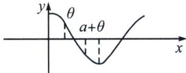
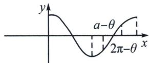

> [!faq]- 《导数专题(下册)》例题解析
>
> > [!success]- **【答案】** 详见解析
>
> > [!note]- **【解析】**
> > 解析 (1) $f'(x) = -5\sin x + 5\sin 5x = 5 (\sin 5x - \sin x) = 5 [\sin (3x + 2x) - \sin (3x + 2x)] = 10\cos 3x\sin 2x$ ，又 $x \in \left(0, \frac{\pi}{4}\right)$ ，故 $\sin 2x > 0$ ，且 $f'\left(\frac{\pi}{6}\right) = 0$ ，又 $\cos 3x$ 在 $\left(0, \frac{\pi}{4}\right)$ 时单调递减，故 $\left(0, \frac{\pi}{6}\right)$ 内 $f'(x) > 0$ ， $f(x)$ 单调递增； $\left(\frac{\pi}{6}, \frac{\pi}{4}\right)$ 内 $f'(x) < 0$ ， $f(x)$ 单调递减，故 $f(x)$ 在 $\left(0, \frac{\pi}{4}\right)$ 的最大值为 $f\left(\frac{\pi}{6}\right) = \frac{5\sqrt{3}}{2} + \frac{\sqrt{3}}{2} = 3\sqrt{3}$ ;
> >
> > (2) $g(x)=\cos x,\quad x\in[a-\theta,\quad a+\theta]$ ，由周期性，改 $a\in[0,2\pi]$ ，则 $-\pi<a-\theta<a+\theta<3\pi,\quad g'(x)=-\sin x$ ，考虑在区间内有无极值。即0， $\pi$ ， $2\pi$ 是不在区间内。
> >
> > 无极值分四类： $-\pi<a-\theta<a+\theta<0$ （舍）， $0<a-\theta<a+\theta<\pi$ ，此时， $g'(x)<0$ ， $g(x)\downarrow$ ， $g(x)_{\min}=g(a+\theta)=\cos(a+\theta)<\cos\theta$
> >
> > 
> >
> > $$
> > \pi <   a - \theta <   a + \theta <   2 \pi
> > $$
> >
> > 此时， $g'(x)>0,\quad g(x)\uparrow,\quad g(x)_{\min}=g(a-\theta)=\cos(a-\theta)<\cos(2\pi-\theta)=\cos\theta.$
> >
> > 
> >
> > $$
> > 2 \pi <   a - \theta <   a + \theta <   3 \pi (\text {   舍   })
> > $$
> >
> > 有极值：①当 $-\pi<a-\theta<0<a+\theta$ 时，此时0作为极大值，此时 $a-\theta<\theta<a+\theta$ 。由连续性， $\min\{\cos(a-\theta),\cos(a+\theta)\}<\cos\theta.$ ② $a<a-\theta<\pi<a+\theta$ 。此时 $g(x)_{\min}=g(\pi)=-1\leqslant g(\theta)=\cos\theta.$
> >
> > 综上：得证！
> >
> > 
> >
> > (3)结合余弦函数的周期可知 $\varphi\in[0,2\pi)$ 可表示所有 $\varphi$ 的情况，结合 $5\cos x$ 周期为 $2\pi,\cos(5x+\varphi)$ 周期为 $\frac{2\pi}{5}$ 可知 $5\cos x-\cos(5x+\varphi)$ 周期为 $2\pi.$ 当 $\varphi=0$ 时， $5\cos x-\cos(5x+\varphi)=5\cos x-\cos5x=f(x)$ ，由(1)可知 $f(x)$ 在 $\left(0,\frac{\pi}{4}\right)$ 的最大值为 $3\sqrt{3}$ ;
> >
> > 法一：先猜后证，考虑 $\varphi = 0$ 时候 $b$ 的最小值为 $3\sqrt{3}$ ，猜测 $3\sqrt{3}$ 为所求，
> >
> > $g(x)=5\cos x-\cos(5x+t)$ ，下证 $b=3\sqrt{3}$ 为所求，
> > - **①**：若 $b<3\sqrt{3}$ ，不妨设 $t\in[-\pi,\pi)$ ，则 $\left|g(x)\right|<3\sqrt{3}$ ， $\forall x\in R$
> >
> > $$
> > g \left(\frac {\pi - t}{6}\right) = 5 \cos \frac {\pi - t}{6} - \cos \left(\frac {5 \pi - 5 t}{6} + t\right) = 5 \cos \frac {t - \pi}{6} + \cos \frac {t - \pi}{6} = 6 \cos \frac {t - \pi}{6} <   3 \sqrt {3}
> > $$
> >
> > 同理， $g\left(\frac{-\pi - t}{6}\right) = 5\cos \frac{t + \pi}{6} -\cos \left(\frac{-5\pi - 5t}{6} +t\right) = 6\cos \frac{t + \pi}{6} < 3\sqrt{3}$
> >
> > 因此有 $\cos \frac{t - \pi}{6} < \frac{\sqrt{3}}{2}$ , $\cos \frac{t + \pi}{6} < \frac{\sqrt{3}}{2}$ , $t \in [-\pi, \pi)$ , 则 $\frac{t - \pi}{6} \in \left[-\frac{\pi}{3}, 0\right)$ , $\frac{t + \pi}{6} \in \left[0, \frac{\pi}{3}\right)$
> >
> > 则 $\left\{\begin{aligned}\frac{t-\pi}{6}&<-\frac{\pi}{6}\\ \frac{t+\pi}{6}&>\frac{\pi}{6}\end{aligned}\right.\Rightarrow\left\{\begin{aligned}t&<0\\ t&>0\end{aligned}\right.$ 矛盾.
> > - **②**：若 $b = 3\sqrt{3}$ ，则取 $t = 0$ ， $f(x) = 5\cos x - \cos 5x = 5\cos x - (16\cos^5 x - 20\cos^3 x + 5\cos x) = 20t^3 -16$ $t^5$ ， $t = \cos x$ ，证明 $\forall t\in [-1,1]$ 有 $20t^{3} - 16t^{5}\leqslant 3\sqrt{3}$ ， $t = \frac{\sqrt{3}}{2}$ 时取等，
> >
> > 下证 $t^{6}(20-16t^{2})^{2}\leqslant27\Leftrightarrow x^{3}(20-16x)^{2}\leqslant27,\quad\forall x\in[0,1]$
> >
> > 均值： $\left(\frac{32}{3} x\right)^3 (20 - 16x)^2\leqslant \left(\frac{40}{5}\right)^5 = 8^5\Rightarrow x^3 (20 - 16x)^2\leqslant 27$ ，得证
> >
> > 法二：赋值当 $\varphi=0$ 时，前面已求 b 的最小值为 $3\sqrt{3}$ ，当 $\varphi\in(0,2\pi)$ 时，取 $x=\frac{\pi-\varphi}{6}\in\left(-\frac{\pi}{6},\frac{\pi}{6}\right)$ ，则 $5\cos x-\cos\left(\frac{5\pi+\varphi}{6}\right)=5\cos x-\cos\left[\pi-\left(\frac{\pi-\varphi}{6}\right)\right]=5\cos x-\cos(\pi-x)=6\cos x\geqslant3\sqrt{3}$ ，得 b 的最小值为 $3\sqrt{3}$ .
> >
> > 法三：必要性+充分性
> >
> > 必要性：当 $\varphi=0$ 时，同法二，可得 $b\geqslant3\sqrt{3}$
> >
> > 充分性：当 $\varphi \neq 0$ 时，结合(2)的结论，取 $\theta = \frac{5\pi}{6}$ ， $a = \varphi$ ，则存在 $y \in \left[\varphi - \frac{5\pi}{6}, \varphi + \frac{5\pi}{6}\right]$ ，使得 $\cos y \leqslant \cos \frac{5\pi}{6}$ ，取 $x = \frac{y - \varphi}{5} \in \left[-\frac{\pi}{6}, \frac{\pi}{6}\right]$ ，则 $\cos x \geqslant \cos \frac{\pi}{6}$ ，且 $\cos (5x + \varphi) = \cos y \leqslant \cos \frac{5\pi}{6}$
> >
> > $$
> > 5 \cos x - \cos (5 x + \varphi) \geqslant 5 \cos \frac {\pi}{6} - \cos \frac {5 \pi}{6} \geqslant 3 \sqrt {3}
> > $$
> >
> > 解法四：
> >
> > 令 $g(x)=5\cos x-\cos(5x+t)$ 当 $t=2k\pi$ 时， $g(x)_{\max}=3\sqrt{3}$ ，即证 t 取其他值时， $\left[5\cos x-\cos(5x+t)\right]_{\max}\geqslant3\sqrt{3}$ ，对 $g(x)$ 求导则有， $g'(x)=-5\sin x+5\sin(5x+t)$ ，令 $g'(x)=0\Rightarrow\sin x=\sin(5x+t)$ ， $15x+t=x+2k\pi$ ，则 $x_{1}=-\frac{t}{4}+\frac{k\pi}{2}$ ，
> >
> > 因此 $g(x_{1})=5\cos x_{1}-\cos(5x_{1}+t)=4\cos x_{1}$ ， $25x+t=\pi-x+2k\pi$ ，则 $x_{2}=-\frac{t}{6}+\frac{k\pi}{3}+\frac{\pi}{6}$
> >
> > $$
> > g \left(x _ {2}\right) = 5 \cos x _ {2} - \cos (\pi - x _ {2} + 2 k \pi) = 6 \cos x _ {2}
> > $$
> >
> > 如下图所示：
> >
> > 
> >
> > $x_{1}$ 在单位圆上有 4 种取法， $\frac{k\pi}{2}$ 的 k=0, 1, 2, 3，因此一定有 $x_{1}$ 落在 A 部分中，则 $(\cos x_{1})_{\max} \geqslant \frac{\sqrt{2}}{2}$ ，所以一定存在 $g(x) \geqslant g(x_{1}) = 2\sqrt{2}$ .
> >
> > 同理 $x_{2}$ 在单位圆上有 6 种取法， $\frac{k\pi}{3}$ 一定有一个 $x_{2}$ 落在 $\left(-\frac{\pi}{6}, \frac{\pi}{6}\right)$ 里，则 $(\cos x_{2})\max \geqslant \frac{\sqrt{3}}{2}$ ，所以一定存在 $g(x) \geqslant g(x_{2}) = 3\sqrt{3}$ ，综上所示存在 b 的最小值为 $3\sqrt{3}$ .
> >
> > (2025·内蒙古呼和浩特·模拟预测)已知函数 $f(x)=\cos x+m\left(x+\frac{\pi}{2}\right)\sin x$ ，其中 $m\leqslant1$ .
> >
> > (1)证明：曲线 $y=f(x)$ 是中心对称图形；
> >
> > (2) 讨论函数 $f(x)$ 在 $(-π, 0)$ 内零点的个数；
> >
> > (3)若存在 t>0，当 $x\in\left(-\frac{\pi}{2}-t,-\frac{\pi}{2}\right)$ 时，总有 $\left|f(x)\right|<-2x-\pi$ 成立，求符合条件的 m 的最小值.
> >
> > 解析 (1) 因为 $f(x) = \cos x + m\left(x + \frac{\pi}{2}\right)\sin x$ ，所以 $f\left(x - \frac{\pi}{2}\right) = \cos \left(x - \frac{\pi}{2}\right) + m\left(x - \frac{\pi}{2} + \frac{\pi}{2}\right)\sin \left(x - \frac{\pi}{2}\right) = \sin x - mx\cos x$ ，因为 $y = \sin x - mx\cos x$ 是奇函数，其图象关于原点对称，所以 $f\left(x - \frac{\pi}{2}\right)$ 关于点(0, 0)中心对称，所以 $y = f(x)$ 是关于点 $\left(-\frac{\pi}{2}, 0\right)$ 中心对称.
> >
> > (2) 据题意 $f'(x)=(m-1)\sin x+m\left(x+\frac{\pi}{2}\right)\cos x=F(x)$ ，当 $0 \leqslant m \leqslant 1$ 时， $f'(x)>0$ ，故函数 $f(x)$ 在 $(-π,0)$ 上单调递增，且 $f(-π)f(1)<0$ ，
> >
> > 故存在唯一的零点 $x = -\frac{\pi}{2}$ . 当 $m < 0$ 时, $F'(x) = (2m - 1)\cos x - m\left(x + \frac{\pi}{2}\right)\sin x$ , 当 $x \in \left(-\pi, -\frac{\pi}{2}\right)$ 时, $F'(x) > 0$ , 函数 $f'(x)$ 单调递增; 当 $x \in \left(-\frac{\pi}{2}, 0\right)$ 时, $F'(x) < 0$ , 函数 $f'(x)$ 单调递减; 由 $f'(-\pi) < 0$ , $f'\left(-\frac{\pi}{2}\right) > 0$ , $f'(x) < 0$ , 可知, 存在唯一的 $x_1 \in \left(-\pi, -\frac{\pi}{2}\right)$ , 使得 $f'(x_1) = 0$ , 存在唯一的 $x_2 \in \left(-\frac{\pi}{2}, 0\right)$ , 使得 $f'(x_2) = 0$ .
> >
> > 因此，函数 $f(x)$ 在 $(-π, x_{1})$ 和 $(x_{2}, 0)$ 单调递减，在 $(x_{1}, x_{2})$ 单调递增.
> >
> > 由 $f(-\pi) < 0$ ， $f\left(-\frac{\pi}{2}\right) = 0$ ， $f(0) > 0$ ，可知函数 $f(x)$ 有唯一零点。综上，函数 $f(x)$ 在 $(- \pi, 0)$ 内有且仅有一个零点。
> >
> > $$
> > g (x) = - 2 x - \pi - | f (x) |
> > $$
> >
> > $$
> > m <   0
> > $$
> >
> > $$
> > x \in \left(x _ {1}, - \frac {\pi}{2}\right)
> > $$
> >
> > $$
> > f (x) <   0
> > $$
> >
> > 问题等价于存在 t>0，当 $x\in\left(-\frac{\pi}{2}-t,-\frac{\pi}{2}\right)$ 时，总有 $g(x)=-2x-\pi+f(x)>0$ 成立.
> > 由 $g'(x)=-2+f'(x)$ ， $g'(x)=f''(x)>0$ ，可得函数 $g'(x)$ 在 $\left(x_{1}, -\frac{\pi}{2}\right)$ 上单调递增。当 m<-1 时， $g'\left(-\frac{\pi}{2}\right)>0$ ， $g'(x_{1})<0$ ，故存在唯一的 $t_{0}\in\left(x_{1}, -\frac{\pi}{2}\right)$ ，满足 $g'(t_{0})=0$ ，
> >
> > 因此，当 $x \in \left(t_0, -\frac{\pi}{2}\right)$ 时，函数 $g(x)$ 单调递增，故 $g(x) < g\left(-\frac{\pi}{2}\right) = 0$ ，不合题意。当 $m = -1$ 时， $g'\left(-\frac{\pi}{2}\right) = 0$ ，当 $x \in \left(x_1, -\frac{\pi}{2}\right)$ 时， $g'(x) < 0$ ，函数 $g(x)$ 单调递减，故 $g(x) > g\left(-\frac{\pi}{2}\right) = 0$ 合题意。综上，取 $t = -\frac{\pi}{2} - x_1$ ，当 $x \in \left(-\frac{\pi}{2} - t, -\frac{\pi}{2}\right)$ 时，总有 $|f(x)| < -2x - \pi$ 成立，此时 $m$ 的最小值为-1。
