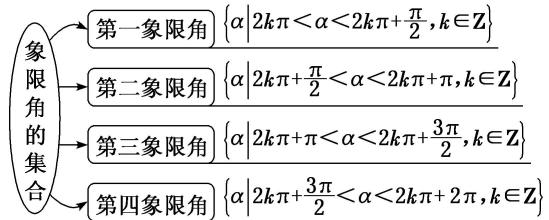

<!-- source-part:1 pages:1-8 -->

# 专题一 任意角、弧度制及任意角的三角函数

![[高中/总复习/专题/三角函数/专题1 任意角、弧度制及任意角的三角函数-三角函数/考点01_角的概念/考点01_角的概念.md]]
![[高中/总复习/专题/三角函数/专题1 任意角、弧度制及任意角的三角函数-三角函数/考点02_扇形的弧长及面积公式的应用/考点02_扇形的弧长及面积公式的应用.md]]
![[高中/总复习/专题/三角函数/专题1 任意角、弧度制及任意角的三角函数-三角函数/考点03_三角函数的定义及应用/考点03_三角函数的定义及应用.md]]
